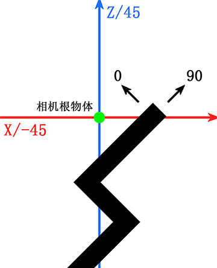

# How to implement the official camera following of Dancing Line in rectangular coordinate system
*****
* **The official commonly used coordinate system is along the -45/45 direction, which is referred to 
as the "oblique coordinate system" in this article; the fan-made commonly used coordinate system is 
mostly along the 0/90 direction, which is referred to as the "rectangular coordinate system" in this 
article.**

## Implementation principle
In the oblique coordinate system, the x-axis is the offset axis of the camera, and the z-axis is the axis along which 
the camera actually moves to follow the line.


In the oblique coordinate system, the camera only moves forward along the z axis, which is smoother than the rectangular 
coordinate system that moves forward along both the x and z axes. The camera is offset by about 1.5 
units on the x axis to ensure that the line is always in the center of the screen.

To achieve this effect in the rectangular coordinate system, just rotate the original coordinate space 
and related variables by 45° in the code.

## Implementation method
To implement in a rectangular coordinate system, you need to first define the following quantities:
```
Vector3 followSpeed = new Vector3(1.2f,3f,6f); //Follow speed
Quaternion vectorRotation = Quaternion.Euler(0,-45,0); //Coordinate rotation
Transform origin; //Coordinate origin object
Vector3 Translation //Follow data after rotation
{
    get
    {
        var targetPosition = vectorRotation * target.position;
        var followerPosition = vectorRotation * follower.position;
        return targetPosition - followerPosition;
    }
}
```
In the Start() function, you need to set the coordinate origin object.
```
origin = new GameObject("TranslatingOrigin")
{
    transform =
    {
        position = Vector3.zero,
        rotation = Quaternion.Euler(0, 45, 0),
        localScale = Vector3.one
    }
}.transform;
```
In the Update() function, you need to modify the relevant code.
```
var translation = new Vector3(Translation.x * Time.smoothDeltaTime * followSpeed.x, Translation.y * Time.smoothDeltaTime * followSpeed.y, Translation.z * Time.smoothDeltaTime * followSpeed.z);
```
Set a new coordinate origin.
```
follower.Translate(translation, origin);
```