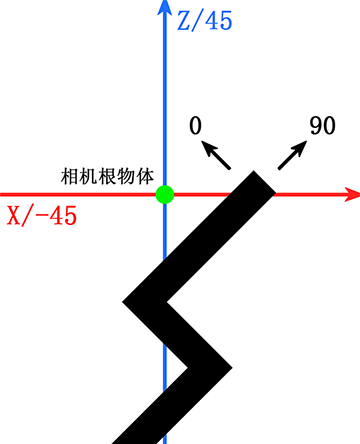

# 跳舞的线官方相机跟随在0°/90°坐标系的实现方式
*****
* **本文所使用的Unity版本为2021.3.14f1c1**
* **官方常用坐标系轴向为-45°/45°，本文简称“对角坐标系”；饭制常用坐标系轴向为0°/90°，本文简称“直角坐标系”**

## 实现原理
在对角坐标系中，x轴为相机的偏移轴，z轴是相机实际跟随线移动的轴


在对角坐标系中，相机只沿z轴移动，相比于在x轴和z轴均移动的直角坐标系更加平滑。且相机在x轴方向存在约1.5单位长度的偏移量，以确保线始终位于屏幕中心

若要在直角坐标系中实现，只需将原始的坐标空间及相关向量旋转45°

## 实现方式
若要在直角坐标系中实现，需先在代码中定义如下量：
```csharp
public Transform target; //需要跟随的物体（通常是线）
public Transform follower; //需要进行跟随的物体（通常是相机根物体）

private Vector3 followSpeed = new Vector3(1.2f,3f,6f); //跟随速度（在对角坐标系下该值为(1f,3f,6f)）
private Quaternion vectorRotation = Quaternion.Euler(0,-45f,0); //坐标旋转四元数
private Transform origin; //坐标原点物体

private Vector3 Translation //旋转坐标系下的位移向量
{
    get
    {
        var targetPosition = vectorRotation * target.position;
        var followerPosition = vectorRotation * follower.position;
        return targetPosition - followerPosition;
    }
}
```

在```Start()```函数中，需设置坐标原点物体
```csharp
private void Start()
{
    origin = new GameObject("TranslatingOrigin")
    {
        transform =
        {
            rotation = Quaternion.Euler(0f, 45f, 0f)
        }
    }.transform; //创建旋转后的坐标系的原点
}
```

在```Update()```函数中，需修改相关代码
```csharp
private void Update()
{
    var translation = new Vector3(
        Translation.x * Time.smoothDeltaTime * followSpeed.x, 
        Translation.y * Time.smoothDeltaTime * followSpeed.y, 
        Translation.z * Time.smoothDeltaTime * followSpeed.z
    );
    follower.Translate(translation, origin); //使用新的坐标原点
}
```