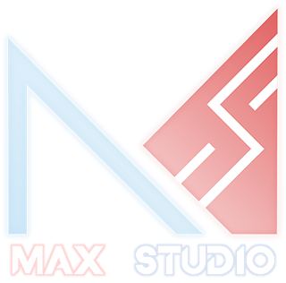

# MaxLine - About
*****
## Credit

### Producer
Max Studio

### Technical Support
Summer of Orange

Feng Yan

Hatcat

Jim Tsai

MaxIceFlame

MaxBlazeRes

Kedit_W

### Translator
:flag_vn: Vietnamese

Bell

Fitzgerald

Top Finger

:flag_id: Indonesian

Manatite

Real Nath

:flag_jp: Japanese

Feng Yan

:flag_cn: Traditional Chinese (Correction)

Jim Tsai

Zutek 3134

:flag_ua: Ukrainian

Dju de la va

### Special Thanks
#### Technic
BluesDawn

Summer of Orange

Feng Yan

dogdie233

鸡块

Jim Tsai

#### Music
ChronosAeon

初云CLoudie

C-725

MAPLEX

Fairo

098765_

#### Image
DGCK81LNN

Hatcat

LAM

TL Kasimyia

Startal_Fall

#### Publicity
GP0108

Hatcat

TBOTP

Jim Tsai

Zutek 3134

#### Partner
Fire Cloud Studio

Sky Cloud Studio

WINDER Studio

#### Other
BlockZ

Max Zhi Flame

RicoTen

杨哥我来了

Fenger

Z1029

## Copyright Notice
**The copyright of the music used in the game belong to their copyright owners**

**This game is a fanmade of "Dancing Line". The original game copyright belongs to MINIMAX**

## Game OST
 [跳舞的线饭制游戏「MaxLine」官方原声](https://music.163.com/djradio?id=1004185369 "NetEase Cloud Music")