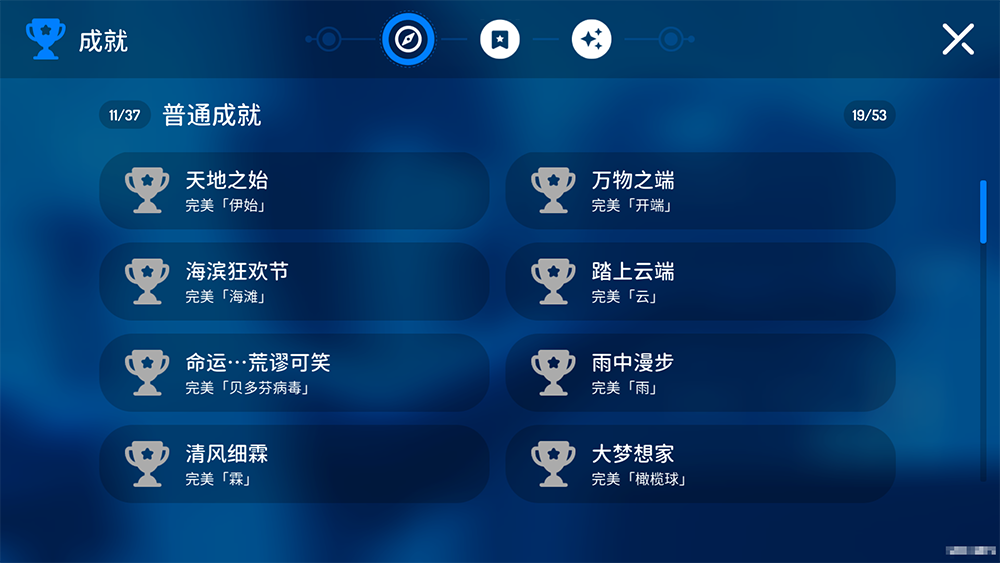
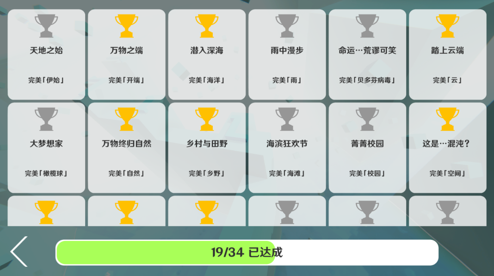
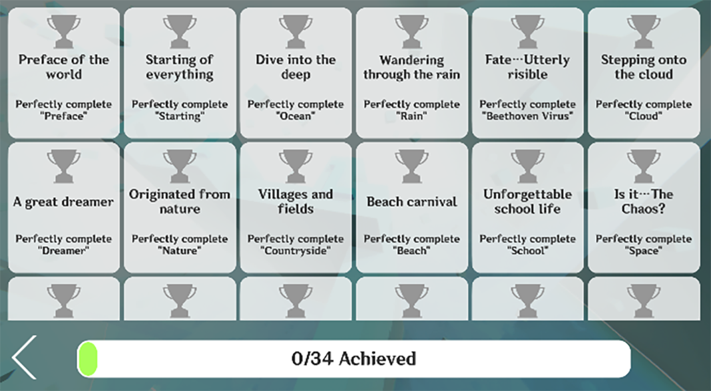
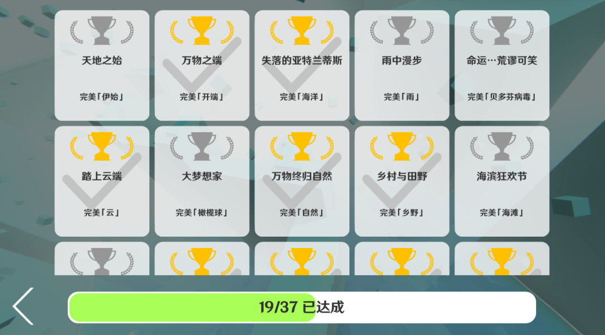
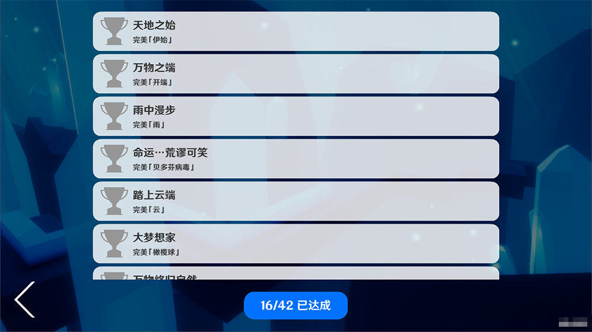

# MaxLine - Achievements
*****

## Achievement list
>Sorted by first letter
### Common achievements
|           Level            |              Name              |        How to Achieve        |
|:--------------------------:|:------------------------------:|:----------------------------:|
|        Anniversary         |        Happy birthday!         | Perfectly complete the level |
|         Apocalypse         |     Under the apocalypse…      | Perfectly complete the level |
|   Beach \[Melodic House]   |         Beach carnival         | Perfectly complete the level |
|      Beethoven Virus       |      Fate…Utterly risible      | Perfectly complete the level |
|         Chemistry          |            He Zn Tm            | Perfectly complete the level |
|       Christmas Snow       |        Merry Christmas!        | Perfectly complete the level |
|           Cloud            |    Stepping onto the cloud     | Perfectly complete the level |
|        Countryside         |      Villages and fields       | Perfectly complete the level |
|        Desert Maze         |          Maze escaper          | Perfectly complete the level |
|          Dreamer           |        A great dreamer         | Perfectly complete the level |
| Drizzle \[Soft Orchestral] |       Breeze and drizzle       | Perfectly complete the level |
|           Empire           |       History of rising        | Perfectly complete the level |
|       Fire of Anger        |     May the world be peace     | Perfectly complete the level |
|     Firework Paradise      |      Summer festival line      | Perfectly complete the level |
|         Food Party         |      Delicacy Temptation       | Perfectly complete the level |
|           Gloom            |      Annihilated Spirits       | Perfectly complete the level |
|     Head in the Clouds     |       Kingdom of clouds        | Perfectly complete the level |
|          Holidays          |            Traveler            | Perfectly complete the level |
|         Hollowness         |    Life passes like a dream    | Perfectly complete the level |
|  Hollowness \[Redesigned]  |   Life passes like a dream Ⅱ   | Perfectly complete the level |
|           Huaji            | The world is a giant Li Ga Yb! | Perfectly complete the level |
|         In the End         |      The final epilogue…       | Perfectly complete the level |
|  Jupiter \[Trance Remix]   |       Fa, Fake diamonds!       | Perfectly complete the level |
|          MARENOL           |            MARENOL             | Perfectly complete the level |
|        Mathematics         |          Tool subject          | Perfectly complete the level |
|           Nature           |     Originated from nature     | Perfectly complete the level |
|           Ocean            |       The lost Atlantis        | Perfectly complete the level |
|          Preface           |      Preface of the world      | Perfectly complete the level |
|            Rain            |   Wandering through the rain   | Perfectly complete the level |
|        Rainy Night         |    Walking at a rainy night    | Perfectly complete the level |
|           School           |   Unforgettable school life    | Perfectly complete the level |
|           Space            |        Is it…The Chaos?        | Perfectly complete the level |
|          Starting          |     Starting of everything     | Perfectly complete the level |
| Strawberries & Cigarettes  |          Fall in love          | Perfectly complete the level |
|  The Discovery - Chronos   |     Reborn from the ashes      | Perfectly complete the level |
|           Valley           |        Hills and rivers        | Perfectly complete the level |
|        White Realm         |  White Realm: Sound of Nature  | Perfectly complete the level |

### Special achievements
|        Name         |        How to Achieve         |
|:-------------------:|:-----------------------------:|
| Diamond collector Ⅰ |  Obtain 10 diamonds in total  |
| Diamond collector Ⅱ | Obtain 100 diamonds in total  |
| Diamond collector Ⅲ | Obtain 400 diamonds in total  |
| Diamond collector Ⅳ | Obtain 800 diamonds in total  |
| Diamond collector Ⅴ | Obtain 1200 diamonds in total |
|   Rich in crown Ⅰ   |   Obtain 3 crowns in total    |
|   Rich in crown Ⅱ   |   Obtain 30 crowns in total   |
|   Rich in crown Ⅲ   |  Obtain 120 crowns in total   |
|   Rich in crown Ⅳ   |  Obtain 240 crowns in total   |
|   Rich in crown Ⅴ   |  Obtain 360 crowns in total   |

### Secret achievements
|          Level           |              Name              |                    Description                    |
|:------------------------:|:------------------------------:|:-------------------------------------------------:|
|       Anniversary        |          Handsome boy          |              Discover our photo wall              |
|        Chemistry         | Chemistry changed the world!!! |         A heaven full of chemistry books          |
|       Desert Maze        |             Bang!              |  You thought this road is passable, didn't you?   |
|        Hollowness        |         Hallowed tree          | Encounter the hallowed tree in a mysterious world |
| Hollowness \[Redesigned] |        Monument Valley         |                   Best partner!                   |
|          Ocean           |         Lifeless ocean         |   Why there are no fishes in such a vast ocean?   |

## Trivia
* The achievement of Ocean was originally named as "Dive into the deep", and was later changed to "The lost Atlantis". It's a homage to the lyric "Where are you now? -Atlantis." in Alan Walker's song ["Faded"](https://music.163.com/#/song?id=36990266)
* The Chinese achievement name of Dreamer actually came from the level's English title "Dreamer". It's also the name of the song used in the level
* In Chinese, the name of the achievement of School came from a poem written by the level designer lyckay when designing the level
* After the official version of [Space](https://www.bilibili.com/video/BV1Ex4y117sm) had been released, many players called this level "Bonus of The Chaos", so the achievement of Space was named as "Is it…The Chaos?"
* The achievement of The Discovery - Chronos is "Reborn from the ashes", which seems to have no relation to the level, is closely connected to the process that the level was removed and was remade then released again
* The achievement of Desert Maze is "Maze escaper", which has nothing to do with the level's actual content, is supposed that it's insinuating something
* The achievement of Chemistry is "He Zn Tm". Actually, He, Zn and Tm are the preceding elements of Li, Ga and Yb, respectively. Li Ga Yb used to use this name as his name
* The achievement of Fireworks, "Summer festival line", came from a food called "Summer Festival Fish" in Genshin Impact
* The achievement of Mathematics, "Tool subject", came from a joke told by game producer's physics teacher in class
* The achievement of Jupiter, "Fa, Fake diamonds!", is actually an answer to the question "What are on the Jupiter?" in the title of the official video
* The achievement of Food Party, "Delicacy Temptation", came from a level named "Delicacy Temptation" in Rolling Sky
* The secret achievement of Ocean, "Lifeless ocean", is actually a joke told by players because there are no fishes and other sea creatures in ocean

## Gallery

<body>
    
        <i>
            ^The first design of achievement page
        </i>
    
</body>

<body>
    
        <i>
            ^The achievement page sent by MaxIceFlame in Discord server (magnified)
        </i>
    
</body>

<body>
    
        <i>
            ^The second design of achievement page
        </i>
    
</body>

<body>
    
        <i>
            ^The third design of achievement page
        </i>
    
</body>

<body>
    
        <i>
            ^The forth design of achievement page
        </i>
    
</body>