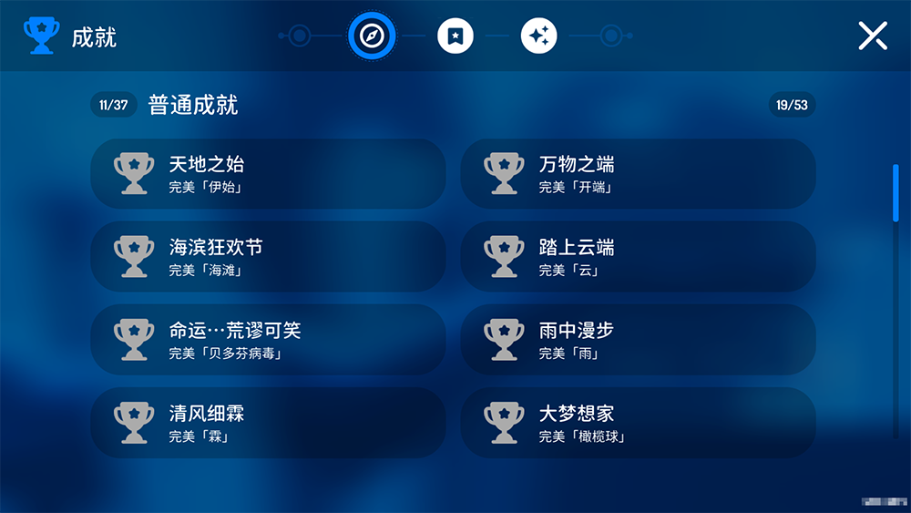
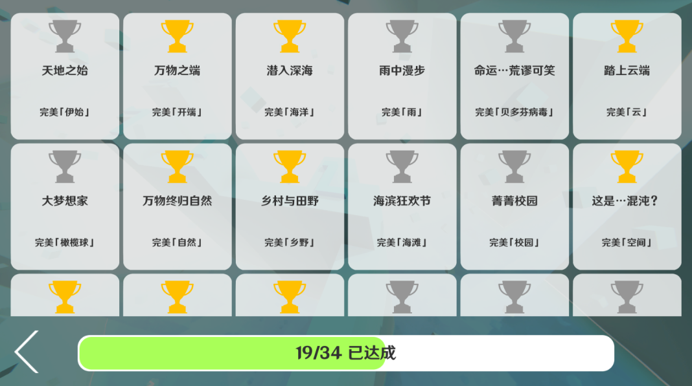
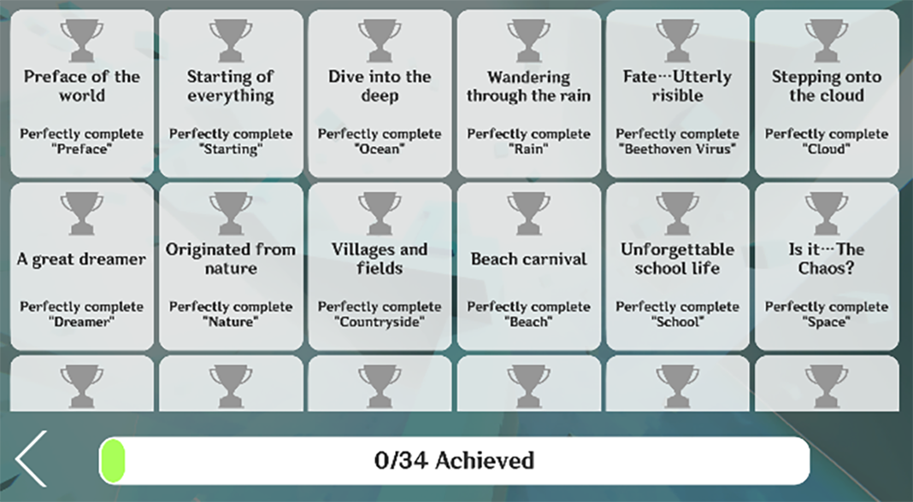
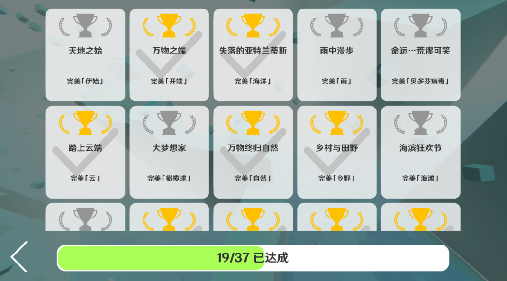
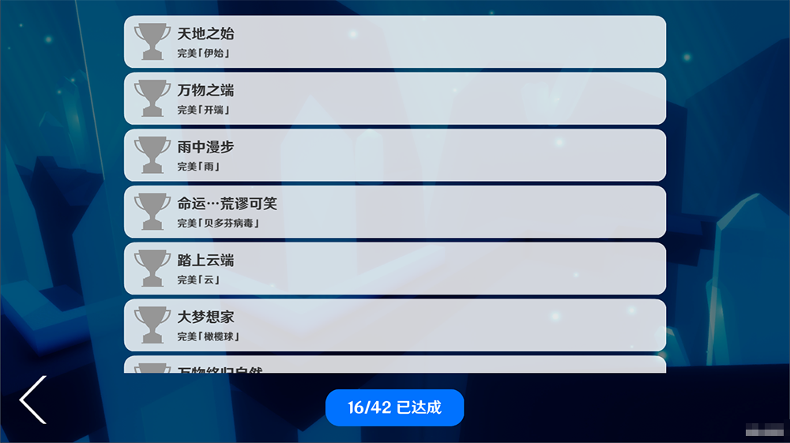
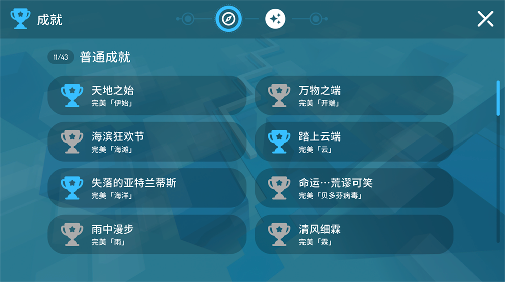

# Achievements
*****

<body>
    
        <i>
            ^Achievement page in game
        </i>
    
</body>

## Achievement List
>Sorted by first letter
### Common Achievements
|             Level              |                Title                |        How to Achieve        |
|:------------------------------:|:-----------------------------------:|:----------------------------:|
|          Anniversary           |           Happy Birthday!           | Perfectly complete the level |
|           Apocalypse           |        Under the Apocalypse…        | Perfectly complete the level |
|     Beach - Melodic House      |           Beach Carnival            | Perfectly complete the level |
|        Beethoven Virus         |        Fate…Utterly Risible         | Perfectly complete the level |
|          Caramel Star          |         A Call. An Answer.          | Perfectly complete the level |
| Caramel Star - 9th Anniversary |          Nonuple Sweetness          | Perfectly complete the level |
|           Chemistry            |              He Zn Tm               | Perfectly complete the level |
|         Christmas Snow         |          Merry Christmas!           | Perfectly complete the level |
|             Cloud              |       Stepping onto the Cloud       | Perfectly complete the level |
|          Countryside           |         Villages and Fields         | Perfectly complete the level |
|          Desert Maze           |            Maze Escaper             | Perfectly complete the level |
|            Dreamer             |           A Great Dreamer           | Perfectly complete the level |
|   Drizzle - Soft Orchestral    |         Breeze and Drizzle          | Perfectly complete the level |
|             Empire             |          History of Rising          | Perfectly complete the level |
|         Fire of Anger          |       May the World be Peace        | Perfectly complete the level |
|       Firework Paradise        |        Summer Festival Line         | Perfectly complete the level |
|           Food Party           |         Delicacy Temptation         | Perfectly complete the level |
|             Gloom              |         Annihilated Spirits         | Perfectly complete the level |
|       Head in the Clouds       |          Kingdom of Clouds          | Perfectly complete the level |
|            Holidays            |              Traveler               | Perfectly complete the level |
|           Hollowness           |      Life Passes like a Dream       | Perfectly complete the level |
|        Hollowness - New        |         A New Lease of Life         | Perfectly complete the level |
|             Huaji              |   The World is a Giant Li Ga Yb!    | Perfectly complete the level |
|            Inferno             |      Hear the Inferno's Call!       | Perfectly complete the level |
|           In the End           |         The Final Epilogue…         | Perfectly complete the level |
|     Jupiter - Trance Remix     |         Fa, Fake Diamonds!          | Perfectly complete the level |
|            MARENOL             |               MARENOL               | Perfectly complete the level |
|          Mathematics           |            Tool Subject             | Perfectly complete the level |
|             Nature             |       Originated from Nature        | Perfectly complete the level |
|             Ocean              |          The Lost Atlantis          | Perfectly complete the level |
|            Preface             |        Preface of the World         | Perfectly complete the level |
|              Rain              |     Wandering through the Rain      | Perfectly complete the level |
|          Rainy Memory          |           A Rainy Memory            | Perfectly complete the level |
|          Rainy Night           |      Walking at a Rainy Night       | Perfectly complete the level |
|      Refraction Corridor       |               Polaris               | Perfectly complete the level |
|          Ringing Rain          |          Drizzling Lament           | Perfectly complete the level |
|             School             |      Unforgettable School Life      | Perfectly complete the level |
|           Sincerity            |             Love Story              | Perfectly complete the level |
|             Space              |          Is It…The Chaos?           | Perfectly complete the level |
|            Starting            |       Starting of Everything        | Perfectly complete the level |
|   Strawberries & Cigarettes    |            Fall in Love             | Perfectly complete the level |
|    The Discovery - Chronos     |        Reborn from the Ashes        | Perfectly complete the level |
|             Valley             |          Hills and Rivers           | Perfectly complete the level |
|          White Realm           |    White Realm: Sound of Nature     | Perfectly complete the level |

### Special Achievements
|         Title         |            How to Achieve            |
|:---------------------:|:------------------------------------:|
|  Diamond Collector Ⅰ  |     Obtain 10 diamonds in total      |
|  Diamond Collector Ⅱ  |     Obtain 100 diamonds in total     |
|  Diamond Collector Ⅲ  |     Obtain 400 diamonds in total     |
|  Diamond Collector Ⅳ  |     Obtain 800 diamonds in total     |
|  Diamond Collector Ⅴ  |    Obtain 1200 diamonds in total     |
|    Rich in Crown Ⅰ    |       Obtain 3 crowns in total       |
|    Rich in Crown Ⅱ    |      Obtain 30 crowns in total       |
|    Rich in Crown Ⅲ    |      Obtain 120 crowns in total      |
|    Rich in Crown Ⅳ    |      Obtain 240 crowns in total      |
|    Rich in Crown Ⅴ    |      Obtain 360 crowns in total      |
|   Diving Champion Ⅰ   |     Fall into water for 10 times     |
|   Diving Champion Ⅱ   |     Fall into water for 50 times     |
|   Diving Champion Ⅲ   |    Fall into water for 100 times     |
| Careless Adventurer Ⅰ | Deviate from the route for 10 times  |
| Careless Adventurer Ⅱ | Deviate from the route for 50 times  |
| Careless Adventurer Ⅲ | Deviate from the route for 100 times |

### Secret Achievements
|             Level              |             Title              |                    Description                    |
|:------------------------------:|:------------------------------:|:-------------------------------------------------:|
|          Anniversary           |          Handsome Boy          |              Discover our photo wall              |
| Caramel Star - 9th Anniversary |     Happy 9th Anniversary!     |           Happy birthday, Dancing Line!           |
|           Chemistry            | Chemistry Changed the World!!! |         A heaven full of chemistry books          |
|          Desert Maze           |             Bang!              |  You thought this road is passable, didn't you?   |
|           Hollowness           |         Hallowed Tree          | Encounter the hallowed tree in a mysterious world |
|        Hollowness - New        |        Monument Valley         |                   Best partner!                   |
|             Ocean              |         Lifeless Ocean         |   Why there are no fishes in such a vast ocean?   |

## Trivia
* The achievement of _Ocean_ was originally named as _Dive into the Deep_, and was later changed to _The Lost Atlantis_. It's a homage to the lyric "Where are you now? -Atlantis." in Alan Walker's song _[Faded](https://music.163.com/#/song?id=36990266)_
* The Chinese achievement title of _Dreamer_ actually came from the level's English title. This name is also the name of the song used in the level
* In Chinese, the name of the achievement of _School_ came from a poem written by the level designer lyckay when designing the level
* After the official version of _[Space](https://www.bilibili.com/video/BV1Ex4y117sm)_ had been released, many players called this level "Bonus of The Chaos", so the achievement was named as _Is It…The Chaos?_
* The achievement of _The Discovery - Chronos_ is _Reborn from the Ashes_, which seems to have no relation to the level, is closely connected to the process that the level was removed and redesigned then released again
* The achievement of _Desert Maze_ is _Maze Escaper_, which has nothing to do with the level's actual content, is supposed that it's insinuating something
* The achievement of _Chemistry_ is _He Zn Tm_. Actually, He, Zn and Tm are the preceding elements of Li, Ga and Yb, respectively. Li Ga Yb used to use this name as his name
* The achievement of _Fireworks_, _Summer Festival Line_, came from a kind of food called _Summer Festival Fish_ in _Genshin Impact_
* The achievement of _Mathematics_, _Tool Subject_, came from a joke told by game producer's physics teacher in class
* The achievement of _Jupiter_, _Fa, Fake Diamonds!_, is actually an answer to the question "What are on the Jupiter?" in the title of the official video
* The achievement of _Food Party_, _Delicacy Temptation_, came from a level named _Delicacy Temptation_ in _Rolling Sky_
* The secret achievement of _Ocean_, _Lifeless Ocean_, is actually a joke told by players because there are no fishes and other sea creatures in _Ocean_

## Gallery

<body>
    
        <i>
            ^The first design of achievement page
        </i>
    
</body>

<body>
    
        <i>
            ^The achievement page sent by MaxIceFlame in Discord server (magnified)
        </i>
    
</body>

<body>
    
        <i>
            ^The second design of achievement page
        </i>
    
</body>

<body>
    
        <i>
            ^The third design of achievement page
        </i>
    
</body>

<body>
    
        <i>
            ^The forth design of achievement page
        </i>
    
</body>