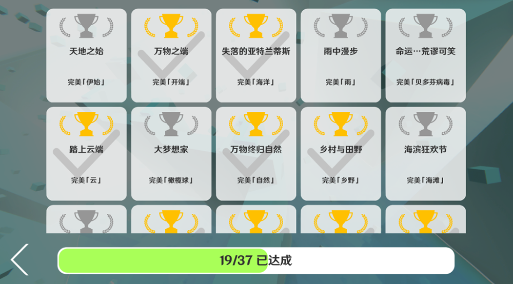
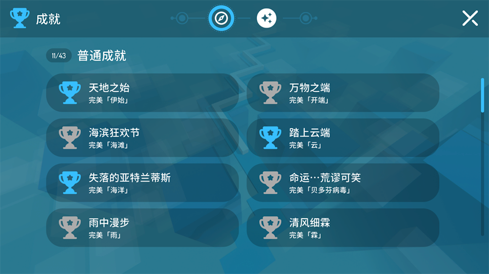

# MaxLine - 成就
*****

<body>
    
        <i>
            ^游戏中的成就页面
        </i>
    
</body>

## 成就列表
>按英文名称首字母排序
### 普通成就
|          关卡          |       成就名称        | 达成方法 |
|:--------------------:|:-----------------:|:----:|
|         周年庆          |       生日快乐！       | 完美通关 |
|         启示录          |       末世之下…       | 完美通关 |
| 海滩 \[Melodic House]  |       海滨狂欢节       | 完美通关 |
|        贝多芬病毒         |      命运…荒谬可笑      | 完美通关 |
|         焦糖星          |   你在哪里？——我在这里。    | 完美通关 |
|       焦糖星·九周年        |        九分甜        | 完美通关 |
|          化学          |        氦锌铥        | 完美通关 |
|         圣诞雪          |       圣诞快乐！       | 完美通关 |
|          云           |       踏上云端        | 完美通关 |
|          乡野          |       乡村与田野       | 完美通关 |
|         沙漠迷宫         |       迷宫逃脱者       | 完美通关 |
|         橄榄球          |       大梦想家        | 完美通关 |
| 霖 \[Soft Orchestral] |       清风细霖        | 完美通关 |
|          帝国          |        兴盛史        | 完美通关 |
|          燃火          |       愿世和平        | 完美通关 |
|         花火之都         |       夏祭游线        | 完美通关 |
|         美食派对         |       美食诱惑        | 完美通关 |
|          抑           |       魂销意散        | 完美通关 |
|         云端之上         |       白云的国度       | 完美通关 |
|          假日          |        旅行者        | 完美通关 |
|          迷度          |       浮生若暮        | 完美通关 |
|       迷度 \[新]        |      浮生若暮 Ⅱ       | 完美通关 |
|          滑稽          | 世界是一个巨大的Li Ga Yb！ | 完美通关 |
|      In the End      |      最后的终章…       | 完美通关 |
|  木星 \[Trance Remix]  |      有、有假钻！       | 完美通关 |
|       MARENOL        |        噩梦醇        | 完美通关 |
|          数学          |       工具学科        | 完美通关 |
|          自然          |      万物终归自然       | 完美通关 |
|          海洋          |     失落的亚特兰蒂斯      | 完美通关 |
|          伊始          |       天地之始        | 完美通关 |
|          雨           |       雨中漫步        | 完美通关 |
|          雨夜          |       夜雨徐行        | 完美通关 |
|          校园          |       菁菁校园        | 完美通关 |
|          空间          |      这是…混沌？       | 完美通关 |
|          开端          |       万物之端        | 完美通关 |
|        草莓&香烟         |       坠入爱河        | 完美通关 |
|          探索          |       浴火重生        | 完美通关 |
|          山谷          |       青山绿水        | 完美通关 |
|          白界          |      白界：自然之音      | 完美通关 |

### 特殊成就
|  成就名称   |    达成方法     |
|:-------:|:-----------:|
| 钻石收藏家 Ⅰ |  累计获得10颗钻石  |
| 钻石收藏家 Ⅱ | 累计获得100颗钻石  |
| 钻石收藏家 Ⅲ | 累计获得400颗钻石  |
| 钻石收藏家 Ⅳ | 累计获得800颗钻石  |
| 钻石收藏家 Ⅴ | 累计获得1200颗钻石 |
| 大皇冠富翁 Ⅰ |  累计获得3个皇冠   |
| 大皇冠富翁 Ⅱ |  累计获得30个皇冠  |
| 大皇冠富翁 Ⅲ | 累计获得120个皇冠  |
| 大皇冠富翁 Ⅳ | 累计获得240个皇冠  |
| 大皇冠富翁 Ⅴ | 累计获得360个皇冠  |

### 隐藏成就
|   关卡    |   成就名称    |        成就描述        |
|:-------:|:---------:|:------------------:|
|   周年庆   |    帅小伙    |      找到我们的照片墙      |
| 焦糖星·九周年 |  九周年快乐！   |     跳舞的线，生日快乐！     |
|   化学    | 化学改变世界！！！ |       化学书天堂        |
|  沙漠迷宫   |    嘣！     |   你不会以为这条路是活路吧？    |
|   迷度    |    迷树     |      邂逅迷界中的圣树      |
| 迷度 \[新] |   纪念碑谷    |       最好的伙伴！       |
|   海洋    |    死海     | 你这这么大的海里怎么连条鱼都没有啊？ |

## 你知道吗
* 海洋的成就名最初确定为“潜入深海”，后改为“失落的亚特兰蒂斯”，致敬了Alan Walker的歌曲[《Faded》](https://music.163.com/#/song?id=36990266)中的歌词“Where are you now? -Atlantis.”
* 橄榄球的成就名“大梦想家”其实源于该关卡的英文名“Dreamer”。该名称同时也是关卡使用音乐的名称
* 校园的成就名“菁菁校园”源于该关卡作者lyckay与关卡同期创作的一首小诗
* 在官方收录[空间](https://www.bilibili.com/video/BV1Ex4y117sm)后，有大量玩家将这关称作为“混沌奖励关”，所以空间的成就名得名“这是…混沌？”
* 探索的成就名为“浴火重生”，看似与关卡毫无关系，实则是对该关卡经历下架再重制上架这一过程的纪念
* 沙漠迷宫的成就名为“迷宫逃脱者”，但关卡实际内容与这个名称并不相干，疑似是在暗示着什么
* 化学的成就名为“氦锌铥”，其实就是锂（Li）镓（Ga）镱（Yb）三种元素分别向前挪动一位得到的。这个名称（He Zn Tm）也是关卡作者Li Ga Yb的曾用名
* 花火断想的成就名“夏祭游线”源于游戏《原神》中的一种料理“夏祭游鱼”。~~原来你也~~
* 数学的成就名“工具学科”源于游戏作者的物理老师在课上对数学这一学科的调侃
* 木星的成就名“有、有假钻！”其实是回答了关卡发布视频标题的问题“遥远的木星上有什么？”
* 美食派对的成就名“美食诱惑”源于《滚动的天空》中的同名关卡“美食诱惑”
* 海洋的隐藏成就“死海”其实源于玩家们对该关卡中没有鱼等海洋生物的调侃

## 画廊

<body>
    
        <i>
            ^成就页面的第一种设计
        </i>
    
</body>

<body>
    
        <i>
            ^Max冰焰在Discord服务器中发布的成就页面（图片经过放大）
        </i>
    
</body>

<body>
    
        <i>
            ^成就页面的第二种设计
        </i>
    
</body>

<body>
    
        <i>
            ^成就页面的第三种设计
        </i>
    
</body>

<body>
    
        <i>
            ^成就页面的第四种设计
        </i>
    
</body>