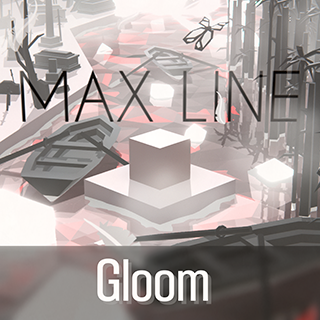

# MaxLine - 介绍
*****
## 游戏简介
MaxLine是由Max Studio开发的一款以《跳舞的线》为蓝本的饭制游戏

## 游戏信息
发布日期：2020年2月4日

更新日期：2024年7月28日

最新版本：V1.4.1

## 关注我们

[哔哩哔哩官方账号](https://space.bilibili.com/373099696 "哔哩哔哩")

[YouTube官方账号](https://www.youtube.com/@MaxStudioOfficial "YouTube")

## 你知道吗
* “MaxLine”这个名字最早出现在Max冰焰于2018年制作的关卡钢琴中
* MaxLine其实最早诞生于2019年7月，但当时并没有将游戏发布出来，直到2020年2月才发布了第一个正式版