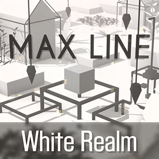

# MaxLine - 介绍
*****
## 游戏简介
MaxLine是由Max Studio开发的一款以《跳舞的线》为蓝本的饭制游戏

## 游戏信息
|  名称  |                        信息                        |
|:----:|:------------------------------------------------:|
| 游戏名称 |                     MaxLine                      |
| 游戏简称 |                    ML 麻辣                     |
| 制作方  |                    Max Studio                    |
| 原作品  |                       跳舞的线                       |
| 最新版本 |                      v2.0.0                      |
| 发布日期 |                    2020年2月4日                     |
| 更新日期 |                    2025年8月25日                    |
| 制作引擎 |          [Unity](https://unity.com/cn)           |
| 游戏页面 | [DL RS 同人群官方网站](https://chinadlrs.com/app/?id=6) |

*****
## 下载途径

[MaxLine官方交流群](https://qm.qq.com/q/DbKb0gpGN2 "QQ")

[DL RS 同人群官方网站](https://chinadlrs.com/app/?id=6 "DL RS 同人群官方网站")

[Dancing Line - Fanmades Community](https://discord.gg/qrPeHegG2k "Discord")

## 关注我们

[哔哩哔哩官方账号](https://space.bilibili.com/373099696 "哔哩哔哩")

[YouTube官方账号](https://www.youtube.com/@MaxStudioOfficial "YouTube")

## 加入我们

[MaxLine官方交流群](https://qm.qq.com/q/DbKb0gpGN2 "QQ")

[MaxLine游戏交流频道](https://pd.qq.com/s/f5mvymy61 "QQ频道")

[Dancing Line - Fanmades Community](https://discord.gg/qrPeHegG2k "Discord")

## 你知道吗
* “MaxLine”这个名字最早出现在Max冰焰于2018年制作的关卡钢琴中
* MaxLine其实最早诞生于2019年7月，但当时并没有将游戏发布出来，直到2020年2月才发布了第一个正式版