# MaxLine - Levels
*****
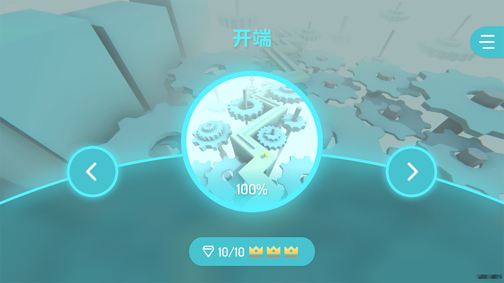
<body>
    
        <i>
            ^Level menu in game
        </i>
    
</body>

## Level list
>Sorted by first letter
### Playable levels
|           Title            |                        Music                         |                 Designer(s)                  |
|:--------------------------:|:----------------------------------------------------:|:--------------------------------------------:|
|        Anniversary         |      MAPLEX / 098765_ - MaxLine 1st Anniversary      | GP0108 lyckay MaxIceFlame qqxqqx |
|         Apocalypse         |               Peter Roe - Last Reunion               |            MaxIceFlame qqxqqx            |
|   Beach \[Melodic House]   |               Fairo - Summer Prologue                |            qqxqqx MaxIceFlame            |
|      Beethoven Virus       |           Diana Boncheva - Beethoven Virus           |            qqxqqx MaxIceFlame            |
|         Chemistry          |               Li Ga Yb - The Chemistry               |                   Li Ga Yb                   |
|       Christmas Snow       |             Chronos - The Christmas Snow             |                 Munity Twin                  |
|           Cloud            |             Cheetah Mobile Games - Cloud             |                    lyckay                    |
|        Countryside         |        Alan Mackin - The Plain [Disco Remix]         |                 MaxIceFlame                  |
|        Desert Maze         |             零燚01 - The Maze [零燚01 Remix]             |                    qqxqqx                    |
|          Dreamer           |                Black Violin - Dreamer                |            qqxqqx MaxIceFlame            |
| Drizzle \[Soft Orchestral] |              初云CLoudie - The Rain Remix              |                 Hua Hua Pig                  |
|           Empire           |        Two Steps From Hell - Empire Of Angels        |             Mandroid GP0108              |
|       Fire of Anger        |       Falcom Sound Team jdk - To be continued!       |                    lyckay                    |
|     Firework Paradise      |                      灰澈 - 花火断想                       |                   STAR_EVE                   |
|         Food Party         |               Tobu - Candyland pt. II                |    Suga Jahsin Hua Hua Pig GP0108    |
|           Gloom            |                    theo5970 - 용서                     |        Mafnero FIRE CLOUD STUDIO         |
|     Head in the Clouds     |              Luke Richards - Tall Tales              |                  寒鹰丶SHADOW                   |
|          Holidays          |               千坂 / Cyan Lpegd - Moment               |                    lyckay                    |
|         Hollowness         |              House Rulez - 37th Avenue               |                   CIAD233                    |
|  Hollowness \[Redesigned]  |              House Rulez - 37th Avenue               |          CIAD233   MaxIceFlame           |
|           Huaji            |                     MöSS - 23:33                     |           Lusaslan MaxIceFlame           |
|         In the End         |             Tommee Profitt - In the End              |         raw_chicken MaxIceFlame          |
|  Jupiter \[Trance Remix]   |                Li Ga Yb - The Jupiter                |                   Li Ga Yb                   |
|          MARENOL           |                    LeaF - MARENOL                    |                     尘落南丘                     |
|        Mathematics         |                Li Ga Yb - Mathematics                |           Li Ga Yb MaxIceFlame           |
|           Nature           |         Alfaiate Franz - O Filtro dos Sonhos         |                 MaxIceFlame                  |
|           Ocean            |                 Fairo - Ocean Remix                  |            MaxIceFlame qqxqqx            |
|          Preface           |                    Fairo - Utopia                    |                 MaxIceFlame                  |
|            Rain            |                  Brian Crain - rain                  |                 MaxIceFlame                  |
|        Rainy Night         |                      四季音色 - 雨夜                       |                  Pumpkin_Z                   |
|           School           |                   RADWIMPS - かたわれ时                   |                    lyckay                    |
|           Space            | Yann Tiersen - Comptine D'un Autre Été, L'après-Midi |                 MaxIceFlame                  |
|          Starting          |                   Fairo - Prologue                   |                 MaxIceFlame                  |
| Strawberries & Cigarettes  |   Yutin - Strawberries & Cigarettes [Yutin Remix]    |              qqxqqx Balabaj              |
|  The Discovery - Chronos   |  Chronos - The Discovery [VIP Mix feat. Max Studio]  |         MaxBlazeRes MaxIceFlame          |
|           Valley           |                MisterPan - The Valley                |                  MisterPan                   |
|        White Realm         |             ¿Téo? - Ascended Vibrations              |                    CXY-辰                     |

### Unplayable level
|    Title    |        Music        |
|:-----------:|:-------------------:|
| Coming Soon | Fairo - Coming Soon |

## Search
In MaxLine, players can find levels quickly by searching

Search function was added in v1.3.5. The purpose was to make it more convenient to quickly find the level they want to play in increasing levels for players, instead of wasting too much time finding levels

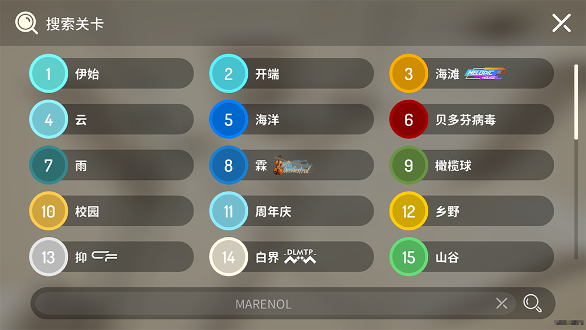
<body>
    
        <i>
            ^Search page in game
        </i>
    
</body>

## Trivia
* Before v1.1.5, Starting was named as "The Prologue" and it was the first level in game. Preface was added in v1.1.5 and it replaced The Prologue. Then, The Prologue was renamed as "The Starting", and it became the second level in game
* Starting was not as easy as it is now. Starting was scaled down difficulty for many times and gradually became what it looks like now
* In the early design of Ocean, it was planned that the line would disappear after 50% and become a ball, in order to be a homage to "Dancing Ball". This plan was abandoned later
* Although the level was re-added in later version, the original intention of adding Rain was to take the place of The Explore
* The designer of School, lyckay, used to write a poem to reminisce about campus life. This level is connected with the poem
* Although many people thought that The Space is similar to The Chaos, MaxIceFlame didn't take The Chaos as a reference while designing
* The official version of [Space](https://www.bilibili.com/video/BV1Ex4y117sm) was not made by MaxIceFlame, but made by Feng Yan according to the original level
* The music of Drizzle was composed by 初云CLoudie when MaxLine was one year old, for celebrating its first anniversary. The music was later adopted by Hua Hua Pig to make level
* The Explore used to be removed due to the conflict between MaxBlazeRes and MaxIceFlame
* In The Discovery - Chronos, the scene from 30% to 40% was made with the reference to [The Journey](https://www.bilibili.com/video/BV18x411Z7ZB) by spspste. There had been cubes rising with the rhythm, but they were removed in following version
* The music of The Discovery - Chronos was remixed by Hatcat using its two versions published by its composer, ChronosAeon
* In Anniversary, many players thought that the scene at 20% refers to Preface, but this scene actually refers to level scene making at the early stage of MaxLine
* In the early design of Anniversary, the scene from 70% to 80% included not only The Explore. Later it was changed that it only included the scene of The Explore
* In Anniversary, the scene from 80% to 90% actually was made with the reference to [Candlelight of Love](https://www.bilibili.com/video/BV1Zi4y1K7az) from Sky Cloud Story
* The original name of Huaji was "The Funny". It used to be planned to changed to "Jocularity" while remaking, but the plan was abandoned later. Then it was directly named as "Huaji" (From the Chinese Pinyin of "滑稽", its Chinese name)
* In the early design of [Apocalypse](https://www.bilibili.com/video/BV1uv411678R), the scene after 80% was not same as it is now. What it looks like now was a redesign by MaxIceFlame
* The scene transformations after 80% in Apocalypse was used to be planned to realize by images, but it was changed to its now appearance due to the bad result
* At the end of Apocalypse, the three tombstones in front of the house refer to hero's wife and two children. They are showed up in scene transformations after 80%
* In the early design of [In the End](https://www.bilibili.com/video/BV1qN41197MR), the scene from 60% to 90% was not same as it is now. What it looks like now was a redesign by MaxIceFlame according to raw_chicken's oral description
* There had been an easter egg in Strawberries & Cigarettes, but it was cancelled when level released
* MARENOL was named as "MARENOL - LeaF" when the level was released. Later it was changed to "MARENOL"
* There had been an easter egg in the original version of Mathematics, but it was cancelled when the level was remade
* In the early stage of game development, the model of Coming Soon was redesigned for many times

## Gallery
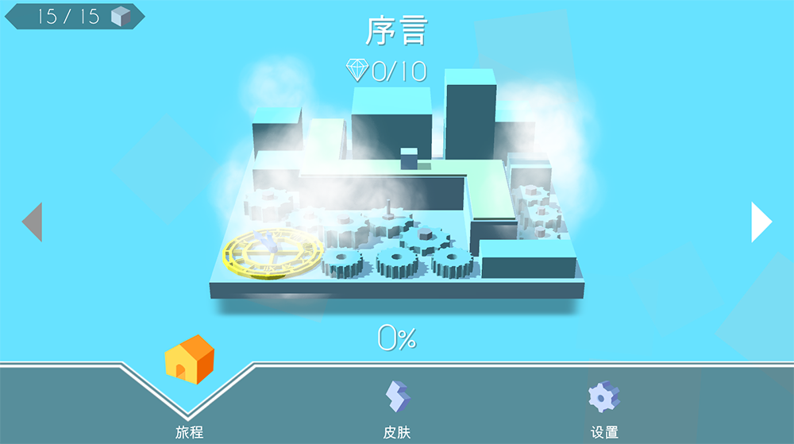
<body>
    
        <i>
            ^The first design of level menu
        </i>
    
</body>

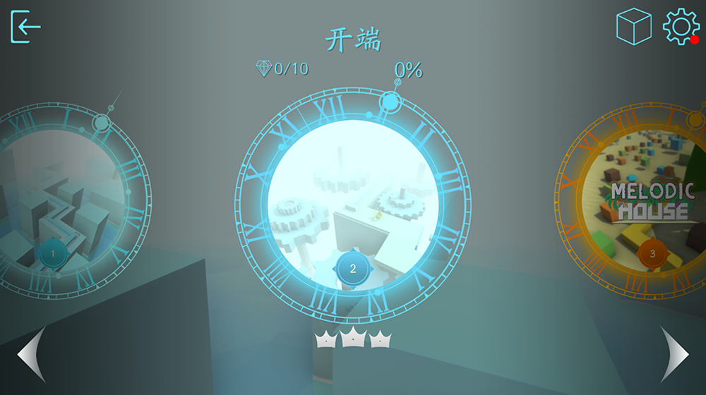
<body>
    
        <i>
            ^The second design of level menu
        </i>
    
</body>

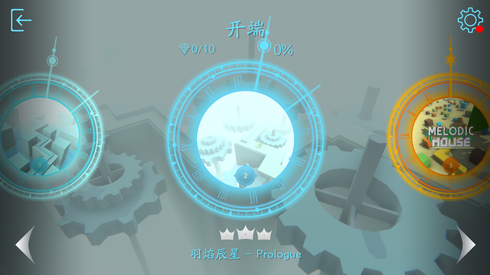
<body>
    
        <i>
            ^The third design of level menu
        </i>
    
</body>

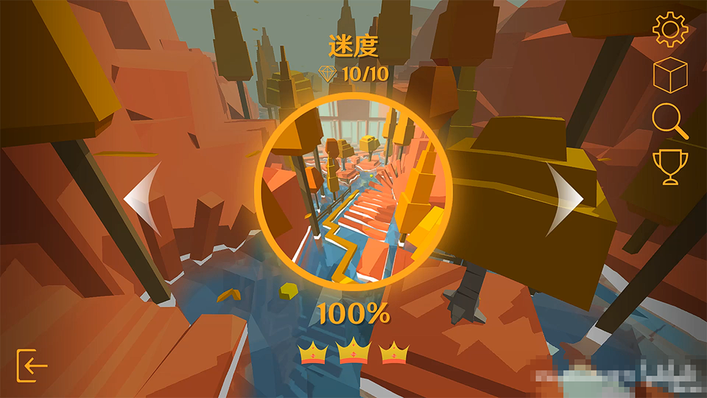
<body>
    
        <i>
            ^The forth design of level menu
        </i>
    
</body>

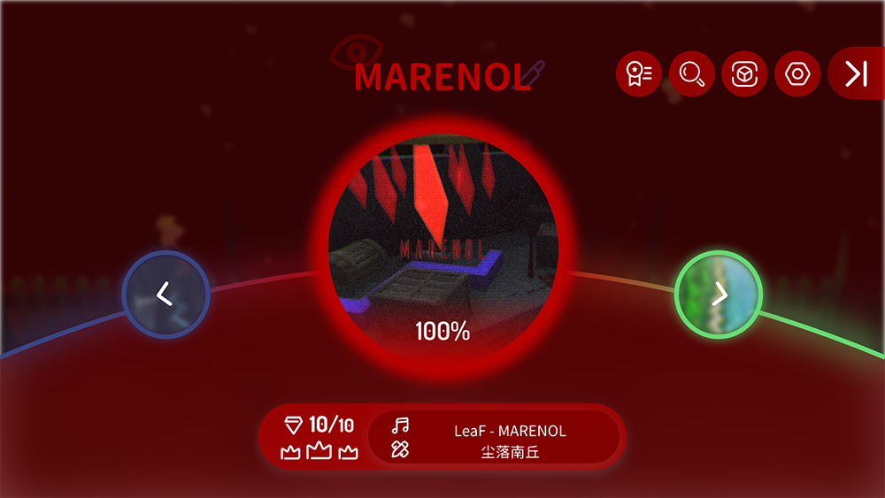
<body>
    
        <i>
            ^The fifth design of level menu
        </i>
    
</body>

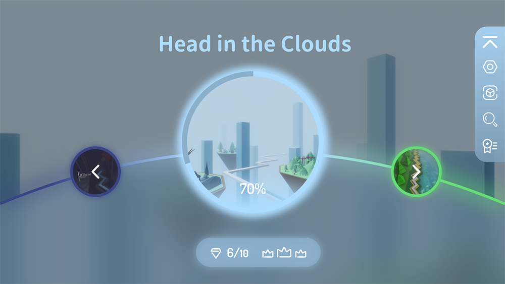
<body>
    
        <i>
            ^The sixth design of level menu
        </i>
    
</body>

<body>
    
        <i>
            ^The first design of Coming Soon ("尽情" was a typo)
        </i>
    
</body>

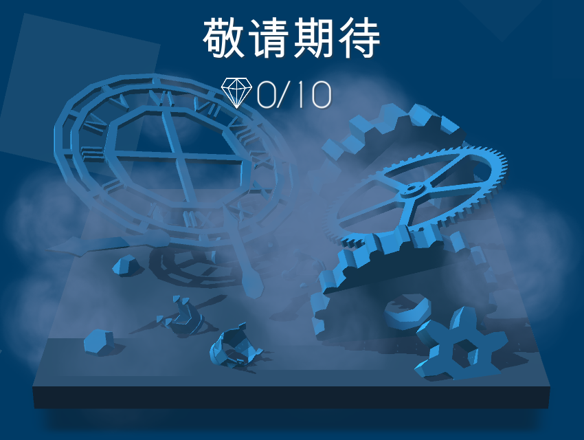
<body>
    
        <i>
            ^The second design of Coming Soon
        </i>
    
</body>

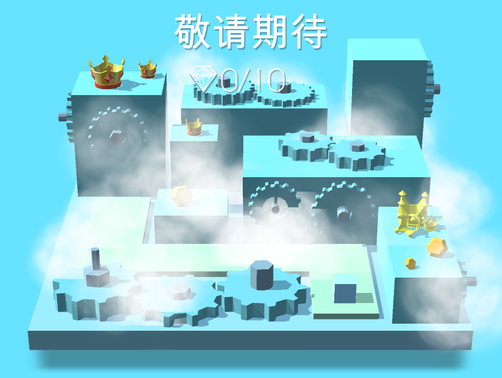
<body>
    
        <i>
            ^The third design of Coming Soon
        </i>
    
</body>

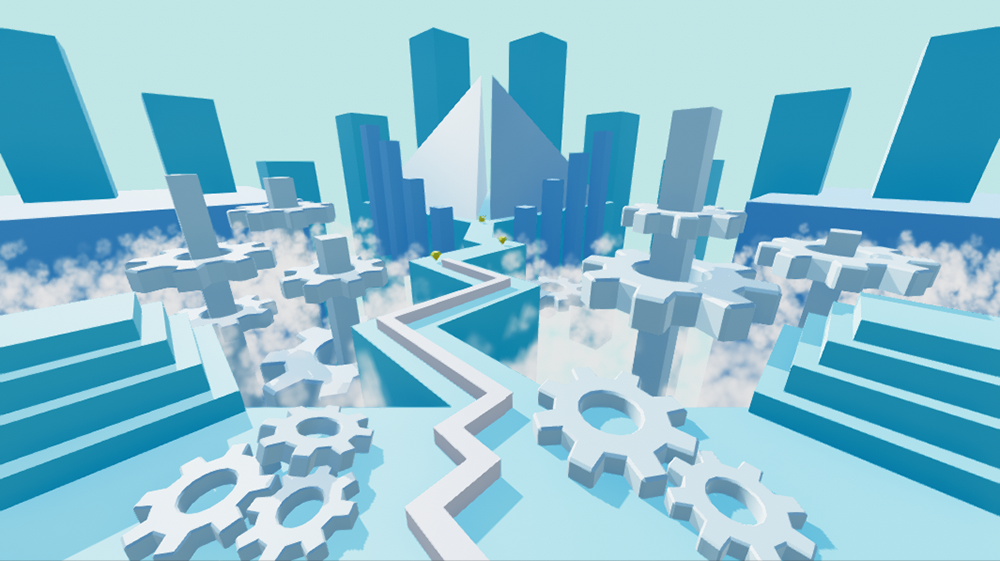
<body>
    
        <i>
            ^The original design of Coming Soon background
        </i>
    
</body>

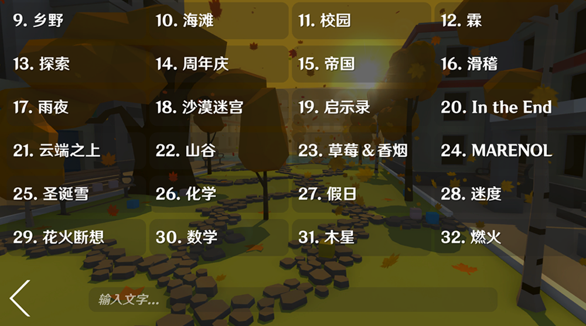
<body>
    
        <i>
            ^The first design of search page
        </i>
    
</body>

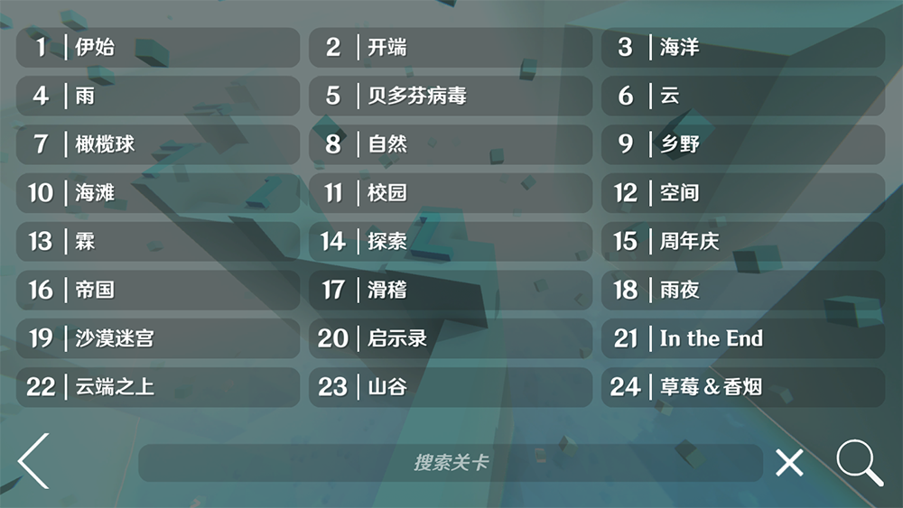
<body>
    
        <i>
            ^The second design of search page
        </i>
    
</body>

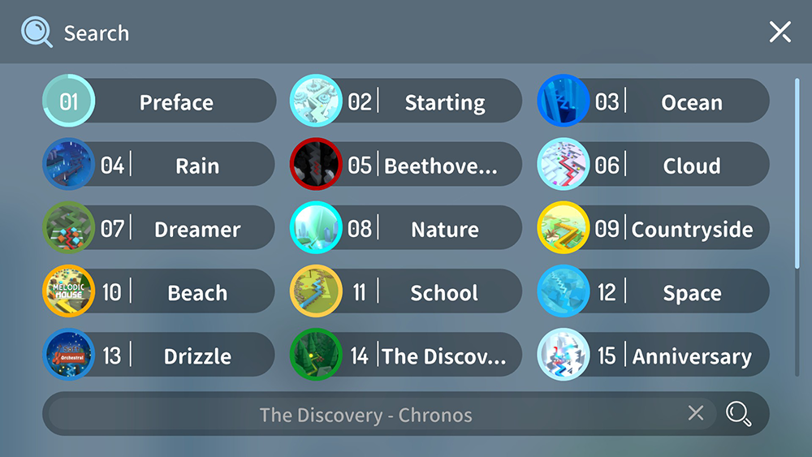
<body>
    
        <i>
            ^The third design of search page
        </i>
    
</body>

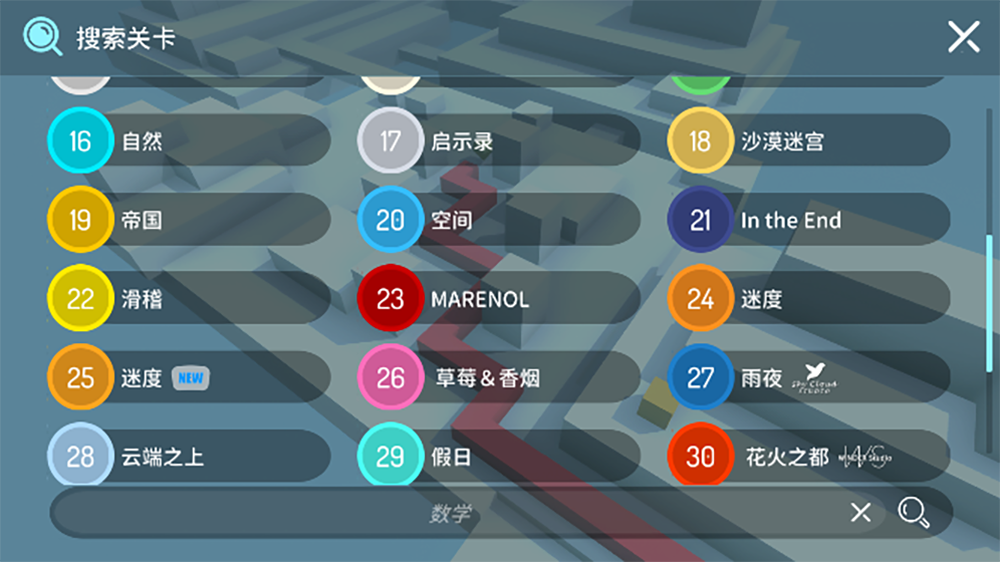
<body>
    
        <i>
            ^The forth design of search page
        </i>
    
</body>