# Levels
*****
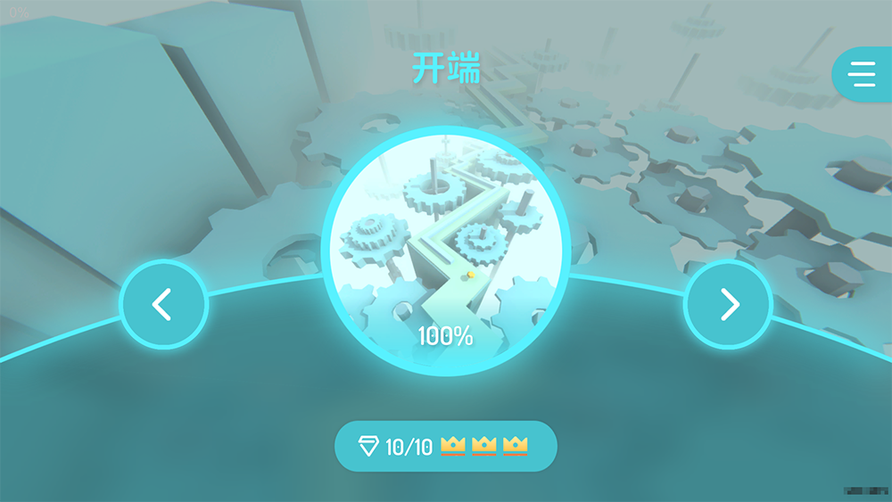
<body>
    
        <i>
            ^Level menu in game
        </i>
    
</body>

## Level List
>Sorted by first letter
### Playable Levels
|             Title              |                        Music                         |                 Designer(s)                  |
|:------------------------------:|:----------------------------------------------------:|:--------------------------------------------:|
|          Anniversary           |      MAPLEX / 098765_ - MaxLine 1st Anniversary      | GP0108 lyckay MaxIceFlame qqxqqx |
|           Apocalypse           |               Peter Roe - Last Reunion               |            MaxIceFlame qqxqqx            |
|     Beach - Melodic House      |               Fairo - Summer Prologue                |            qqxqqx MaxIceFlame            |
|        Beethoven Virus         |           Diana Boncheva - Beethoven Virus           |            qqxqqx MaxIceFlame            |
|          Caramel Star          |                     warma - 焦糖星                      |         塩_ Hatcat Quantumilk         |
| Caramel Star - 9th Anniversary |                     warma - 焦糖星                      |  塩_ Hatcat Quantumilk SrY-ABYSS  |
|           Chemistry            |               Li Ga Yb - The Chemistry               |                   Li Ga Yb                   |
|         Christmas Snow         |             Chronos - The Christmas Snow             |                 Munity Twin                  |
|             Cloud              |             Cheetah Mobile Games - Cloud             |                    lyckay                    |
|          Countryside           |        Alan Mackin - The Plain \[Disco Remix]        |                 MaxIceFlame                  |
|          Desert Maze           |            零燚01 - The Maze \[零燚01 Remix]             |                    qqxqqx                    |
|            Dreamer             |                Black Violin - Dreamer                |            qqxqqx MaxIceFlame            |
|   Drizzle - Soft Orchestral    |              初云CLoudie - The Rain Remix              |                   HHPStar                    |
|             Empire             |        Two Steps From Hell - Empire Of Angels        |             Mandroid GP0108              |
|         Fire of Anger          |       Falcom Sound Team jdk - To be continued!       |                    lyckay                    |
|       Firework Paradise        |                      灰澈 - 花火断想                       |                   STAR_EVE                   |
|           Food Party           |               Tobu - Candyland pt. II                |      Suga Jahsin HHPStar GP0108      |
|             Gloom              |                    theo5970 - 용서                     |        Mafnero FIRE CLOUD STUDIO         |
|       Head in the Clouds       |              Luke Richards - Tall Tales              |                  寒鹰丶SHADOW                   |
|            Holidays            |               千坂 / Cyan Lpegd - Moment               |                    lyckay                    |
|           Hollowness           |              House Rulez - 37th Avenue               |                   CIAD233                    |
|        Hollowness - New        |              House Rulez - 37th Avenue               |           CIAD233 MaxIceFlame            |
|             Huaji              |                     MöSS - 23:33                     |           Lusaslan MaxIceFlame           |
|            Inferno             |             Fairo / 初云CLoudie - The Hell             |                    CXY-辰                     |
|           In the End           |             Tommee Profitt - In the End              |         raw_chicken MaxIceFlame          |
|     Jupiter - Trance Remix     |                Li Ga Yb - The Jupiter                |                   Li Ga Yb                   |
|            MARENOL             |                    LeaF - MARENOL                    |                     尘落南丘                     |
|          Mathematics           |                Li Ga Yb - Mathematics                |           Li Ga Yb MaxIceFlame           |
|             Nature             |         Alfaiate Franz - O Filtro dos Sonhos         |                 MaxIceFlame                  |
|             Ocean              |                 Fairo - Ocean Remix                  |            MaxIceFlame qqxqqx            |
|            Preface             |                    Fairo - Utopia                    |                 MaxIceFlame                  |
|              Rain              |                  Brian Crain - rain                  |                 MaxIceFlame                  |
|          Rainy Memory          |                RABPIT - Rainy Memory                 |       Birdking鸟王 HHPStar CXY-辰       |
|          Rainy Night           |                      四季音色 - 雨夜                       |                  Pumpkin_Z                   |
|      Refraction Corridor       |                HOYO-MiX - 北极星 Polaris                |                  SrY-ABYSS                   |
|          Ringing Rain          |                  Alan Mackin - 雨霖铃                   |                    CXY-辰                     |
|             School             |                   RADWIMPS - かたわれ时                   |                    lyckay                    |
|           Sincerity            |                 ORKZ - Lo-fi Romance                 |                    CXY-辰                     |
|             Space              | Yann Tiersen - Comptine D'un Autre Été, L'après-Midi |                 MaxIceFlame                  |
|            Starting            |                   Fairo - Prologue                   |                 MaxIceFlame                  |
|   Strawberries & Cigarettes    |   Yutin - Strawberries & Cigarettes \[Yutin Remix]   |              qqxqqx Balabaj              |
|    The Discovery - Chronos     | Chronos - The Discovery \[VIP Mix feat. Max Studio]  |         MaxBlazeRes MaxIceFlame          |
|             Valley             |                MisterPan - The Valley                |                  MisterPan                   |
|          White Realm           |             ¿Téo? - Ascended Vibrations              |                    CXY-辰                     |

### Unplayable Level
|    Title    |        Music        |
|:-----------:|:-------------------:|
| Coming Soon | Fairo - Coming Soon |

### Removed Levels
|                       Title                       | Removal Version |
|:-------------------------------------------------:|:---------------:|
|           The Funny (i.e., Huaji) (Old)           |     v1.1.3      |
| The Explore (i.e., The Discovery - Chronos) (Old) |     v1.1.6      |

## Search
In MaxLine, players can find levels quickly by search

Search was added in v1.3.5. The purpose was to make it more convenient to quickly find the level they want to play in increasing levels for players, instead of wasting too much time finding levels

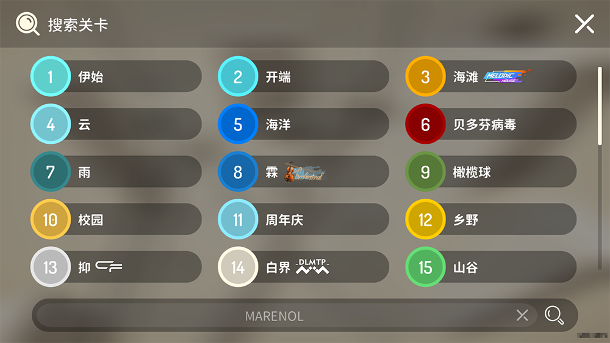
<body>
    
        <i>
            ^Search page in game
        </i>
    
</body>

## Trivia
* Before v1.1.5, _Starting_ was named as _The Prologue_. Later, _Preface_ was added and it replaced _The Prologue_. Then, _The Prologue_ was renamed as _The Starting_
* _Starting_ was not as easy as it is now. _Starting_ was scaled down difficulty for many times and gradually became what it looks like now
* In the early design of _Ocean_, it was planned that the line would disappear after 50% and become a ball, in order to be a homage to _Dancing Ball_. This plan was cancelled later
* Although the level was re-added in later version, the original intention of adding _Rain_ was to take the place of _The Explore_
* The designer of _School_, lyckay, used to write a poem to reminisce about campus life. This level is connected with the poem
* Although many people thought that _Space_ is similar to _The Chaos_, MaxIceFlame didn't take _The Chaos_ as a reference while designing
* The official version of _[Space](https://www.bilibili.com/video/BV1Ex4y117sm)_ was not made by MaxIceFlame, but made by Feng Yan according to the original level
* The music of _Drizzle_ was composed by 初云CLoudie when MaxLine was one year old, for celebrating its first anniversary. The music was later adopted by HHPStar to make level
* _The Explore_ used to be removed due to the conflict between MaxBlazeResFire and MaxIceFlame
* In _The Discovery - Chronos_, the scene from 30% to 40% was made with the reference to _[The Journey](https://www.bilibili.com/video/BV18x411Z7ZB)_ by spspste. There had been cubes rising with the rhythm, but they were removed in following version
* The music of _The Discovery - Chronos_ was remixed by Hatcat using its two versions published by its composer, ChronosAeon
* In _Anniversary_, many players thought that the scene at 20% refers to _Preface_, but this scene actually refers to level scene making at the early stage of MaxLine
* In the early design of _Anniversary_, the scene from 70% to 80% included not only _The Explore_. Later it was changed and only the scene of _The Explore_ was included
* In _Anniversary_, the scene from 80% to 90% actually was made with the reference to _[Candlelight of Love](https://www.bilibili.com/video/BV1Zi4y1K7az)_ from Sky Cloud Story
* The original name of _Huaji_ was _The Funny_. It used to be planned to changed to _Jocularity_ while remaking, but the plan was cancelled later. Then it was directly named as _Huaji_ (The Chinese Pinyin of "滑稽", its Chinese name)
* In the early design of _[Apocalypse](https://www.bilibili.com/video/BV1uv411678R)_, the scene after 80% was not same as it is now. What it looks like now was a redesign by MaxIceFlame
* The scene transitions after 80% in _Apocalypse_ was used to be planned to realize by images, but it was changed to its now appearance due to bad performance
* At the end of _Apocalypse_, the three tombstones in front of the house refer to hero's wife and two children. They are shown up in scene transitions after 80%
* In the early design of _In the End_, the scene from 60% to 90% was not same as it is now. What it looks like now was a redesign by MaxIceFlame according to raw_chicken's oral description
* There had been an Easter egg in _Strawberries & Cigarettes_, but it was cancelled when released
* _MARENOL_ was named as _MARENOL - LeaF_ when the level was released. Later it was changed to _MARENOL_
* There had been an Easter egg in the original version of _Mathematics_, but it was cancelled when the level was redesigned
* In the early stage of game development, the model of _Coming Soon_ was redesigned for many times
* _Firework Paradise_ was originally named as _Fireworks_. It was renamed as _Firework Paradise_ in v2.0.0 — its original name from the design phase
* In 2019, there was the plan to add _Inferno_, but it was shelved until 2026, when the level was finally entrusted to CXY-辰 for production

## Gallery
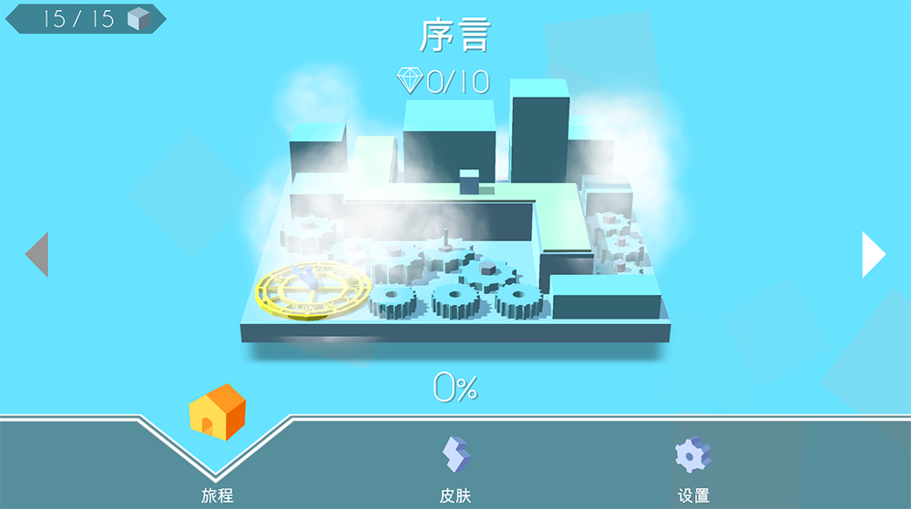
<body>
    
        <i>
            ^The first design of level menu
        </i>
    
</body>

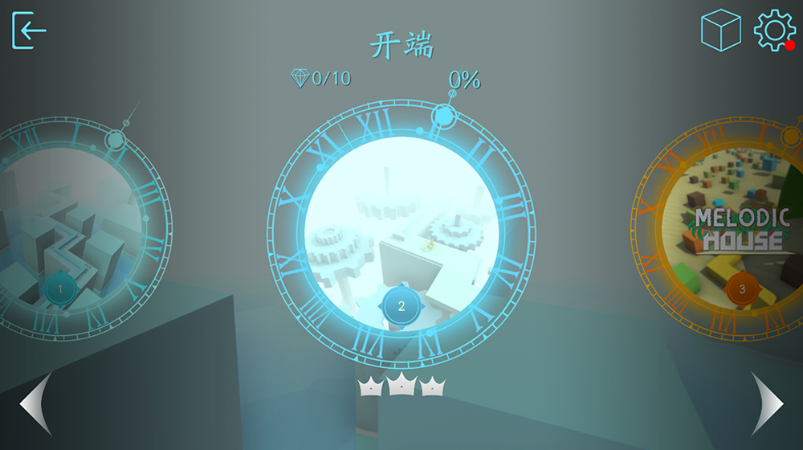
<body>
    
        <i>
            ^The second design of level menu
        </i>
    
</body>

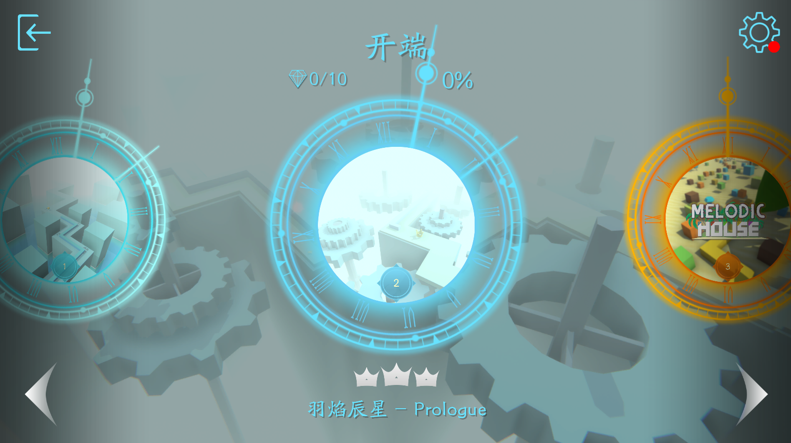
<body>
    
        <i>
            ^The third design of level menu
        </i>
    
</body>

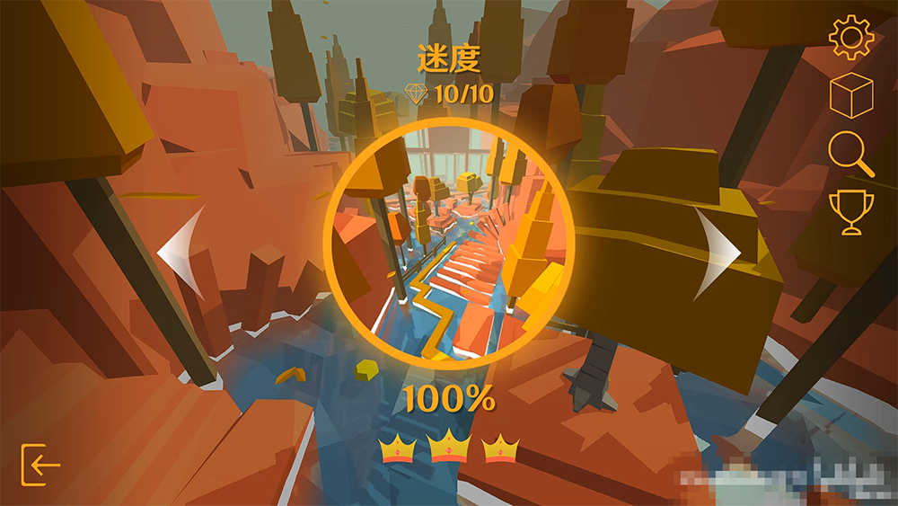
<body>
    
        <i>
            ^The forth design of level menu
        </i>
    
</body>

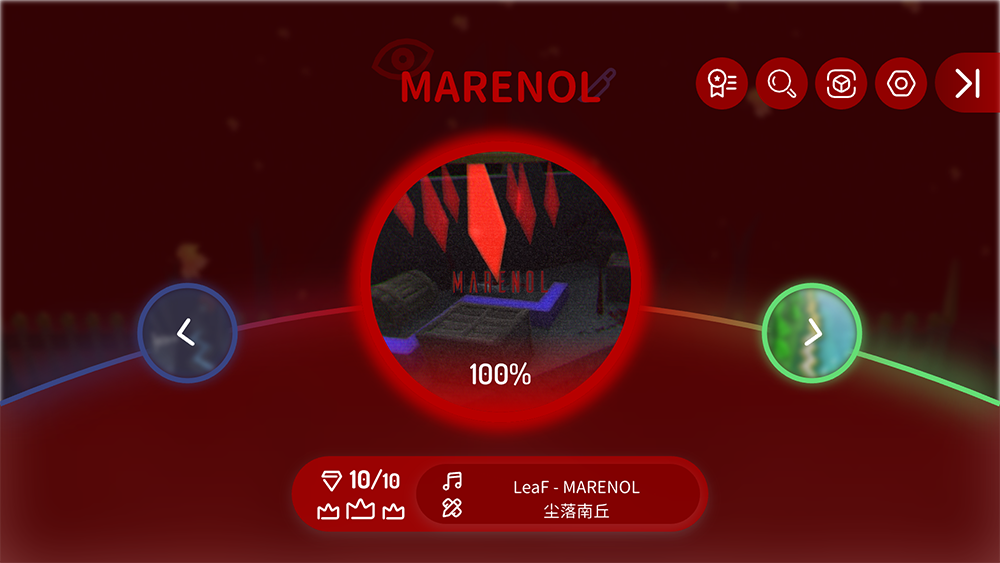
<body>
    
        <i>
            ^The fifth design of level menu
        </i>
    
</body>

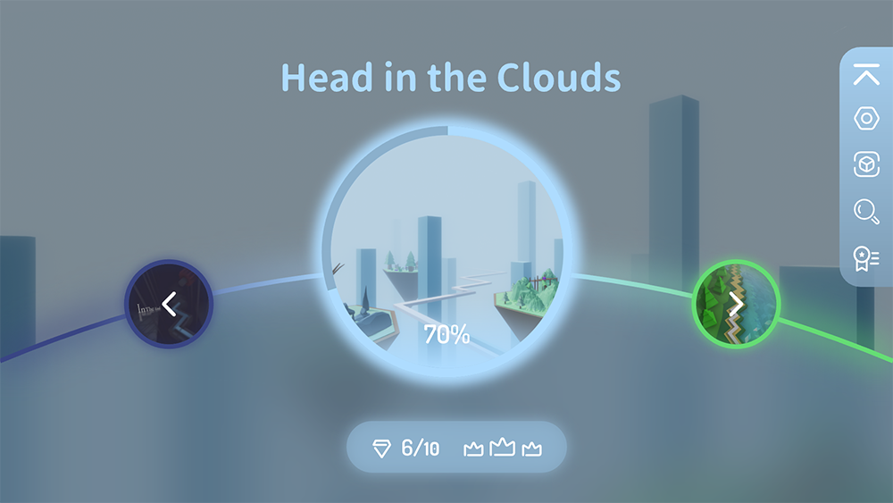
<body>
    
        <i>
            ^The sixth design of level menu
        </i>
    
</body>

<body>
    
        <i>
            ^The first design of Coming Soon ("尽情" was a typo)
        </i>
    
</body>

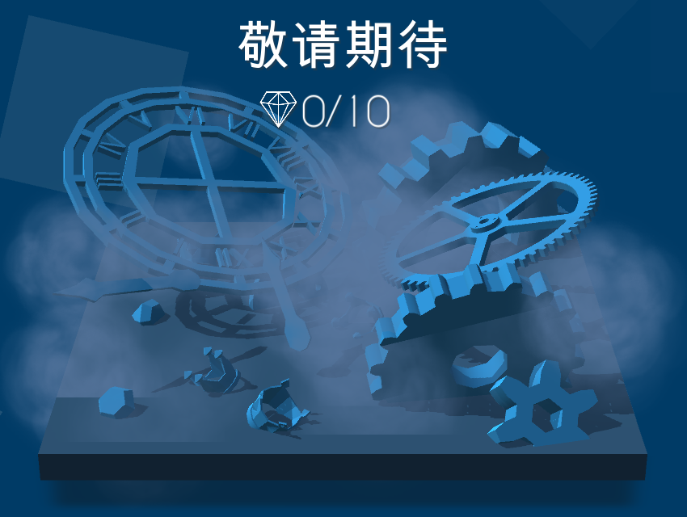
<body>
    
        <i>
            ^The second design of Coming Soon
        </i>
    
</body>

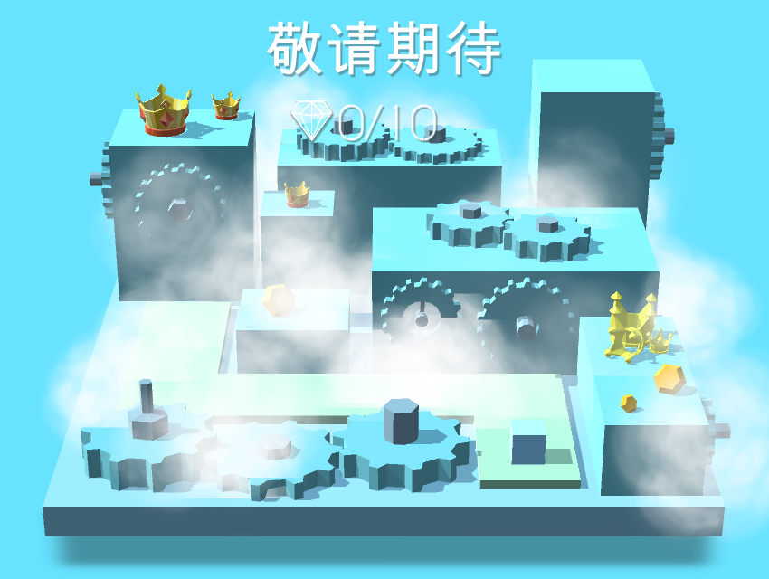
<body>
    
        <i>
            ^The third design of Coming Soon
        </i>
    
</body>

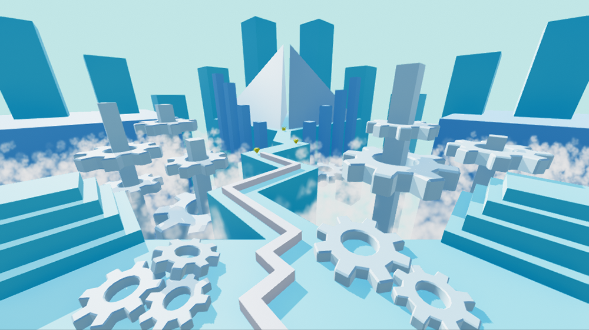
<body>
    
        <i>
            ^The original design of Coming Soon background
        </i>
    
</body>

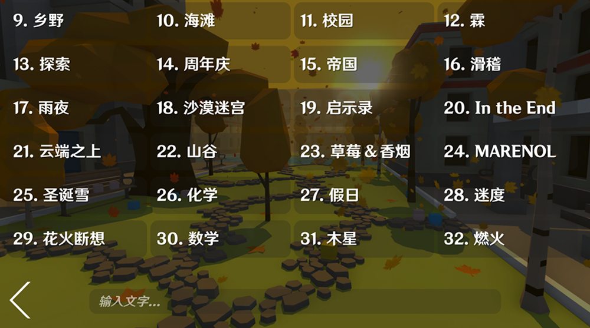
<body>
    
        <i>
            ^The first design of search page
        </i>
    
</body>

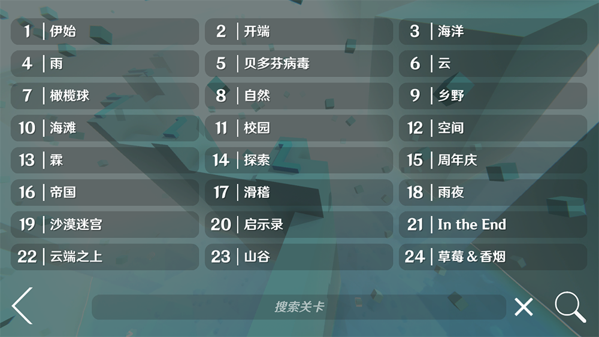
<body>
    
        <i>
            ^The second design of search page
        </i>
    
</body>

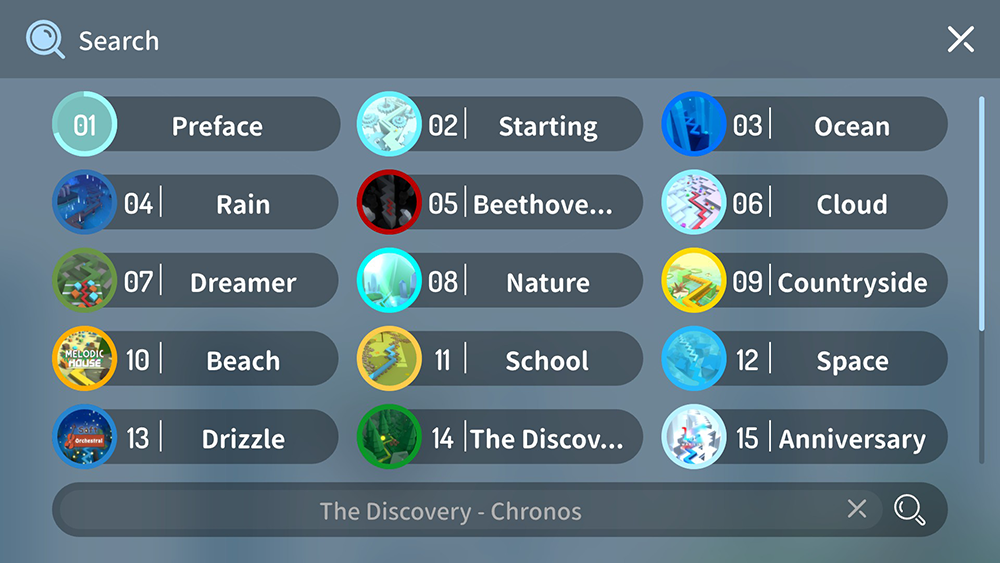
<body>
    
        <i>
            ^The third design of search page
        </i>
    
</body>

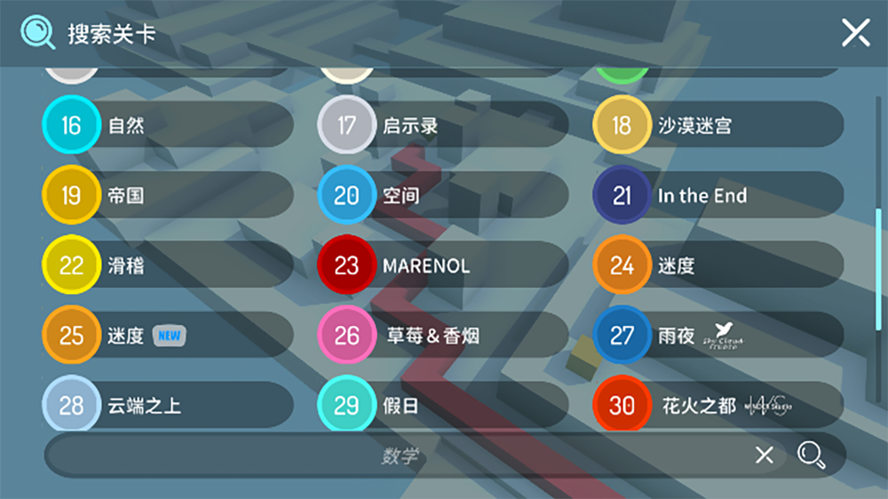
<body>
    
        <i>
            ^The forth design of search page
        </i>
    
</body>