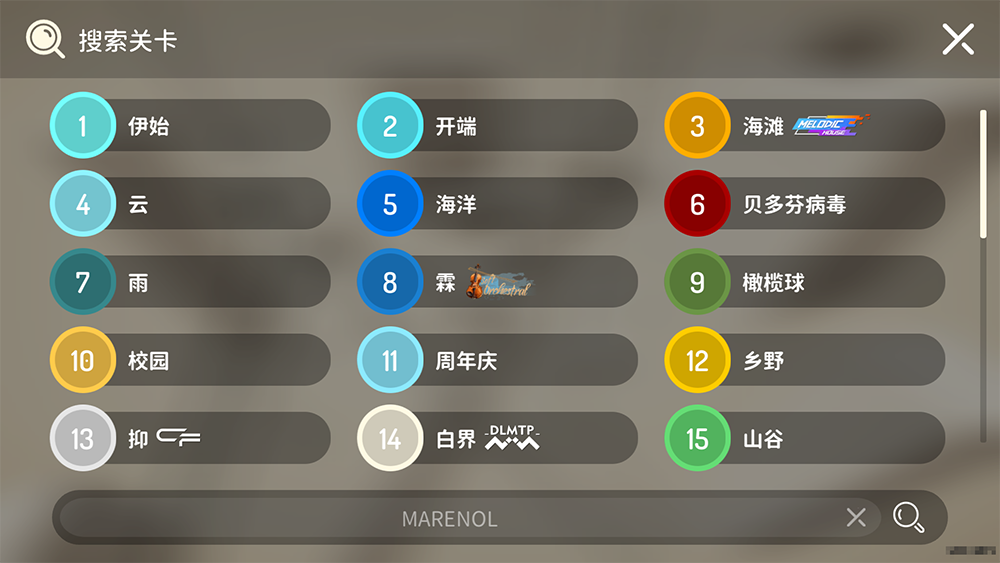
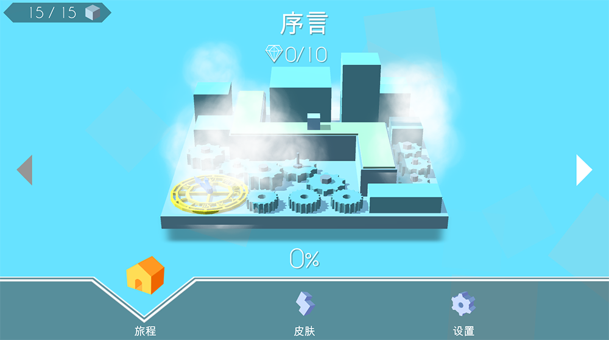
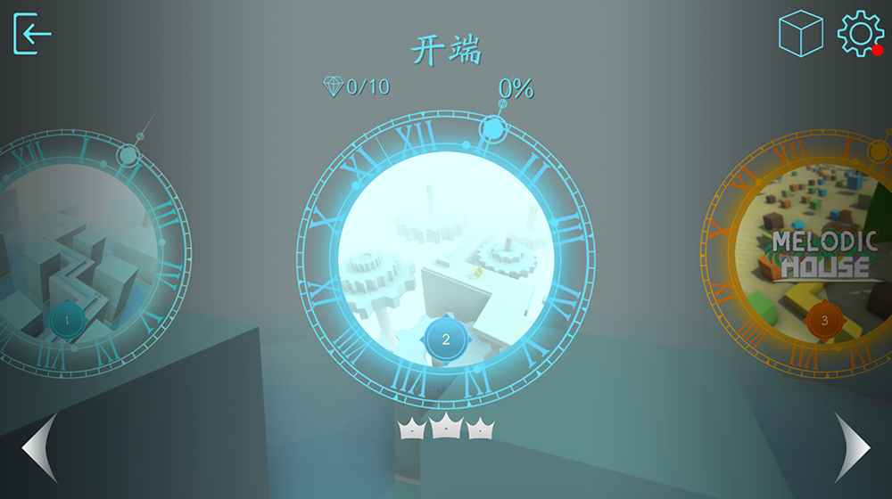
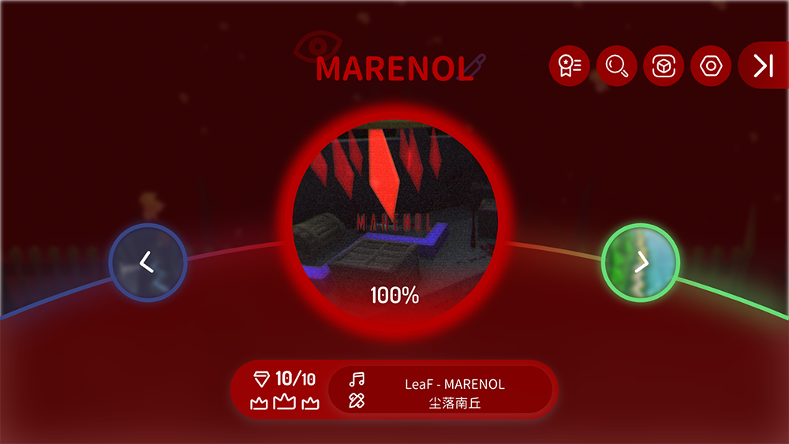
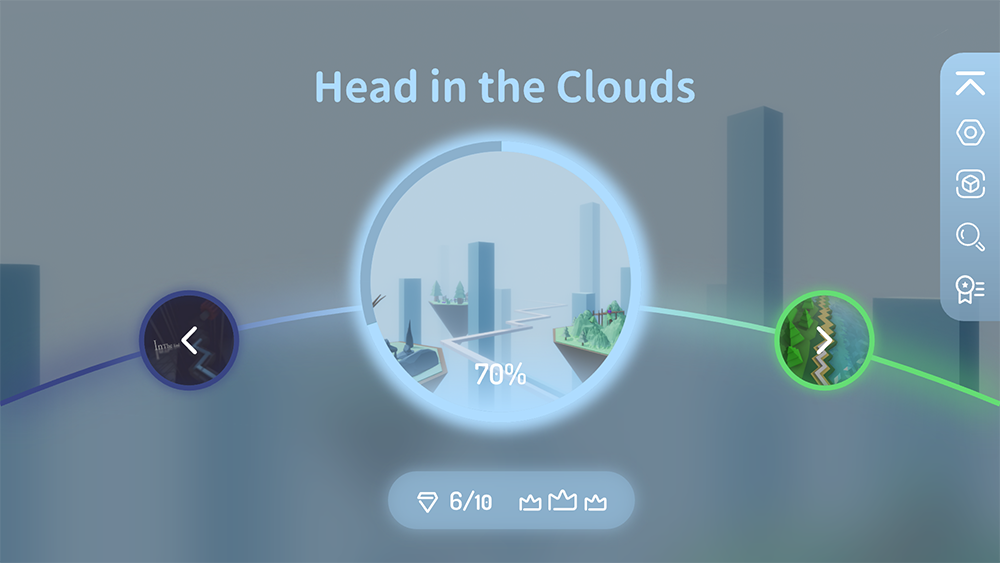
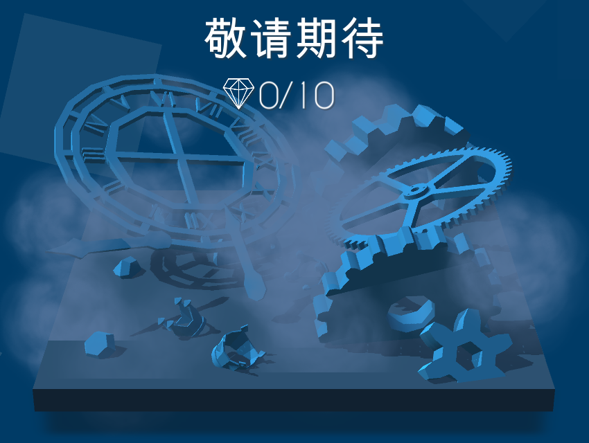
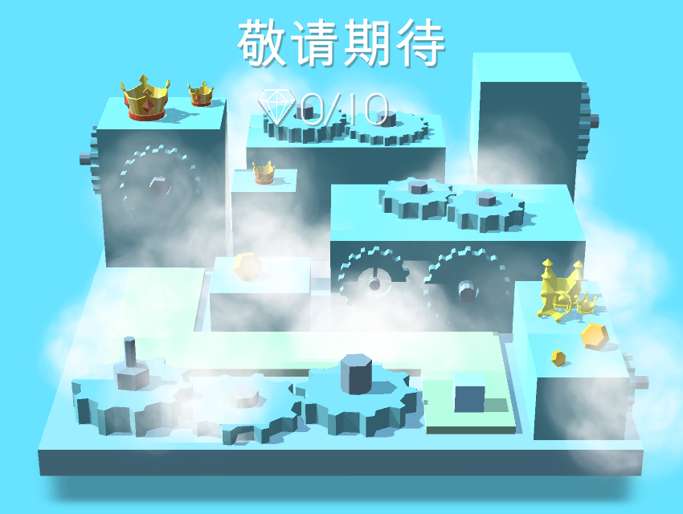
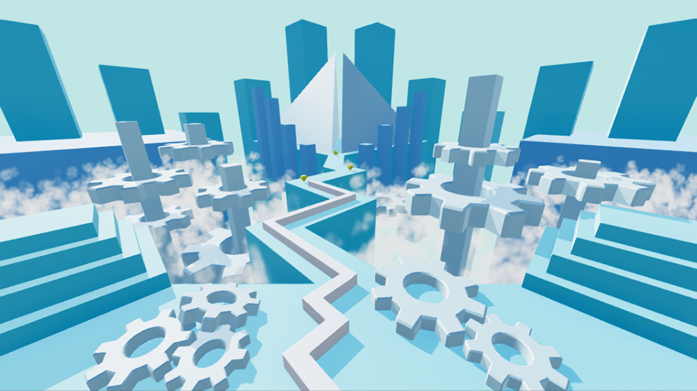

# MaxLine - 关卡
*****

<body>
    
        <i>
            ^游戏中的关卡菜单
        </i>
    
</body>

## 关卡列表
>按英文名称首字母排序
### 可玩关卡
|         关卡名称         |                         使用音乐                         |                  关卡作者                  |
|:--------------------:|:----------------------------------------------------:|:--------------------------------------:|
|         周年庆          |      MAPLEX / 098765_ - MaxLine 1st Anniversary      | GP0108 lyckay Max冰焰 qqxqqx |
|         启示录          |               Peter Roe - Last Reunion               |            Max冰焰 qqxqqx            |
| 海滩 \[Melodic House]  |                羽焰辰星 - Summer Prologue                |            qqxqqx Max冰焰            |
|        贝多芬病毒         |           Diana Boncheva - Beethoven Virus           |            qqxqqx Max冰焰            |
|         焦糖星          |                     warma - 焦糖星                      |          塩_ Hatcat 牛奶          |
|       焦糖星·九周年        |                     warma - 焦糖星                      |   塩_ Hatcat 牛奶 SrY-ABYSS   |
|          化学          |               Li Ga Yb - The Chemistry               |                Li Ga Yb                |
|         圣诞雪          |             Chronos - The Christmas Snow             |              Munity Twin               |
|          云           |                       猎豹游戏 - 云                       |                 lyckay                 |
|          乡野          |                麦金 - 田野 \[Disco Remix]                |                 Max冰焰                  |
|         沙漠迷宫         |               零燚01 - 迷宫 \[零燚01 Remix]                |                 qqxqqx                 |
|         橄榄球          |                Black Violin - Dreamer                |            qqxqqx Max冰焰            |
| 霖 \[Soft Orchestral] |              初云CLoudie - The Rain Remix              |                  华华猪                   |
|          帝国          |        Two Steps From Hell - Empire Of Angels        |          Mandroid GP0108           |
|          燃火          |       Falcom Sound Team jdk - To be continued!       |                 lyckay                 |
|         花火之都         |                      灰澈 - 花火断想                       |                STAR_EVE                |
|         美食派对         |               Tobu - Candyland pt. II                |     Suga Jahsin 华华猪 GP0108     |
|          抑           |                    theo5970 - 용서                     |     Mafnero FIRE CLOUD STUDIO      |
|         云端之上         |              Luke Richards - Tall Tales              |               寒鹰丶SHADOW                |
|          假日          |               千坂 / Cyan Lpegd - Moment               |                 lyckay                 |
|          迷度          |              House Rulez - 37th Avenue               |                CIAD233                 |
|       迷度 \[新]        |              House Rulez - 37th Avenue               |          CIAD233   Max冰焰           |
|          滑稽          |                     MöSS - 23:33                     |           Lusaslan Max冰焰           |
|      In the End      |             Tommee Profitt - In the End              |         raw_chicken Max冰焰          |
|  木星 \[Trance Remix]  |                Li Ga Yb - The Jupiter                |                Li Ga Yb                |
|       MARENOL        |                    LeaF - MARENOL                    |                  尘落南丘                  |
|          数学          |                Li Ga Yb - Mathematics                |           Li Ga Yb Max冰焰           |
|          自然          |         Alfaiate Franz - O Filtro dos Sonhos         |                 Max冰焰                  |
|          海洋          |                  羽焰辰星 - Ocean Remix                  |            Max冰焰 qqxqqx            |
|          伊始          |                    羽焰辰星 - Utopia                     |                 Max冰焰                  |
|          雨           |                  Brian Crain - rain                  |                 Max冰焰                  |
|          雨夜          |                      四季音色 - 雨夜                       |               Pumpkin_Z                |
|          校园          |                   RADWIMPS - かたわれ时                   |                 lyckay                 |
|          空间          | Yann Tiersen - Comptine D'un Autre Été, L'après-Midi |                 Max冰焰                  |
|          开端          |                   羽焰辰星 - Prologue                    |                 Max冰焰                  |
|        草莓&香烟         |   Yutin - Strawberries & Cigarettes \[Yutin Remix]   |            qqxqqx 巴拉巴j             |
|          探索          | Chronos - The Discovery \[VIP Mix feat. Max Studio]  |            Max余焰 Max冰焰             |
|          山谷          |                MisterPan - The Valley                |               MisterPan                |
|          白界          |             ¿Téo? - Ascended Vibrations              |                 CXY-辰                  |

### 不可玩关卡
|         关卡名称         |                       使用音乐                       |
|:--------------------:|:------------------------------------------------:|
|         敬请期待         |                羽焰辰星 - Coming Soon                |

## 搜索
在MaxLine中，玩家可使用搜索快速寻找关卡

搜索功能于v1.3.5加入游戏。加入游戏的目的是为了方便玩家在逐渐增多的关卡中能够快速寻找自己想游玩的关卡，而不会在寻找关卡上浪费过多时间

<body>
    
        <i>
            ^游戏中的搜索页面
        </i>
    
</body>

## 你知道吗
* 在v1.1.5以前，开端名为序言，并且是游戏中的第一个关卡。伊始于v1.1.5加入游戏，并取代了序言的位置。从此之后序言改名为开端，并成为游戏中的第二个关卡
* 开端曾经并不像现在这样简单。开端曾经历多次削弱，并逐渐成为现在的样子
* 在海洋设计早期，曾计划线在50%之后消失，并变成一颗球，以致敬《跳舞的球》。此计划后被放弃
* 雨加入游戏的初衷是取代探索，尽管该关卡在后续的版本中重新上架
* 校园的关卡作者lyckay曾写了一首小诗怀念校园生活，该关卡和这首诗的内容相关
* 尽管有很多人认为空间和混沌很像，但在Max冰焰制作该关卡时并没有参考混沌
* 官方收录的[空间](https://www.bilibili.com/video/BV1Ex4y117sm)并不由Max冰焰制作，而是由枫炎根据原版关卡制作
* 霖的音乐是曲师初云CLoudie在MaxLine一周年时为给MaxLine庆祝生日而创作的。后被华华猪采用并制作出该关卡
* 探索曾因Max余焰和Max冰焰间的矛盾而下架
* 探索30%至40%的场景其实参考了spspste的[旅程](https://www.bilibili.com/video/BV18x411Z7ZB)。此处曾有随音乐节奏上升的方块，但在后续版本中被移除。
* 新探索的音乐是Hatcat根据曲师ChronosAeon发布的两种版本的探索而重新混曲得来的
* 周年庆20%的场景被多数玩家认为是代表伊始，但其实此处代表的是MaxLine在早期制作关卡时的场景
* 在早期设计中，周年庆70%至80%包含了探索等多个场景，后被更改为仅包含探索场景
* 周年庆80%至90%的场景其实参考了Sky Cloud Story的[烛光之恋](https://www.bilibili.com/video/BV1Zi4y1K7az)
* 滑稽的英文名称最早为“The Funny”。在关卡重制时，曾计划更改为“Jocularity”，后被放弃，并决定直接使用“Huaji”作为英文名称
* 在[启示录](https://www.bilibili.com/video/BV1uv411678R)设计早期，80%之后的场景和现在并不一样，现在的场景是Max冰焰重做后的结果
* 启示录80%之后的场景变换最初计划使用图片实现，但因效果不佳而被更改为现在的样子
* 在启示录结尾处，房屋前的三个墓碑分别代表了主人公逝去的妻子和两个孩子。主人公的妻子和两个孩子均在80%之后的场景变换中出现。~~表达了作者的悲伤之情~~
* 在[In the End](https://www.bilibili.com/video/BV1qN41197MR)设计早期，60%至90%的场景和现在并不一样，现在的场景是Max冰焰根据raw_chicken的口述重做后的结果
* 草莓&香烟中原本存在一条彩蛋路线，但此路线在关卡发布时被取消
* MARENOL在关卡发布时名为“MARENOL - LeaF”，后被改为“MARENOL”
* 数学的原版关卡中存在一条彩蛋路线，但此路线在关卡重制时被取消
* 在游戏制作早期，敬请期待的模型曾被多次修改

## 画廊

<body>
    
        <i>
            ^关卡菜单的第一种设计
        </i>
    
</body>

<body>
    
        <i>
            ^关卡菜单的第二种设计
        </i>
    
</body>

<body>
    
        <i>
            ^关卡菜单的第三种设计
        </i>
    
</body>

<body>
    
        <i>
            ^关卡菜单的第四种设计
        </i>
    
</body>

<body>
    
        <i>
            ^关卡菜单的第五种设计
        </i>
    
</body>

<body>
    
        <i>
            ^关卡菜单的第六种设计
        </i>
    
</body>

<body>
    
        <i>
            ^敬请期待的第一种设计（图中“尽情”为“敬请”的误拼）
        </i>
    
</body>

<body>
    
        <i>
            ^敬请期待的第二种设计
        </i>
    
</body>

<body>
    
        <i>
            ^敬请期待的第三种设计
        </i>
    
</body>

<body>
    
        <i>
            ^敬请期待背景的初版设计
        </i>
    
</body>

<body>
    
        <i>
            ^搜索页面的第一种设计
        </i>
    
</body>

<body>
    
        <i>
            ^搜索页面的第二种设计
        </i>
    
</body>

<body>
    
        <i>
            ^搜索页面的第三种设计
        </i>
    
</body>

<body>
    
        <i>
            ^搜索页面的第四种设计
        </i>
    
</body>