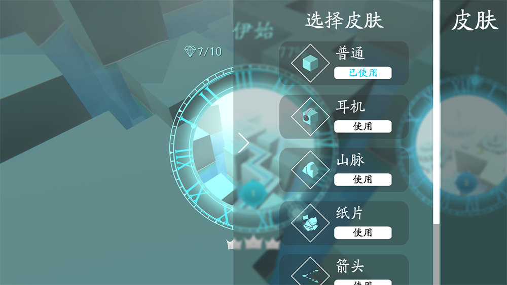

# MaxLine - Skins
*****

<body>
    
        <i>
            ^Skin page in game
        </i>
    
</body>

## Skin list
|    Name    |                 Version                  |
|:----------:|:----------------------------------------:|
|   Normal   |                  v1.0.0                  |
| Headphone  |                  v1.1.2                  |
|   Paper    |                  v1.1.2                  |
| Mountains  |                  v1.1.2                  |
|   Arrow    |                  v1.1.2                  |
|    Zeus    | v1.1.2 (Not available before v1.1.4) |
|   Chaos    |                  v1.3.2                  |
|   Snake    |                  v1.3.2                  |
| Stalagmite |                  v1.4.0                  |
|   Module   |                  v1.4.0                  |

## Trivia
* Zeus was added in v1.1.2, but it was not available before v1.1.4
* The game producer used to consider adding Flying Nimbus, Magic Witch, etc. But it was cancelled due to some reasons

## Gallery

<body>
    
        <i>
            ^The first design of skin page (Zeus was not available)
        </i>
    
</body>

<body>
    
        <i>
            ^The second design of skin page
        </i>
    
</body>

<body>
    
        <i>
            ^The third design of skin page
        </i>
    
</body>