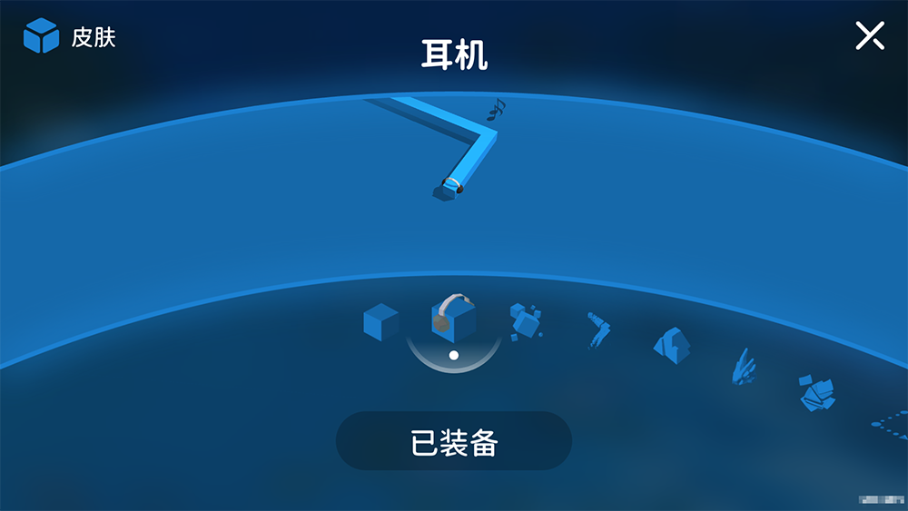
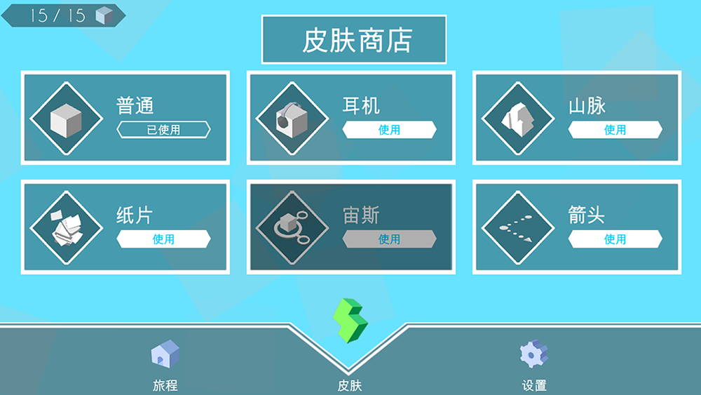

# MaxLine - 皮肤
*****

<body>
    
        <i>
            ^游戏中的皮肤页面
        </i>
    
</body>

## 皮肤列表
| 皮肤名称 |         更新版本          |
|:----:|:---------------------:|
|  普通  |        v1.0.0         |
|  耳机  |        v1.1.2         |
|  纸片  |        v1.1.2         |
|  山脉  |        v1.1.2         |
|  箭头  |        v1.1.2         |
|  宙斯  | v1.1.2 v1.1.4开放使用 |
|  混沌  |        v1.3.2         |
|  蛇   |        v1.3.2         |
|  石笋  |        v1.4.0         |
| 太空舱  |        v1.4.0         |

## 你知道吗
* 宙斯皮肤于v1.1.2加入游戏，但在v1.1.4才开放使用
* 游戏制作者曾经还考虑过加入筋斗云、魔力女巫等皮肤，但因为某些原因被取消了

## 画廊

<body>
    
        <i>
            ^皮肤页面的第一种设计（宙斯尚不可用）
        </i>
    
</body>

<body>
    
        <i>
            ^皮肤页面的第二种设计
        </i>
    
</body>

<body>
    
        <i>
            ^皮肤页面的第三种设计
        </i>
    
</body>