# MIF's DLFM Template V4.7.2 User Manual
*****
* **This page will introduce how to use the template. This page does not explain the basic operations 
of Unity. If you encounter any problems, please query and solve them yourself. This tutorial is 
applicable to the latest version of the template.**
* **To fully understand this tutorial, you need to master some basic Unity operations. If you are not 
familiar with the basic operations of Unity, it is recommended that you read this tutorial after you 
are familiar with them.**
*****

## 1. How to enter the preset scene
After opening the template, you will not be able to enter the preset scene directly. You need to go 
to the ```Assets/#Template/[Scenes]``` path to find the ```Scene``` scene file and double-click it 
to enter the preset scene.


## 2. Introduction to preset scene objects
### Object structure


* LevelHolder: The highest level parent object in the level, all objects are its children
* \- Objects: Contains the basic elements of the level, such as light, camera and line
* \-- Directional Light: The most basic light source in the level
* \-- CameraRoot: Control the camera to follow the line
* \--- Rotator: Control camera rotation
* \---- Scale: Control camera zoom
* \----- Camera: The camera
* \-- Player: The line
* \- Scene: All scenes in the level are placed under this object
* \-- Ground: The ground

**Note: Unless there is a special requirement, other objects except the ground cannot be deleted at will.**

### Special notes
On the **Scene** object, there are already placed **Playable Director** and **Time Scale**.

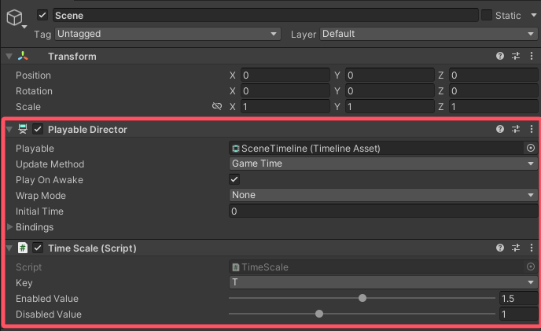

#### Playable Director
This is the timeline of the scene.

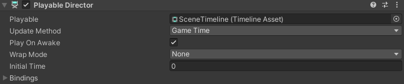

#### Time Scale
Used to change the play speed.


* Key: key to enable and disable speed play
* Enabled Value: Speed up. Default is 1.5, minimum is 0, maximum is 3
* Disabled Value: Initial speed. Default is 1, minimum is 0, maximum is 3

**Note: This code is only available in the editor.**

## 3. Introduction to prefabricated objects
### In ```Assets/#Template```


* \[Animators]: Folder for storing frame animations
* \[Materials]: Folder for storing materials
* \[Meshes]: Folder for storing meshes
* \[Music]: Folder for storing music
* \[Scenes]: Folder for storing scenes
* \[Textures]: Folder for storing textures
* \[Timelines]: Folder for storing timelines
* Checkpoint: The checkpoint
* FakePlayer: The fake line
* Gem: The gem
* Ground: The ground
* Obstacle: The obstacle
* Percentage: The percentage
* Pyramid: The pyramid
* TrailPredictor: The fall and jump trajectory predictor
* Trigger: The trigger

### In ```Assets/Resources/Prefabs```


* Dust: Line landing particle effect
* FakeTail: Fake line body
* GetGem: Gem collected particle effect
* Guideline: The guideline
* GuidelineTap: Guideline click box
* GuidelineTapEffect: Guideline triggered effect object
* LevelUI: Level UI
* LoadingUI: Loading UI
* PreviewCameraHolder: Preview object of following camera
* Remain: Line death effect object
* StartUI: UI before the level starts
* Tail: Real line body

**Note: The above objects cannot be deleted at will. 
When importing music, creating materials or frame animations, etc., 
it is recommended to put them in the corresponding folders.**

*****
## 4. Initial level settings
Before you start making a level, you need to set some basic information of the level. 
The level information file is ```SceneData``` under ```Assets/#Template/[Scenes]```.


* Level Title: Level name
* Sound Track: Level music
* Speed: Line speed. Default is 12
* Block Limit: The total number of gems. Default is 10
* Time Scale: Time speed. Default is 1
* Gravity: Scene gravity. Default is -9.3
* Colors: Material color preset. If there is a material color change in the level, you need to 
set the initial color of the material here. **Material** is the material that needs to be 
initialized, **Color** is the normal color, **Emission Color** is the emitting color

After setting the basic level information, you need to select the set level information file in **Level Data** of the code on **Player**.


Level information files can also be created by ```right-clicking the project window → Create → Dancing Line Fanmade → Level Data```.

## 5. Getting to know the line and follow camera
### The line
#### Panel Data


* Level Data: Level information file
* Scene Camera: The camera
* Scene Light: Directional light
* Character Material: The material used for the line
* Start Position: Initial position of the line
* First Direction: First direction of line
* Second Direction: Second direction of line
* Pool Size: Upper limit of the line body object pool
* Played Animators: The frame animation to start when the line starts moving
* Played Timelines: The timeline to start when the line starts moving
* Allow Turn: Whether it is allowed to turn by clicking
* No Death: Whether to enable line non-death
* Draw Direction: When checking, arrows in four directions of 0, 90, 180, and 270 will be drawn at the position of the line
* Video Quality Level: The default image quality level. The value represents the image quality. 
If you want to apply the nth image quality, the value to be filled in here is n-1, and other values 
are the lowest quality
* Anti Aliasing Level: Default anti-aliasing level. 0 is disabled, 1 is 2X MSAA, 2 is 4X MSAA, 3 is 8X MSAA, other values are disabled
* Shadow: Whether to enable shadow by default

When you start playing, the line will automatically move to the initial position, that is, **Start 
Position**. If you need to change the initial position of the line, you can manually modify the 
value of **Start Position**, or click the **Get Start Position** button on the panel to automatically 
get the position.

#### Shortcut keys
Shortcut keys can be used when playing scenes.

* R: Reload the current level immediately
* C: Output the current music time in the console
* K: Kill the line immediately

**Note: Shortcut keys are only available in the editor. C and K are only available after the line starts moving.**

#### Events
Events are invoked only under certain conditions and can be used to achieve specific effects. The event controller script is also on the line.


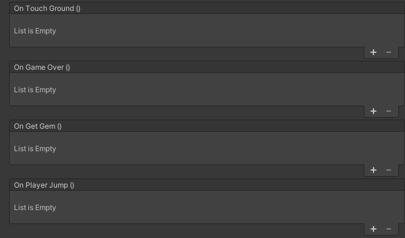

* On Game Awake (): Invoked when the scene is played
* On Player Start (): Invoked when the line starts moving
* On Change Direction (): Invoked when the line turns
* On Leave Ground (): Invoked when the line leaves the ground
* On Touch Ground (): Invoked when the line lands on the ground
* On Game Over (): Invoked when the line dies
* On Get Gem (): Invoked when the line gets gem
* On Player Jump (): Invoked when the line jumps

### The follow camera


* Target: The target object to follow. That is, the line
* Rotator: Camera rotation controller object
* Scale: Camera zoom control object
* Default Offset: Initial camera offset
* Default Rotation: Initial camera rotation
* Default Scale: Initial camera zoom
* Follow: Whether to enable follow
* Smooth: Whether to enable smooth follow

When start playing, the camera's offset, rotation, and zoom will be changed to **Default Offset** , 
**Default Rotation** , and **Default Scale** . Therefore, you need to set these three data in advance.

## 6. Use of guideline
### Placing guideline
#### Method 1: Import osu! score to generate
First, export the music chart you made from osu!, change the suffix of the exported .osz file to .zip, 
then decompress it and get the .osu file. Then change the suffix of the .osu file to .txt and import 
it into the project.

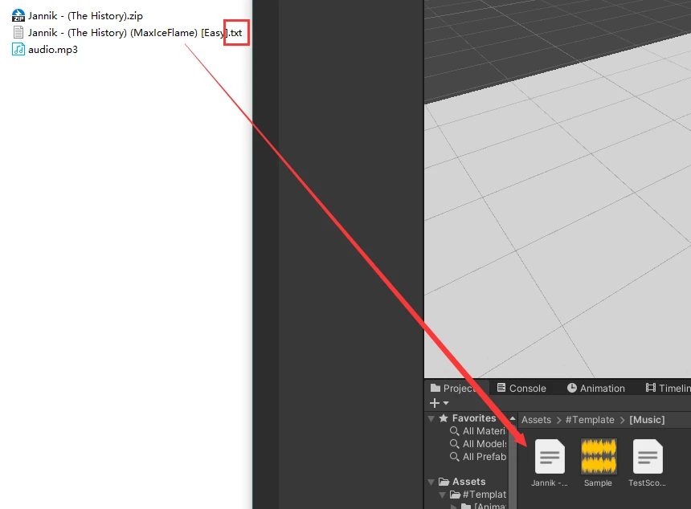

After successfully importing, drag it into the **Score** of the **Score Reader** located on the **LevelHolder**.


After that, click the **Create Guideline Taps By Score** button to generate the guideline. There may be errors in the 
actual generation, which can be solved by modifying the Offset parameter.

If the score data is changed, you can click **Reload Hit Time** to reload it.

#### Method 2: Manually place guideline
Add the code **Guideline Tap Generator** to any object in the scene, play the scene, and the guideline will be 
generated when you click. After completion, copy the parent object of the guideline, end the play, and paste it again.

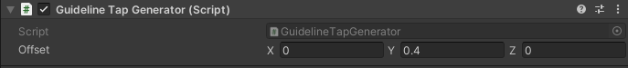

**Note: After placing, the code needs to be disabled or removed.**

### Enable guideline
After placing is completed, in the **Box Holder** of the **Guideline Manager** on the **LevelHolder**, select the parent 
object of the guideline.


After selecting, start playing, and you will see a button to enable guideline on the left side of the screen. Click to 
enable guideline.


### Enable Autoplay
On the **Guideline Manager**, check **Autoplay** to enable autoplay.


**Note: When autoplay is enabled, the line will not be able to turn by clicking. And the guideline will not be triggered.**

### Use of other parameters


* Colors: Guideline color presets. You can add new color presets
* Line Gap: The distance between the line and the frame. The default value is 0.2, which can be modified as needed.
* Autoplay Trigger Size: The trigger size of the autoplay. If the guide wireframe is too dense and cannot work properly, 
you can adjust it down appropriately


There is a **Guideline Tap** code on the guideline tap box object. The **Color Index** on the code is 
the color preset used for this guideline tap box, and the value represents the preset number. If you 
want to apply the nth preset color on the **Guideline Manager**, the value to be filled in here 
is n-1.

**Have Line** on the code indicates whether a line segment is generated between this and the next guideline 
tap box. If checked, it will be generated, otherwise it will not be generated.

**Note: Do not change other parameters in the code at will.**

## 7. Path Generation
### Method 1: Generate path based on guideline
After setting the guideline, you can generate the path under **Road Generator Setting** in **Guideline Manager.**


* Road Prefab: Path object
* Width: Path width
* Offset: Path offset

After setting the above three data, click **Create Road By Guideline Taps** to generate the path.

### Method 2: Manually generate the path
Add the code **Road Generator** to any object in the scene, play the scene, and you can generate a path following the 
line. After completion, copy the parent object of the path, end the play, and paste it again.


* Road Prefab: Path object
* Road Width: Path width
* Road Height: Path height

**Note: After generating, the code needs to be disabled or removed.**

## 8. Use of debugging function
The template provides debugging functionality. Debugging functionality is only available in the editor.

### Path highlighting and click time display
This code is located in **LevelHolder** . This function relies on the guideline.


* Controller: Guideline manager
* Max Distance: The maximum visible distance of the path highlight and time display
* Trail Color: Path highlight color
* Trail Offset: Path highlight offset
* Render Trail: Whether to enable path highlighting
* Render Time: Whether to enable the display of click count and click time

If the data related to the guideline is changed, you can click **Reload Trail Data** to reload it.


### Information display
This code is located in **LevelHolder**.


* Display: Whether to display debugging information
* Key: Button for showing and closing debug information
* Size: Debug information font size
* Space: The distance between two lines of debug information
* Font: Debug information font
* Rect: Debug information location
* Information: Display debugging information. You can add or reduce it by yourself


The debugging information supported by the current version of the template is as follows:

|             Name              |               Content               |           Name           |             Content             |
|:-----------------------------:|:-----------------------------------:|:------------------------:|:-------------------------------:|
|          Game State           |             Game status             |         Progress         |            Progress             |
|          Audio Time           |             Music time              |   Audio Time Formatted   |        Format music time        |
|        Player Position        |            Line location            |  Player Local Position   |    Relative position of line    |
|        Player Rotation        |        Rotation of the line         |  Player Local Rotation   |  Relative rotation of the line  |
|         Player Speed          |             Line speed              |       Block Count        |       Number of got gems        |
|       Checkpoint Count        |   Number of activated checkpoints   |         Gravity          |             Gravity             |
|    Camera Follower Offset     |        Follow camera offset         | Camera Follower Rotation |     Follow camera rotation      |
| Camera Follower Real Rotation |     Follow camera real rotation     |  Camera Follower Scale   |       Follow camera zoom        |
|        Camera Position        |           Camera position           |  Camera Local Position   |    Camera relative position     |
|        Camera Rotation        |           Camera rotation           |  Camera Local Rotation   | Relative rotation of the camera |
|          Camera Fov           |        Camera field of view         |         Fog Mode         |            Fog mode             |
|           Fog Start           |         Fog start distance          |         Fog End          |     Maximum distance of fog     |
|          Fog Density          |             Fog density             |      Light Rotation      |   Directional light rotation    |
|     Light Local Rotation      | Directional light relative rotation |     Light Intensity      |   Directional light intensity   |
|     Light Shadow Strength     | Directional light shadow intensity  |  Ambient Lighting Type   |       Ambient light type        |
|       Ambient Intensity       |       Ambient light intensity       |      Video Quality       |          Quality level          |
|         Anti Aliasing         |         Anti-aliasing level         |          Shadow          |          Shadow state           |

### Line falling and jump trajectory prediction
The drop and jump trajectory predictor, that is, **TrailPredictor**, can be used by dragging it out from the Project 
window. When using it, place it at the position where the line drops or takes off, adjust the relevant 
data, and you can use it.


* Line Renderer: Track drawing component
* Player Speed: Line speed
* Force: Jump strength. 0 means falling
* Distance: Draw distance
* Accuracy: Drawing precision. The larger the value, the fewer the segments

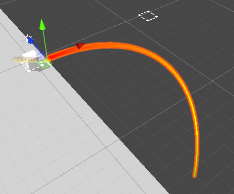

**Note: It is recommended to delete it after it is no longer used to avoid other problems later.**

## 9. Gem, checkpoint and pyramid
### Gem
Gem, or **Gem**, can be used by dragging them from the Project window. When using them, place them 
on the path that the line passes through.


The following settings can be changed on the gem code panel:


* Gem Mesh: Gem model
* Effect Path: The path where the gem gets the effect. This path is under ```Assets/Resources```
* Fake: Is it a fake gem? If checked, the line cannot be obtained

### Checkpoint
Checkpoint, or **Checkpoint**, can be used by dragging them out from the Project window. When using 
them, place them on the path that the line passes through.

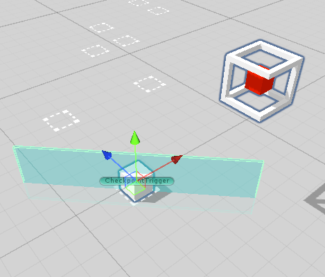

When placing a checkpoint, the checkpoint trigger, resurrection location, and the position of the checkpoint marker 
object can be changed at will.


* RevivePosition: Resurrection position
* Rotator: Checkpoint marking object
* CheckpointTrigger: Checkpoint trigger

The following settings can be changed on the checkpoint code panel:


* Direction: The direction of the line after it is revived. Same as **First Direction** and **Second Direction** on the line code panel
* Soundtrack Time: Audio time
* Offset: Camera offset
* Rotation: Camera rotation
* Scale: Camera zoom
* Fov: Camera field of view
* Follow: Whether the camera follows the line
* Use Fog: Whether to enable fog
* Fog Color: Fog color
* Start: Fog start distance
* End: Maximum distance of fog
* Rotation: Directional light rotation
* Color: Directional light color
* Intensity: Directional light Intensity
* Shadow Strength: Directional light shadow intensity
* Lighting Type: Ambient light type
* Material Colors Auto: Automatically record the color of the material. You need to manually add the material you want to record
* Material Colors Manual: Manually recorded color materials
* Image Colors Auto: Automatically record the color of the image. You need to manually add the image you want to record
* Image Colors Manual: Manually record the color of images
* On Revive (): Event. Invoked when resurrected

Except for **Direction** , **Material Colors Manual** and **Image Colors Manual** , the rest of the 
data will be automatically recorded when the checkpoint is activated. If you want to record manually 
or the automatic recording will cause some problems, you can check the manual recording.


### Pyramid
Pyramid, that is, **Pyramid**, can be used by dragging it from the Project window. When using it, place it at the end of the level.


The pyramid contains 4 triggers, each with the following functions:

* Trigger 1: Open the Pyramid
* Trigger 2: Stops the camera from following and prevents the line from turning by clicking. There is 
a **Change Direction** option on the code panel of this trigger. If it is checked, the line will turn 
to the specified direction when this trigger is touched. If it is not checked, the line will not turn


* Trigger 3: Start the countdown to the end of the level
* Trigger 4: Stops the line from moving

The countdown to the end of the level is located on the pyramid code panel. You can modify the time according to the actual situation.


The positions of the 4 triggers can be adjusted according to the actual situation of the level.

## 10. Use of trigger
Trigger, that is, **Trigger**, can be used by dragging it from the Project window. When using it, place it on the path where the line passes.


### Change trigger color
On the trigger panel there is the **Trigger Renderer** code, with the following settings available for change:


* Render Box: whether to display the trigger box
* Render Wire: whether to display the trigger border
* Box Color: the color of the trigger box
* Wire Color: the color of the trigger border

To change the trigger color, just modify **Box Color** and **Wire Color**

### Add code
Under the trigger panel, there is an **Add Component** button. Click it and search for the code you want to add, then click the target code to add it.


**Note: Other components on the trigger panel do not need to be modified.**

## 11. Use of camera code and production of time animation
### Using the camera code
#### Perspective change
Add the **Camera Trigger** code to the trigger and modify the settings on the code according to actual needs:

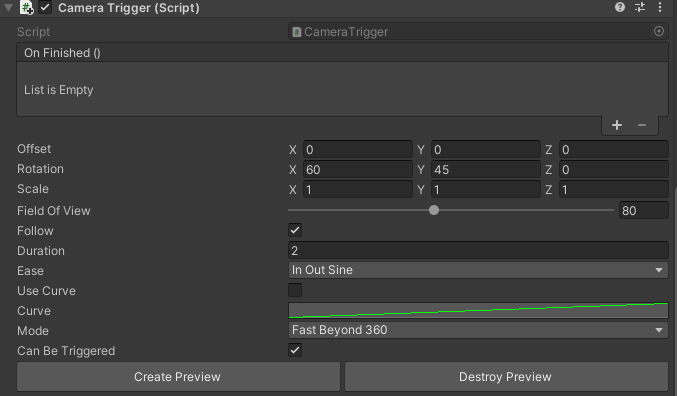

* On Finished (): Event. Invoked when the perspective transformation is completed
* Offset: New camera offset
* Rotation: New camera rotation
* Scale: New camera scale
* Field Of View: New camera field of view
* Follow: Whether to enable follow
* Duration: Time required for transformation
* Ease: Easing function used for transformation
* Use Curve: Whether to use animation curve (the easing function will no longer be used after checking)
* Curve: Animation curve
* Mode: Rotation mode
* Can Be Triggered: Whether to use triggers

This tag can be triggered by either a trigger or an event.

#### View transformation preview
Click **Create Preview** on the code panel to generate a preview at the trigger location. The preview angle will change as the settings on the code change.

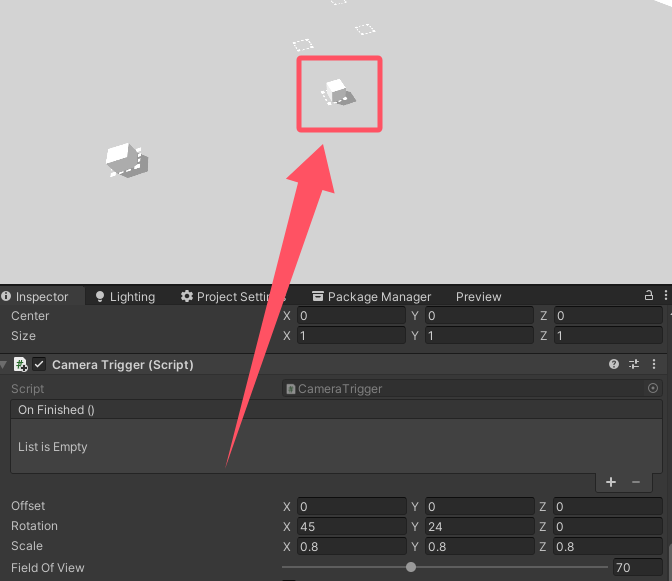

**Note: After the preview is finished, it is recommended to click Destroy Preview to delete it to avoid other problems later.**

#### Shake
Add the **Camera Shake Trigger** code to the trigger and modify the settings on the code according to actual needs:


* Power: Shake intensity
* Duration: Shake duration

### General rules for using time animation
#### Type 1
This type includes the object's translation, rotation and scaling time animation.

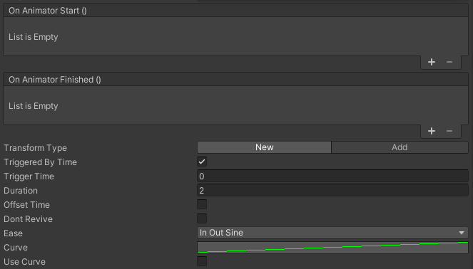

* On Animator Start (): Event. Invoked when the animation starts
* On Animator Finished (): Event. Invoked when the animation finishes
* Transform Type: Assignment type. New means assigning a new value, and Add means adding to the current value
* Triggered By Time: Whether to use time trigger
* Trigger Time: Waiting time to trigger the animation
* Duration: Animation duration
* Offset Time: Whether to enable time offset. If checked, the animation will start **Duration** seconds in advance
* Dont Revive: Whether to cancel and resume this animation
* Ease: Easing function used by the animation
* Curve: Animation curve
* Use Curve: Whether to use the animation curve (the easing function will no longer be used after checking)

This animation can be triggered by either time or event.

#### Type 2
This type includes fog, directional light, ambient light, material color and Image color time animation.


* On Animator Start (): Event. Invoked when the animation starts
* On Animator Finished (): Event. Invoked when the animation finishes
* Trigger Time: Waiting time to trigger the animation
* Duration: Duration of the animation
* Offset Time: Whether to enable time offset. If checked, the animation will start **Duration** seconds earlier
* Dont Revive: Whether to cancel and resume this animation
* Ease: Easing function used by the animation
* Curve: Animation curve
* Use Curve: Whether to use the animation curve (the easing function will no longer be used after checking)

### Object time animation
#### Displacement
To change the position of an object.

Add the **Local Pos Animator** code to the object that needs animation.


* Original Transform: The original position of the object
* Position: The target position of the object
* Get original position: Get the original position of the object
* Set as original position: Move the object to the original position
* Get new position: Get the target position of the object
* Set as new position: Move the object to the target position

When starting playback, the object's position will automatically change to **Original Transform**.

#### Rotation
Used to change the rotation of an object.

Add **Local Rot Animator** code to the object that needs animation.


* Original Transform: The initial rotation of the object
* Rotation: The target rotation of the object
* Rotate Mode: Rotation mode
* Get original rotation: Get the initial rotation of the object
* Set as original rotation: Rotate the object to the initial rotation

When starting playback, the rotation angle of the object will automatically change to **Original Transform**.

#### Zoom
Used to change the scale of an object.

Add **Local Scale Animator** code to the object that needs animation.


* Original Transform: Object initial scale
* Scale: Object target scale
* Get original scale: Get object initial scale
* Set as original scale: Scale the object to the initial scale
* Get new scale: Get object target scale
* Set as new scale: Scale the object to the target scale

When starting playback, the object's scale will automatically change to **Original Transform**.

### Fog time animation
Used to change fog related settings.

Add **Timer Fog** code to any object.


* Use Fog: Whether to enable fog
* Fog Color: Fog color
* Start: Fog start distance
* End: Fog maximum distance

### Directional light source time animation
Used to change directional light source related settings.

Add **Timer Light** code to any object.

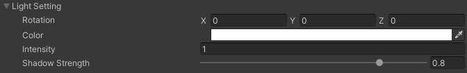

* Rotation: Directional light source rotation angle
* Color: Directional light source color
* Intensity: Directional light source intensity
* Shadow Strength: Directional light source shadow intensity

### Ambient light source time animation
Used to change ambient light source related settings.

Add **Timer Ambient** code to any object.


* Lighting Type: Ambient light source type

### Material color time animation
Used to change material color.

Add **Timer Material Color** code to any object.


* Material: Material whose color needs to be changed
* Color: Normal color
* Emission Color: Emission color

Click the plus sign in the upper right corner to add a material.

### Image color time animation
Used to change the image color.

Add **Timer Image Color** code to any object.


* Image: Image whose color needs to be changed
* Color: Target color

Click the plus sign in the upper right corner to add an image.

## 12. Use of trigger code
**Note: Unless otherwise specified, the following codes are triggered when the line touches the trigger**.

### Change Direction
Used to change the turning direction of the line and automatic click.

#### Change the turning direction of the line
When **Type** is **Direction**, the code function is to change the turning direction of the line. At this time, arrows 
in the four directions of 0, 90, 180, and 270 will be drawn at the trigger position.


* First Direction: New first direction
* Second Direction: New second direction
* Set Camera Coordinate: Whether to change the coordinate system of the following camera. If not checked, the camera may 
not be able to follow normally when the line turns in a new direction

#### Automatic click
When **Type** is **Turn**, the code function is to change the turning direction of the line.

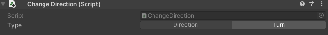

### Event Trigger
Used to call events.


* Invoke On Awake: Whether to call the event when starting the scene playback
* Invoke On Click: Whether to call the event when the line turns in the trigger. If not checked, the event is called when the line touches the trigger
* On Trigger Enter (): Event

### Gravity Trigger
Used to change the scene gravity.


* Gravity: New gravity

### Jump
Used to make the line jump.


* Power: Jump strength
* Change Direction: Whether to make the line change direction at the moment of jumping

### Kill Player
Used to achieve death by falling into water and exiting the map.


* Reason: cause of death. **Hit** means death by hitting a wall, **Drowned** means death by falling into water, **Border** means death by exiting the map

### Play Animator
Used to play frame animation.


* Animator: Frame animation to be played
* Dont Revive: Whether to cancel and restore this frame animation

Click the plus sign in the upper right corner to add frame animation.

### Play Audio Clip
Used to play audio.


* Clip: audio to be played
* Volume: playback volume
* Triggered By Trigger: whether it can be triggered by a trigger

This code can be triggered by a trigger or an event.

### Set Active
Used to turn objects on and off.


* Active On Awake: Whether to trigger when starting scene playback
* Target: Target object
* Active: Whether to turn on the object
* Dont Revive: Whether to cancel the restoration of this object

Click the plus sign in the upper right corner to add objects.

### Set Ambient
Used to change the settings related to the ambient light source. The usage is the same as **Timer Ambient**.

### Set Fog
Used to change the settings related to fog. The usage is the same as **Timer Fog**.

### Set Image Color
Used to change the image color. The usage is the same as **Timer Image Color**.

### Set Light
Used to change the settings related to the directional light source. The usage is the same as **Timer Light**.

### Set Material Color
Used to change the material color. The usage is the same as **Timer Material Color**.

### Speed
Used to change the speed of a line or fake line.


* Set Fake Player: Whether to change the speed of the fake line

* Player: Target fake line

* Speed: New speed

### Teleport
Used for teleportation line.


* Type: Teleport mode. **Target** indicates the position of the target object to be teleported to, **Position** indicates the position to be teleported to
* Target: Target object
* Position: Target position
* Force Camera Follow: Whether to force the camera to follow. If not checked, the camera will move smoothly to the position after the line is teleported
* Turn: Whether to turn the line immediately after the line is teleported. If checked, you can choose the direction of the turn


After setting the target object or target position, a red line will appear between the trigger and the target position, 
and a white cube frame and the name of the trigger that teleported the line to this place will appear at the target position.


## 13. Use of fake line
Fake lines, that is, **FakePlayer**, can be used by dragging them out from the Project window.

### Getting to know fake lines


* Speed: Fake line speed. Default is 12
* Character Material: Material used by fake lines
* Start Position: Initial position of fake lines
* First Direction: First direction of fake lines
* Second Direction: Second direction of fake lines
* Pool Size: Upper limit of fake line object pool
* Is Wall: Is it a wall? If checked, the real line will crash into the fake line body
* Draw Direction: After checking, arrows in the four directions of 0, 90, 180, and 270 will be drawn at the position of the fake line
* Create Turn Trigger: Whether to generate a turn trigger
* Synchronism With Player: Whether to synchronize the turn with the real line
* Create Key: Key to generate a turn trigger
* Trigger Rotation: Rotation angle of the turn trigger
* Trigger Scale: Scale of the turn trigger

When starting playback, the fake line will automatically move to the initial position, that is, 
**Start Position**. If you need to change the initial position of the fake line, you can manually 
modify the value of **Start Position**, or click the **Get Start Position** button on the panel to 
automatically obtain the position.

After the turn trigger is generated, copy the parent object of the turn trigger, end playback, and 
paste it.

When pressing **Create Key**, the fake line will turn and generate a turn trigger in place. 
If **Synchronism With Player** is checked, the fake line will turn when the real line turns, and a 
turn trigger will be generated in place. After **Synchronism With Player** is checked, you will no 
longer be able to turn the fake line and generate a turn trigger by pressing **Create Key**.

### Use fake lines
Add **Fake Player Trigger** code to the trigger and modify the settings on the code according to actual needs:


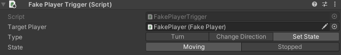

* Target Player: Target fake line
* Type: Trigger mode

#### When the trigger mode is Turn
Used to turn the fake line.

#### When the trigger mode is Change Direction
Used to change the direction of the fake line.

* First Direction: New first direction
* Second Direction: New second direction

#### When the trigger mode is Set State
Used to start and stop the movement of the fake line.

* State: new state. **Moving** will start the fake line moving, **Stopped** will stop the fake line moving

**Note: It is recommended to stop the movement of the fake line in time after the fake line leaves the camera's field of view.**

## 14. Others
### Use of percentage
Percentage, that is, **Percentage**, can be used by dragging it from the Project window.


There is **Percentage** code on the percentage panel:


* Percentage: The percentage to be displayed. Including from 10% to 90%
* Color: Percentage color

**Note: Other components on the percentage panel do not need to be modified.**

### Add new quality
You can add new quality under ```Project Settings→Quality```.


Click the **Add Quality Level** button to add a new quality.

After adding a new quality, modify **Name** of **Current Active Quality Level** to set the quality 
name. Scroll down and change other quality settings.

After setting the new quality, go to the ```StartUI``` prefab under ```Assets/Resources/Prefabs``` and 
find the **Controller** object in the Hierarchy window on the left.

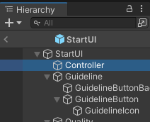

There is a **Set Game Quality** code on the panel of this object. Add the name of the new quality 
in **Quality Names**.


**Note: Do not change other settings in the code at will.**

After adding, exit the prefab editing interface, start playing, change the quality, and you can see 
the newly added quality.


### Material creation suggestions
When creating ordinary materials, use the ```Dancing Line Fanmade/Standard/Color``` Shader.

When creating transparent materials, use the ```Dancing Line Fanmade/Standard/Transparent``` Shader.

*****
The tutorial ends here.