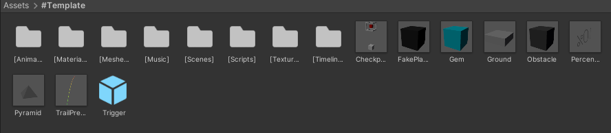
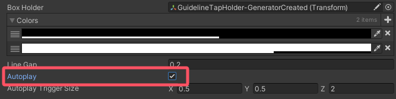
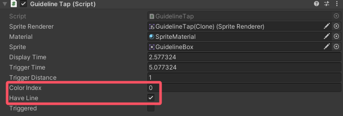
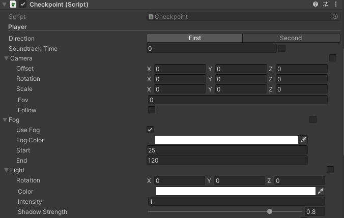
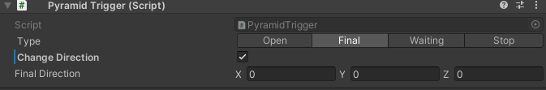
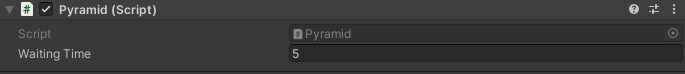
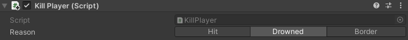
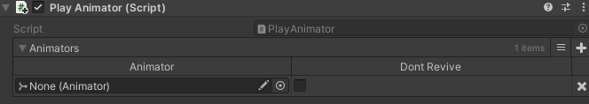

# 冰焰模板 4.7.2 使用手册
*****
* **本页面将会介绍模板的使用方法。Unity基本操作本页面不予讲解，如遇问题请自行查询和解决。本教程适用于最新版模板**
* **完全理解本教程需要掌握一些基本的Unity操作。如对Unity的基本操作尚不熟悉，建议熟悉后再阅读本教程**
*****
## 一、预设场景进入方法
打开模板后，并不会直接进入预设场景。需进入```Assets/#Template/[Scenes]```路径下找到```Scene```场景文件，双击进入预设场景


## 二、预设场景物件介绍
### 物件结构


* LevelHolder：关卡统括物体 - 关卡内等级最高的父物体，所有物体都为其子物体
* \- Objects：关卡基础物体 - 包含关卡内的基本要素，如光源、相机和线
* \-- Directional Light：定向光源 - 关卡内最基本的光源
* \-- CameraRoot：相机根物体 - 控制相机跟随线运动
* \--- Rotator：相机旋转控制物体 - 控制相机旋转
* \---- Scale：相机缩放控制物体 - 控制相机缩放
* \----- Camera：相机
* \-- Player：线
* \- Scene：场景统括物体 - 关卡内所有场景都放在此物体之下
* \-- Ground：地面

**注：如无特别需求，除地面外其他物体不可随意删除**

### 特别说明
在 **Scene** 物体上，有已经放好的 **Playable Director** 和 **Time Scale**


#### Playable Director
此为场景的时间线


#### Time Scale
用于更改播放的倍速


* Key：使用和禁用倍速播放的按键
* Enabled Value：加速倍速。默认为1.5，最低为0，最高为3
* Disabled Value：初始倍速。默认为1，最低为0，最高为3

**注：此代码仅在编辑器内可用**

## 三、预制物体介绍
### ```Assets/#Template```下


* \[Animators]：用于存放帧动画的文件夹
* \[Materials]：用于存放材质的文件夹
* \[Meshes]：用于存放模型的文件夹
* \[Music]：用于存放音乐的文件夹
* \[Scenes]：用于存放场景的文件夹
* \[Textures]：用于存放贴图的文件夹
* \[Timelines]：用于存放时间线的文件夹
* Checkpoint：检查点
* FakePlayer：假线
* Gem：收集物
* Ground：地面
* Obstacle：障碍物
* Percentage：百分比
* Pyramid：金字塔
* TrailPredictor：下落与跳跃轨迹预测器
* Trigger：触发器

### ```Assets/Resources/Prefabs```下


* Dust：线落地粒子效果
* FakeTail：假线线身
* GetGem：收集物获取粒子效果
* Guideline：引导线
* GuidelineTap：引导线点击框
* GuidelineTapEffect：引导线触发效果物体
* LevelUI：关卡UI
* LoadingUI：加载UI
* PreviewCameraHolder：跟随相机预览物体
* Remain：线死亡效果物体
* StartUI：关卡开始前UI
* Tail：真线线身

**注：上述物体均不可随意删除。导入音乐、创建材质或帧动画等时，建议放进相应文件夹中**

*****
## 四、关卡初设置
在开始制作关卡前，需设置好关卡的一些基本信息。 关卡信息文件为```Assets/#Template/[Scenes]```下的```SceneData```


* Level Title：关卡名
* Sound Track：关卡音乐
* Speed：线速。默认为12
* Block Limit：收集物总数。默认为10
* Time Scale：时间倍速。默认为1
* Gravity：场景重力。默认为-9.3
* Colors：材质颜色预设。如果关卡内存在材质颜色改变，需在此设置材质的初始颜色。 **Material** 为需要初始化颜色的材质， **Color** 为常规颜色， **Emission Color** 为发光颜色

关卡基本信息设置好后，需在 **Player** 上的代码的 **Level Data** 中选择设置好的关卡信息文件


关卡信息文件也可以通过```Project窗口右键→Create→Dancing Line Fanmade→Level Data```来创建

## 五、初识线与跟随相机
### 线
#### 面板数据


* Level Data：关卡信息文件
* Scene Camera：相机
* Scene Light：定向光源
* Character Material：线使用的材质
* Start Position：线的初始位置
* First Direction：线的第一朝向
* Second Direction：线的第二朝向
* Pool Size：线身对象池上限
* Played Animators：线开始移动时要启动的帧动画
* Played Timelines：线开始移动时要启动的时间线
* Allow Turn：是否允许通过点击来转向
* No Death：是否启用线不死亡
* Draw Direction：勾选后会在线的位置绘制出0、90、180、270四个方向的箭头
* Video Quality Level：默认画质等级。数值代表是第几个画质。如需应用设置的第n个画质，则此处需填写的数值为n-1，其他数值为最低画质
* Anti Aliasing Level：默认抗锯齿等级。0为禁用，1为2X MSAA，2为4X MSAA，3为8X MSAA，其他数值为禁用
* Shadow：默认是否启用阴影状态

在启动播放时，线会自动移动至初始位置，即 **Start Position** 。如需更改线的初始位置，可手动修改 **Start Position** 的数值，或点击面板上的
**Get Start Position** 按钮自动获取位置

#### 快捷键
快捷键可在播放场景时使用

* R键：立刻重新加载当前关卡
* C键：在控制台输出当前音乐时间
* K键：立刻杀死线

**注：快捷键仅在编辑器内可用。C键与K键仅在线开始移动后可用**

#### 事件
事件仅在特定条件下触发，可用于实现特定效果。事件控制代码也在线上


* On Game Awake ()：在场景播放时调用
* On Player Start ()：在线开始移动时调用
* On Change Direction ()：在线转向时调用
* On Leave Ground ()：在线离开地面时调用
* On Touch Ground ()：在线触碰地面时调用
* On Game Over ()：在线死亡时调用
* On Get Gem ()：在线拾取收集物时调用
* On Player Jump ()：在线跳跃时调用

### 跟随相机


* Target：跟随目标物体。即线
* Rotator：相机旋转控制器物体
* Scale：相机缩放控制物体
* Default Offset：相机初始偏移
* Default Rotation：相机初始旋转角度
* Default Scale：相机初始缩放
* Follow：是否启用跟随
* Smooth：是否启用平滑跟随

在启动播放时，相机的偏移、旋转角度和缩放会自动更改为 **Default Offset** 、 **Default Rotation** 和 **Default Scale** 。因此需提前设置好这三个数据

## 六、引导线的使用
### 铺设引导线
#### 方法一：导入osu!谱面生成
先从osu!中导出你制作的谱面，将导出的.osz文件的后缀名更改为.zip，然后解压并得到.osu文件。接着将.osu文件的后缀名改为.txt，并导入工程


成功导入后，将其拖入位于 **LevelHolder** 上的 **Score Reader** 的 **Score** 中


之后，点击 **Create Guideline Taps By Score** 按钮即可生成引导线。实际生成可能存在误差，可通过修改Offset参数解决问题

如谱面数据有所更改，可点击 **Reload Hit Time** 重新加载

#### 方法二：手动铺设引导线
在场景内任意物体上添加代码 **Guideline Tap Generator** 代码，播放场景，即可在点击时生成引导线。完成后，复制引导线的父物体，结束播放，再粘贴即可


**注：铺设完成后需禁用或移除代码**

### 启用引导线
铺设完成后，在 **LevelHolder** 上的 **Guideline Manager** 的 **Box Holder** 中，选择引导线的父物体


选择后，启动播放，即可看到画面左侧出现了开启引导线的按钮。点击即可启用引导线


### 启用自动播放
在 **Guideline Manager** 上，勾选 **Autoplay** 即可启用自动播放



**注：启用自动播放后，线将无法通过点击转弯。且引导线也不会被触发**

### 其他参数的使用


* Colors：引导线颜色预设。可自行添加新的颜色预设
* Line Gap：线与框间的距离。默认为0.2，可自行按需修改
* Autoplay Trigger Size：自动播放的触发器大小。如因引导线框过于密集而导致无法正常工作，可适当调小



引导线框物体上有 **Guideline Tap** 代码。代码上的 **Color Index** 为此引导线框所采用的颜色预设，数值代表是第几个预设。
如需应用 **Guideline Manager** 上的第n个预设颜色，则此处需填写的数值为n-1

代码上的 **Have Line** 表示此引导线框与下一个引导线框之间是否生成线段来连接。勾选则生成，反之不生成

**注：代码上其他参数请勿随意更改**

## 七、路径的生成
### 方法一：根据引导线生成路径
设置好引导线后，可在 **Guideline Manager** 的 **Road Generator Setting** 下生成路径


* Road Prefab：路径物体
* Width：路径宽度
* Offset：路径偏移

设置好上述三处数据后，点击 **Create Road By Guideline Taps** 即可生成路径

### 方法二：手动铺设路径
在场景内任意物体上添加代码 **Road Generator** 代码，播放场景，即可跟随线生成路径。完成后，复制路径的父物体，结束播放，再粘贴即可


* Road Prefab：路径物体
* Road Width：路径宽度
* Road Height：路径高度

**注：铺设完成后需禁用或移除代码**

## 八、调试功能的使用
模板提供调试功能。调试功能仅在编辑器内可用

### 路径高亮和点击时间显示
此代码位于 **LevelHolder** 。此功能依赖于引导线


* Controller：引导线控制器。即 **Guideline Manager**
* Max Distance：路径高亮与时间显示的最远可见距离
* Trail Color：路径高亮的颜色
* Trail Offset：路径高亮偏移
* Render Trail：是否启用路径高亮
* Render Time：是否启用点击次数和点击时间显示

如引导线相关数据有所更改，可点击 **Reload Trail Data** 重新加载


### 信息显示
此代码位于 **LevelHolder** 


* Display：是否显示调试信息
* Key：显示和关闭调试信息的按键
* Size：调试信息字体大小
* Space：两行调试信息间的距离
* Font：调试信息字体
* Rect：调试信息位置
* Information：显示的调试信息。可自行增添或减少


当前版本模板支持的调试信息如下：

|              名称               |     内容     |            名称            |    内容    |
|:-----------------------------:|:----------:|:------------------------:|:--------:|
|          Game State           |    游戏状态    |         Progress         |    进度    |
|          Audio Time           |    音乐时间    |   Audio Time Formatted   | 格式化音乐时间  |
|        Player Position        |    线的位置    |  Player Local Position   |  线的相对位置  |
|        Player Rotation        |   线的旋转角度   |  Player Local Rotation   | 线的相对旋转角度 |
|         Player Speed          |    线的速度    |       Block Count        | 已获取收集物数量 |
|       Checkpoint Count        |  已激活检查点数量  |         Gravity          |    重力    |
|    Camera Follower Offset     |   跟随相机偏移   | Camera Follower Rotation | 跟随相机旋转角度 |
| Camera Follower Real Rotation | 跟随相机真实旋转角度 |  Camera Follower Scale   |  跟随相机缩放  |
|        Camera Position        |    相机位置    |  Camera Local Position   |  相机相对位置  |
|        Camera Rotation        |   相机旋转角度   |  Camera Local Rotation   | 相机相对旋转角度 |
|          Camera Fov           |    相机视场    |         Fog Mode         |   雾气模式   |
|           Fog Start           |   雾气开始距离   |         Fog End          |  雾气最远距离  |
|          Fog Density          |    雾气密度    |      Light Rotation      | 定向光源旋转角度 |
|     Light Local Rotation      | 定向光源相对旋转角度 |     Light Intensity      |  定向光源强度  |
|     Light Shadow Strength     |  定向光源阴影强度  |  Ambient Lighting Type   |  环境光源类型  |
|       Ambient Intensity       |   环境光源强度   |      Video Quality       |   画质等级   |
|         Anti Aliasing         |   抗锯齿等级    |          Shadow          |   阴影状态   |

### 线下落与跳跃轨迹预测
下落与跳跃轨迹预测器，即 **TrailPredictor** ，从Project窗口拖出即可使用。使用时，将其放置于线下落或起跳的位置，调整相关数据，即可使用


* Line Renderer：轨迹绘制组件
* Player Speed：线的速度
* Force：跳跃力度。为0时即为下落
* Distance：绘制距离
* Accuracy：绘制精度。数值越大，分段越少


**注：不再使用后建议将其删除，避免后续出现其他问题**

## 九、收集物、检查点与金字塔
### 收集物
收集物，即 **Gem** ，从Project窗口拖出即可使用。使用时，将其放置在线所经过的路上即可


收集物代码面板上有以下设置可供更改：


* Gem Mesh：收集物模型
* Effect Path：收集物获取效果的路径。此路径在```Assets/Resources```下
* Fake：是否为假收集物。若勾选，则线无法获取

### 检查点
检查点，即 **Checkpoint** ，从Project窗口拖出即可使用。使用时，将其放置在线所经过的路上即可


放置检查点时，检查点触发器、复活位置和检查点标识物体的位置可以自行更改


* RevivePosition：复活位置
* Rotator：检查点标识物体
* CheckpointTrigger：检查点触发器

检查点代码面板上有以下设置可供更改：




* Direction：线复活后的朝向。与线代码面板上的 **First Direction** 和 **Second Direction** 相同
* Soundtrack Time：音频时间
* Offset：相机偏移
* Rotation：相机旋转角度
* Scale：相机缩放
* Fov：相机视场
* Follow：相机是否跟随线
* Use Fog：是否启用雾气
* Fog Color：雾气颜色
* Start：雾气开始距离
* End：雾气最远距离
* Rotation：定向光源旋转角度
* Color：定向光源颜色
* Intensity：定向光源强度
* Shadow Strength：定向光源阴影强度
* Lighting Type：环境光源类型
* Material Colors Auto：自动记录颜色的材质。需手动添加需要记录的材质
* Material Colors Manual：手动记录颜色的材质
* Image Colors Auto：自动记录颜色的Image。需手动添加需要记录的Image
* Image Colors Manual：手动记录颜色的Image
* On Revive ()：事件。在复活时调用

除 **Direction** 、 **Material Colors Manual** 和 **Image Colors Manual** 外，其余数据在检查点激活时会自动记录。如要手动记录或自动记录会导致一些问题，可勾选手动记录


### 金字塔
金字塔，即 **Pyramid** ，从Project窗口拖出即可使用。使用时，将其放置在关卡结尾即可


金字塔共包含4个触发器，分别有如下功能：

* 1号触发器：打开金字塔
* 2号触发器：停止相机跟随，阻止线通过点击来转向。此触发器代码面板上有 **Change Direction** 选项，若勾选，则线会在触碰此触发器时转向指定的方向。若不勾选，则线不会转向



* 3号触发器：启动关卡结束倒计时
* 4号触发器：使线停止移动

关卡结束倒计时位于金字塔代码面板上，可根据实际情况自行修改时间



可根据关卡实际情况自行调整4个触发器的位置

## 十、触发器的使用
触发器，即 **Trigger** ，从Project窗口拖出即可使用。使用时，将其放置在线所经过的路上即可


### 更改触发器颜色
触发器面板上有 **Trigger Renderer** 代码，有以下设置可供更改：


* Render Box：是否显示触发器盒体
* Render Wire：是否显示触发器边框
* Box Color：触发器盒体颜色
* Wire Color：触发器边框颜色

如需更改触发器颜色，只需修改 **Box Color** 和 **Wire Color** 即可

### 添加代码
在触发器面板下，有 **Add Component** 按钮，点击并搜索要添加的代码，然后点击目标代码，即可添加


**注：触发器面板上的其他组件无需修改**

## 十一、相机代码的使用与时间动画的制作
### 使用相机代码
#### 视角变换
在触发器上添加 **Camera Trigger** 代码，并根据实际需求修改代码上的设置：


* On Finished ()：事件。在视角变换完成时调用
* Offset：新的相机偏移
* Rotation：新的相机旋转角度
* Scale：新的相机缩放
* Field Of View：新的相机视场
* Follow：是否启用跟随
* Duration：变换所需时间
* Ease：变换所使用的缓动函数
* Use Curve：是否使用动画曲线（勾选后将不再使用缓动函数）
* Curve：动画曲线
* Mode：旋转模式
* Can Be Triggered：是否可使用触发器触发

此代码既可以使用触发器触发，也可以使用事件触发

#### 视角变换预览
点击代码面板上的 **Create Preview**，可在触发器的位置生成预览。预览的角度会随代码上设置的改变而改变


**注：预览结束后建议点击Destroy Preview将其删除，避免后续出现其他问题**

#### 震动
在触发器上添加 **Camera Shake Trigger** 代码，并根据实际需求修改代码上的设置：


* Power：震动力度
* Duration：震动持续时间

### 时间动画用法通则
#### 类型一
此类型包括物体的位移、旋转和缩放时间动画


* On Animator Start ()：事件。在动画开始时调用
* On Animator Finished ()：事件。在动画完成时调用
* Transform Type：赋值类型。New表示赋予新值，Add表示在当前值上添加
* Triggered By Time：是否使用时间触发
* Trigger Time：触发动画的等待时间
* Duration：动画持续时间
* Offset Time：是否启用时间偏移。若勾选，则动画将提前 **Duration** 秒启动
* Dont Revive：是否取消恢复此动画
* Ease：动画所使用的缓动函数
* Curve：动画曲线
* Use Curve：是否使用动画曲线（勾选后将不再使用缓动函数）

此动画既可以使用时间触发，也可以使用事件触发

#### 类型二
此类型包括雾气、定向光源、环境光源、材质颜色和Image颜色时间动画


* On Animator Start ()：事件。在动画开始时调用
* On Animator Finished ()：事件。在动画完成时调用
* Trigger Time：触发动画的等待时间
* Duration：动画持续时间
* Offset Time：是否启用时间偏移。若勾选，则动画将提前 **Duration** 秒启动
* Dont Revive：是否取消恢复此动画
* Ease：动画所使用的缓动函数
* Curve：动画曲线
* Use Curve：是否使用动画曲线（勾选后将不再使用缓动函数）

### 物体时间动画
#### 位移
用于改变物体的位置

在需要添加动画的物体上添加 **Local Pos Animator** 代码


* Original Transform：物体初始位置
* Position：物体目标位置
* Get original position：获取物体初始位置
* Set as original position：将物体移动至初始位置
* Get new position：获取物体目标位置
* Set as new position：将物体移动至目标位置

在启动播放时，物体的位置会自动更改为 **Original Transform**

#### 旋转
用于改变物体的旋转角度

在需要添加动画的物体上添加 **Local Rot Animator** 代码


* Original Transform：物体初始旋转角度
* Rotation：物体目标旋转角度
* Rotate Mode：旋转模式
* Get original rotation：获取物体初始旋转角度
* Set as original rotation：将物体旋转至初始旋转角度

在启动播放时，物体的旋转角度会自动更改为 **Original Transform**

#### 缩放
用于改变物体的缩放

在需要添加动画的物体上添加 **Local Scale Animator** 代码


* Original Transform：物体初始缩放
* Scale：物体目标缩放
* Get original scale：获取物体初始缩放
* Set as original scale：将物体缩放至初始缩放
* Get new scale：获取物体目标缩放
* Set as new scale：将物体缩放至目标缩放

在启动播放时，物体的缩放会自动更改为 **Original Transform**

### 雾气时间动画
用于改变雾气相关设置

在任意物体上添加 **Timer Fog** 代码


* Use Fog：是否启用雾气
* Fog Color：雾气颜色
* Start：雾气开始距离
* End：雾气最远距离

### 定向光源时间动画
用于改变定向光源相关设置

在任意物体上添加 **Timer Light** 代码


* Rotation：定向光源旋转角度
* Color：定向光源颜色
* Intensity：定向光源强度
* Shadow Strength：定向光源阴影强度

### 环境光源时间动画
用于改变环境光源相关设置

在任意物体上添加 **Timer Ambient** 代码


* Lighting Type：环境光源类型

### 材质颜色时间动画
用于改变材质颜色

在任意物体上添加 **Timer Material Color** 代码


* Material：需要改变颜色的材质
* Color：常规颜色
* Emission Color：发光颜色

可点击右上角的加号添加材质

### Image颜色时间动画
用于改变Image颜色

在任意物体上添加 **Timer Image Color** 代码


* Image：需要改变颜色的Image
* Color：目标颜色

可点击右上角的加号添加Image

## 十二、触发器代码的使用
**注：除非特别说明，否则下述代码均在线触碰触发器时触发**

### Change Direction
用于更改线的转弯方向和自动点击

#### 更改线的转弯方向
当 **Type** 为 **Direction** 时，代码功能为更改线的转弯方向。此时，会在触发器的位置绘制出0、90、180、270四个方向的箭头


* First Direction：新的第一朝向
* Second Direction：新的第二朝向
* Set Camera Coordinate：是否更改跟随相机的坐标系。若不勾选，线以新的朝向转向时，相机可能不能正常跟随

#### 自动点击
当 **Type** 为 **Turn** 时，代码功能为更改线的转弯方向


### Event Trigger
用于调用事件


* Invoke On Awake：是否在启动场景播放时调用事件
* Invoke On Click：是否当线在触发器内转向时调用事件。若不勾选，则在线触碰触发器时调用事件
* On Trigger Enter ()：事件

### Gravity Trigger
用于更改场景重力


* Gravity：新的重力

### Jump
用于使线跳跃


* Power：跳跃力度
* Change Direction：是否使线在起跳的瞬间转向

### Kill Player
用于实现落水和出图的死亡方式



* Reason：死亡原因。 **Hit** 为撞墙死亡， **Drowned** 为落水死亡， **Border** 为出图死亡

### Play Animator
用于播放帧动画



* Animator：需要播放的帧动画
* Dont Revive：是否取消恢复此帧动画

可点击右上角的加号添加帧动画

### Play Audio Clip
用于播放音频


* Clip：需要播放的音频
* Volume：播放音量
* Triggered By Trigger：是否可使用触发器触发

此代码既可以使用触发器触发，也可以使用事件触发

### Set Active
用于开启和关闭物体


* Active On Awake：是否在启动场景播放时触发
* Target：目标物体
* Active：是否开启物体
* Dont Revive：是否取消恢复此物体

可点击右上角的加号添加物体

### Set Ambient
用于更改环境光源相关设置。用法与 **Timer Ambient** 相同

### Set Fog
用于更改雾气相关设置。用法与 **Timer Fog** 相同

### Set Image Color
用于更改Image颜色。用法与 **Timer Image Color** 相同

### Set Light
用于更改定向光源相关设置。用法与 **Timer Light** 相同

### Set Material Color
用于更改材质颜色。用法与 **Timer Material Color** 相同

### Speed
用于更改线或假线的速度


* Set Fake Player：是否更改假线的速度
* Player：目标假线
* Speed：新的速度

### Teleport
用于传送线


* Type：传送模式。 **Target** 表示传送到目标物体的位置， **Position** 表示传送到目标位置
* Target：目标物体
* Position：目标位置
* Force Camera Follow：是否强制相机跟随。若不勾选，则相机会平滑移动至线传送后的位置
* Turn：是否使线在传送后立刻转向。若勾选，则可选择转向的朝向


设置好目标物体或目标位置后，触发器和目标位置间会出现红色连线，目标位置会出现白色立方体边框和使线传送到此处的触发器的名字


## 十三、假线的使用
假线，即 **FakePlayer** ，从Project窗口拖出即可使用

### 初识假线


* Speed：假线线速。默认为12
* Character Material：假线使用的材质
* Start Position：假线的初始位置
* First Direction：假线的第一朝向
* Second Direction：假线的第二朝向
* Pool Size：假线线身对象池上限
* Is Wall：是否为墙体。若勾选，真线触碰假线线身时会撞死
* Draw Direction：勾选后会在假线的位置绘制出0、90、180、270四个方向的箭头
* Create Turn Trigger：是否生成转向触发器
* Synchronism With Player：是否与真线同步转向
* Create Key：生成转向触发器的按键
* Trigger Rotation：转向触发器的旋转角度
* Trigger Scale：转向触发器的缩放

在启动播放时，假线会自动移动至初始位置，即 **Start Position** 。如需更改假线的初始位置，可手动修改 **Start Position** 的数值，或点击面板上的 **Get Start Position** 按钮自动获取位置

转向触发器生成完成后，复制转向触发器的父物体，结束播放，再粘贴即可

按下 **Create Key** 时，假线会转向，并在原地生成转向触发器。若勾选 **Synchronism With Player** ，假线会在真线转向时转向，并在原地
生成转向触发器。 **Synchronism With Player** 勾选后，将无法再通过按下 **Create Key** 使假线转向和生成转向触发器

### 使用假线
在触发器上添加 **Fake Player Trigger** 代码，并根据实际需求修改代码上的设置：


* Target Player：目标假线
* Type：触发器模式

#### 触发器模式为Turn时
用于使假线转向

#### 触发器模式为Change Direction时
用于改变假线的转向方向

* First Direction：新的第一朝向
* Second Direction：新的第二朝向

#### 触发器模式为Set State时
用于开始和停止假线的移动

* State：新的状态。 **Moving** 会使假线开始移动， **Stopped** 会使假线停止移动

**注：假线离开相机视野后，建议及时停止假线的移动**

## 十四、其他
### 百分比的使用
百分比，即 **Percentage** ，从Project窗口拖出即可使用


百分比面板上有 **Percentage** 代码：


* Percentage：需要显示的百分比。包括从10%到90%
* Color：百分比颜色

**注：百分比面板上的其他组件无需修改**

### 添加新画质
可在```Project Settings→Quality```下添加新画质


点击 **Add Quality Level** 按钮即可添加新画质

添加新画质后，修改 **Current Active Quality Level** 的 **Name** ，设置画质名称。向下滚动，画质的其他设置可自行更改

新画质设置完成后，进入```Assets/Resources/Prefabs```下的```StartUI```预制体，在左侧Hierarchy窗口找到 **Controller** 物体


在此物体的面板上有 **Set Game Quality** 代码。在 **Quality Names** 中添加新画质的名字


**注：代码上其他设置请勿随意更改**

添加完成后，退出预制体编辑界面，启动播放，更改画质，即可看到新添加的画质


### 材质创建建议
创建普通材质时，使用```Dancing Line Fanmade/Standard/Color``` Shader

创建透明材质时，使用```Dancing Line Fanmade/Standard/Transparent``` Shader

*****
教程至此结束