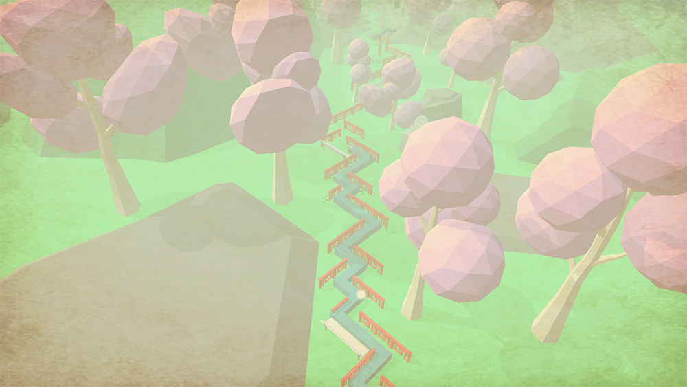
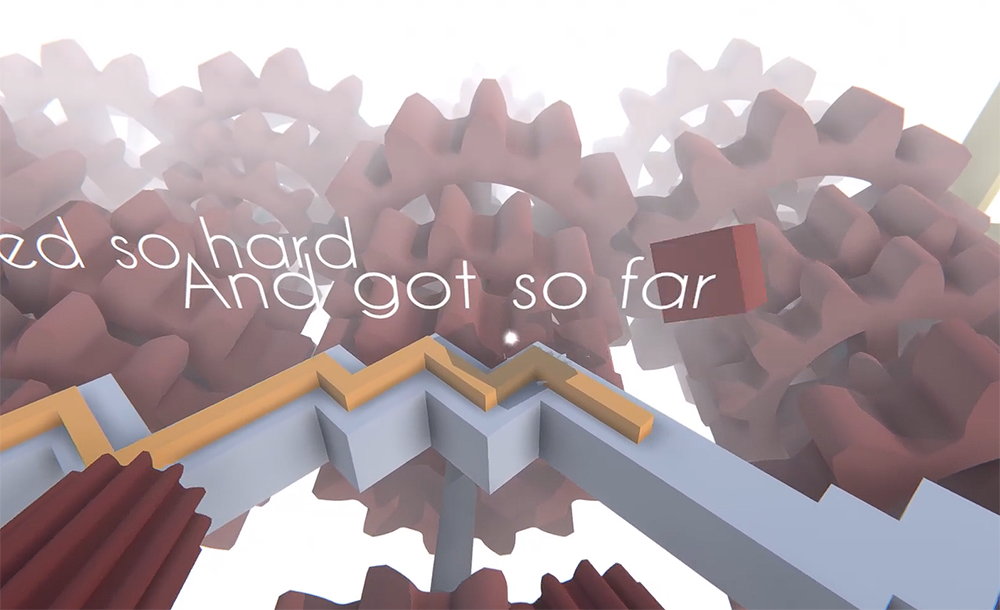
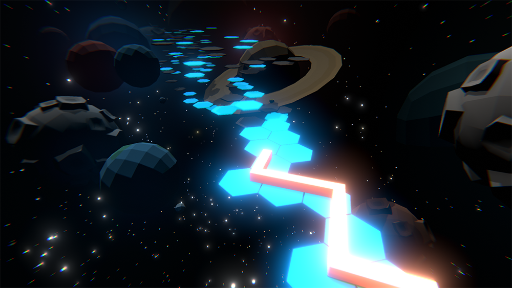
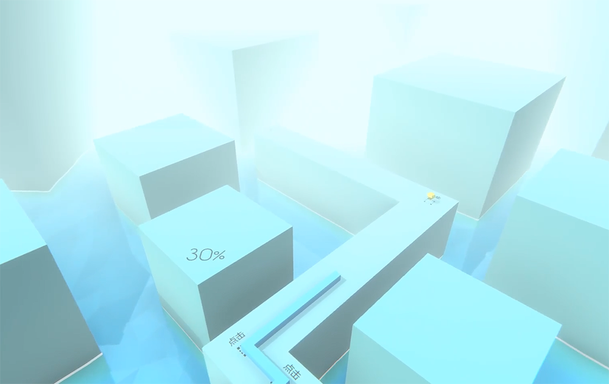
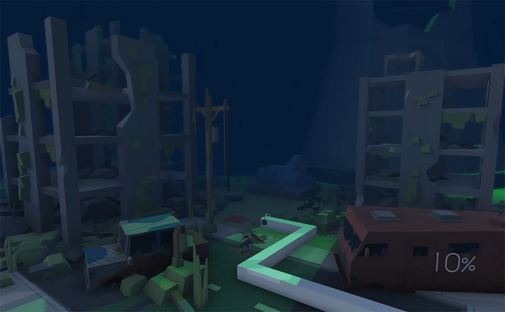
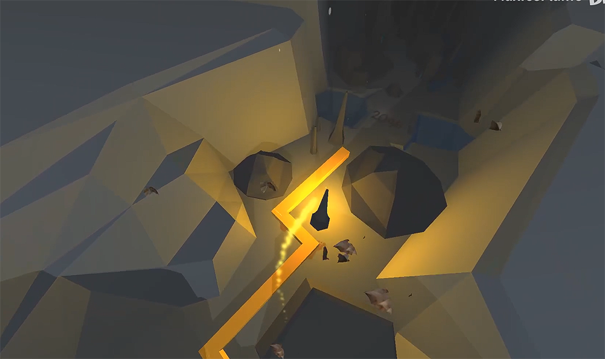

# Individual Works
*****
This page contains my finished and unfinished works made since 2018
## Finished works
### 2018
#### The Ocean

Made with UE4. It was my first complete work in the true sense

Publication date: May 4th, 2018

Video link: [BiliBili](https://www.bilibili.com/video/BV12p411f7kC)

#### The Countryside

Made with UE4

Publication date: May 26th, 2018

Video link: [BiliBili](https://www.bilibili.com/video/BV1Ts411u7Z8/?spm_id_from=333.788.videopod.episodes&vd_source=1c695510ce7ddee97334e7846a16a194&p=38)

#### The Cloud

Made with UE4. It was this work which made me started being famous

Publication date: June 18th, 2018

Video link: [BiliBili](https://www.bilibili.com/video/BV1Ts411u7Z8?spm_id_from=333.788.videopod.episodes&vd_source=1c695510ce7ddee97334e7846a16a194&p=39)

#### The Nature

From this work on, I've changed my engine to Unity

Publication date: July 4th, 2018 (Old version), August 11st, 2018 (New version)

Video link (Old version): [BiliBili](https://www.bilibili.com/video/BV1Ts411u7Z8?spm_id_from=333.788.videopod.episodes&vd_source=1c695510ce7ddee97334e7846a16a194&p=4)

Video link (New version): [BiliBili](https://www.bilibili.com/video/BV1Ts411u7Z8?spm_id_from=333.788.videopod.episodes&vd_source=1c695510ce7ddee97334e7846a16a194&p=41)

#### The Piano

Publication date: July 10th, 2018

Video link: [BiliBili](https://www.bilibili.com/video/BV1Ts411u7Z8?spm_id_from=333.788.videopod.episodes&vd_source=1c695510ce7ddee97334e7846a16a194&p=35)

#### The Chinese

Publication date: August 27th, 2018

Video link: [BiliBili](https://www.bilibili.com/video/BV1Ts411u7Z8?spm_id_from=333.788.videopod.episodes&vd_source=1c695510ce7ddee97334e7846a16a194&p=40)

#### The Environment

~~The most beautiful one~~

Publication date: October 13th, 2018

Video link: [BiliBili](https://www.bilibili.com/video/BV1Ts411u7Z8?spm_id_from=333.788.videopod.episodes&vd_source=1c695510ce7ddee97334e7846a16a194&p=36)

#### Detroit - The OPENING

Publication date: December 16th, 2018

Video link: [BiliBili](https://www.bilibili.com/video/BV1Ts411u7Z8?spm_id_from=333.788.videopod.episodes&vd_source=1c695510ce7ddee97334e7846a16a194&p=34)

### 2019
#### The Enddays

Publication date: January 30th, 2019

Video link: [BiliBili](https://www.bilibili.com/video/BV1Ts411u7Z8?spm_id_from=333.788.videopod.episodes&vd_source=1c695510ce7ddee97334e7846a16a194&p=33)

#### The Cube

Publication date: March 10th, 2019

Video link: [BiliBili](https://www.bilibili.com/video/BV1Ts411u7Z8?spm_id_from=333.788.videopod.episodes&vd_source=1c695510ce7ddee97334e7846a16a194&p=37)

#### The Nature \[Redesigned]

Publication date: March 24th, 2019

Video link: [BiliBili](https://www.bilibili.com/video/BV1Ts411u7Z8?spm_id_from=333.788.videopod.episodes&vd_source=1c695510ce7ddee97334e7846a16a194&p=42)

#### The Countryside \[Redesigned]

Publication date: July 18th, 2019

Video link: [BiliBili](https://www.bilibili.com/video/BV1Yb411K7dV?spm_id_from=333.788.videopod.episodes&vd_source=1c695510ce7ddee97334e7846a16a194&p=132)

#### The Space

Publication date: August 5th, 2019

Video link: [BiliBili](https://www.bilibili.com/video/BV1Yb411K7dV?spm_id_from=333.788.videopod.episodes&vd_source=1c695510ce7ddee97334e7846a16a194&p=130)

### 2020
#### Prologue (Starting)

Publication date: February 4th, 2020

Video link: [BiliBili](https://www.bilibili.com/video/BV157411h7um)

#### Beethoven Virus

It was a redesign of qqxqqx's level, The Beethoven Virus

Publication date: February 4th, 2020

Video link: [BiliBili](https://www.bilibili.com/video/BV157411h7um?spm_id_from=333.788.videopod.episodes&vd_source=1c695510ce7ddee97334e7846a16a194&p=2)

#### Dreamer

It was a redesign of qqxqqx's level, The Dreamer

Publication date: February 13th, 2020

Video link: [BiliBili](https://www.bilibili.com/video/BV1k7411V7Hq)

#### Ocean（MaxLine）

Cooperated with qqxqqx. I made from the beginning to 50%

Publication date: April 6th, 2020

Video link: [BiliBili](https://www.bilibili.com/video/BV1X64y1u7zG)

#### Preface

Publication date: June 2nd, 2020

Video link: [BiliBili](https://www.bilibili.com/video/BV1iA411v7MB)

#### Apocalypse

Cooperated with qqxqqx. I made from the beginning to 40% and from 80% to 100%

The concept of this level had been created in June, 2019

^A picture of the concept of this level made at that time

Publication date: June 15th, 2020

Video link: [BiliBili](https://www.bilibili.com/video/BV15g4y1q7Vx)

#### Beach

It was a redesign of qqxqqx's level, The Prologue Remix

Publication date: August 2nd, 2020

Video link: [BiliBili](https://www.bilibili.com/video/BV1964y1F7Sc)

#### Rain

Publication date: August 2nd, 2020

Video link: [BiliBili](https://www.bilibili.com/video/BV1jA411Y7J3)

#### Huaji

It was a redesign of Lusaslan's level, The Huaji

Publication date: October 4th, 2020

Video link: [BiliBili](https://www.bilibili.com/video/BV1fz4y1Z7sa)

### 2021
#### Anniversary

The first anniversary level of MaxLine. Cooperated with qqxqqx, lyckay and GP0108. I made from 70% to 100%

Publication date: February 4th, 2021

Video link: [BiliBili](https://www.bilibili.com/video/BV18V411B7Tw)

#### The Earth \[Replicated]

Publication date: February 17th, 2021

Video link: [BiliBili](https://www.bilibili.com/video/BV1Zo4y197Hy)

#### In the End

It was a redesign and sequel of raw_chicken's level, In the End

Publication date: February 24th, 2021

Video link: [BiliBili](https://www.bilibili.com/video/BV1Xp4y1n7Vt)

#### The Crystal \[Replicated]

Publication date: June 11th, 2021

Video link: [BiliBili](https://www.bilibili.com/video/BV1664y1R7K9)

#### Mathematics

It was a redesign of Li Ga Yb's level, The Mathematics

Publication date: August 10th, 2021

Video link: [BiliBili](https://www.bilibili.com/video/BV1B3411r7JW)

### 2022
#### The Discovery - Chronos

It was a redesign of MaxBlazeResFire's level, The Explore

Publication date: August 6th, 2022

Video link: [BiliBili](https://www.bilibili.com/video/BV1zt4y137kP)

### 2023
#### The Space

This level was added into "Dancing Line" in February, 2024

Publication date: June 15th, 2023

Video link: [BiliBili](https://www.bilibili.com/video/BV1rW4y1Q7ST)

### 2025
#### The Hollowness \[Redesigned]

It was a redesign of CIAD233's level, The Hollow

Publication date: April 20th, 2025

Video link: [BiliBili](https://www.bilibili.com/video/BV1465fzcEHa)

### Un-traced year works
#### The Storm \[Full]

Cooperated with Fenger

Video link: [BiliBili](https://www.bilibili.com/video/BV1Yb411K7dV?spm_id_from=333.788.videopod.episodes&vd_source=1c695510ce7ddee97334e7846a16a194&p=61)

#### The Begin

Video link: [BiliBili](https://www.bilibili.com/video/BV1Yb411K7dV?spm_id_from=333.788.videopod.episodes&vd_source=1c695510ce7ddee97334e7846a16a194&p=135)

#### The Grassland

Cooperated with MaxBlazeResFire and Max Zhi_Flame

Video link: [BiliBili](https://www.bilibili.com/video/BV1Yb411K7dV?spm_id_from=333.788.videopod.episodes&vd_source=1c695510ce7ddee97334e7846a16a194&p=151)

#### The Beginning (DLPCPE 2021)

Video link: [BiliBili](https://www.bilibili.com/video/BV1qP4y1X71s?spm_id_from=333.788.videopod.episodes&vd_source=1c695510ce7ddee97334e7846a16a194&p=2)

## Unfinished works
### The Town
Made with UE4

The picture of this level was missing

Production time: 2018

### The Storm
It was a TTF fanmade made with UE4

The picture of this level was missing

Production time: 2018

### The Pirate
Made with UE4

The picture of this level was missing

Production time: 2018

### The Storm Dance Remix
Made with UE4. I made from the beginning to 30% and the rest was given to 雪能花

The picture of this level was missing

Production time: 2018

### The Ignite
This level was abandoned because the project was broken. The original name of this level was not searchable

The picture of this level was missing

Production time: 2018

### The Dance Floor

Production time: 2018

Video link: [BiliBili](https://www.bilibili.com/video/BV1cN41167F4?vd_source=1c695510ce7ddee97334e7846a16a194&spm_id_from=333.788.videopod.episodes&p=5)

### The Neon
The picture of this level was missing

Production time: 2018 or 2019

### Darkside
The picture of this level was missing

Production time: 2018 or 2019

### The Faded Original Full
The picture of this level was missing

Production time: 2018 or 2019

### Dream of Snow

Production time: 2018 or 2019

Video link: [BiliBili](https://www.bilibili.com/video/BV1cN41167F4?vd_source=1c695510ce7ddee97334e7846a16a194&spm_id_from=333.788.videopod.episodes&p=3)

### The Space Cube

Production time: 2018 or 2019

Video link: [BiliBili](https://www.bilibili.com/video/BV1cN41167F4?vd_source=1c695510ce7ddee97334e7846a16a194&spm_id_from=333.788.videopod.episodes&p=6)

### The Fight

Production time: 2019

Video link: [BiliBili](https://www.bilibili.com/video/BV1cN41167F4?vd_source=1c695510ce7ddee97334e7846a16a194&spm_id_from=333.788.videopod.episodes&p=4)

### Detroit - The OPENING \[Redesigned]

Production time: 2019

Video link: [BiliBili](https://www.bilibili.com/video/BV1cN41167F4?vd_source=1c695510ce7ddee97334e7846a16a194&spm_id_from=333.788.videopod.episodes&p=7)

### The Internet
The picture of this level was missing

Production time: 2019

### Fantasia
An early level of MaxLine. Its music was composed by Fairo and it was a remix of [Marble Machine](https://music.163.com/song?id=408532991&uct2=U2FsdGVkX1/zS+Qx0uOfnyPY5CbLuj9wWYzK+4tiMy8=)

The picture of this level was missing

Production time: 2020

### The Fate

I made from the beginning to 20% and the rest was given to Hatcat

Production time: 2022

### Vacuum Track#ADD8E6 \[Redesigned]

Production time: 2022