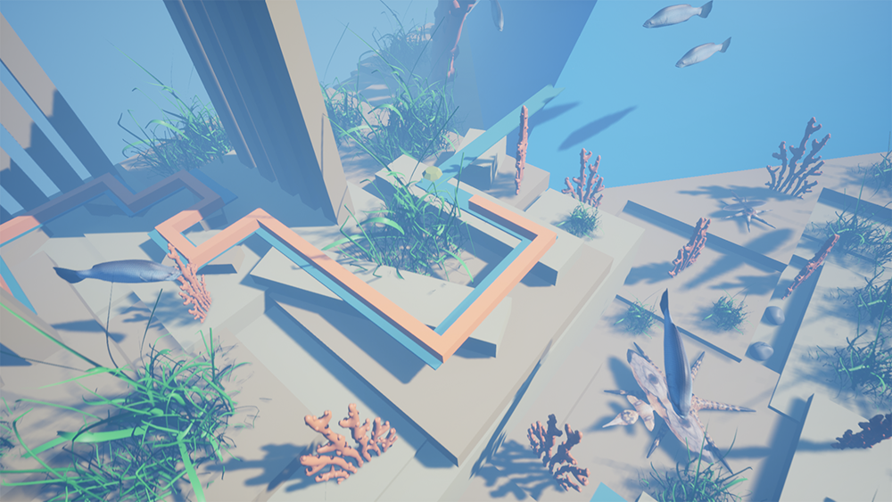
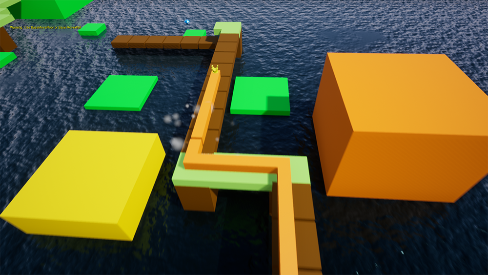
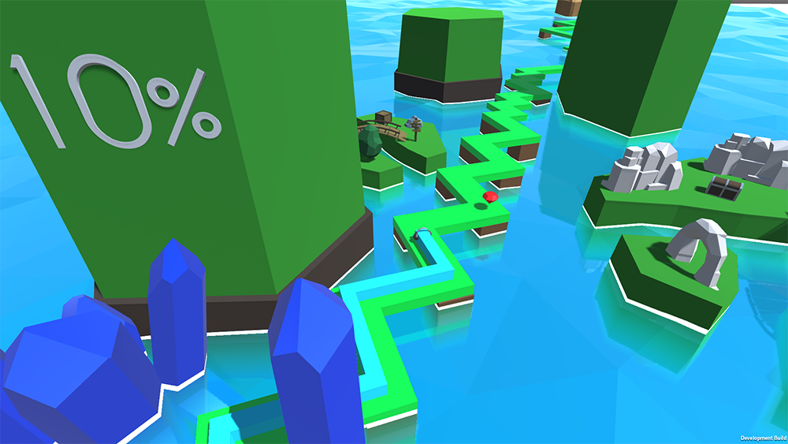
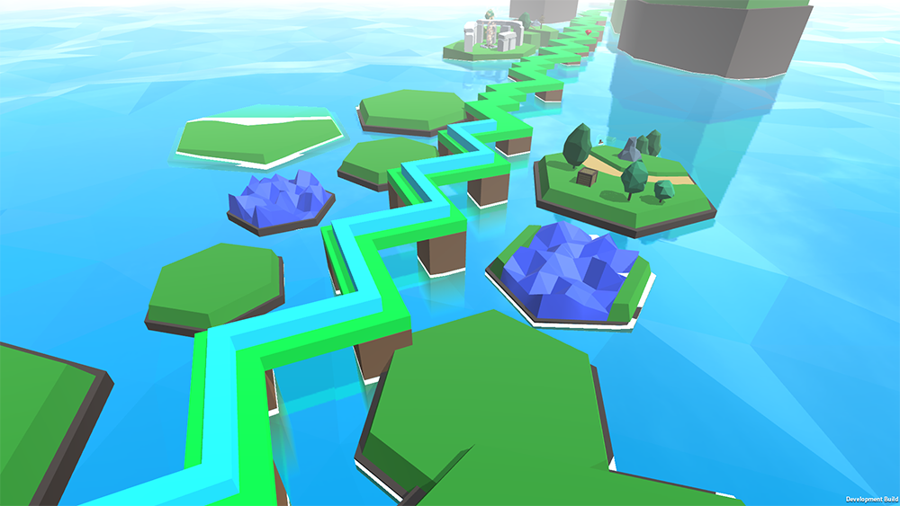
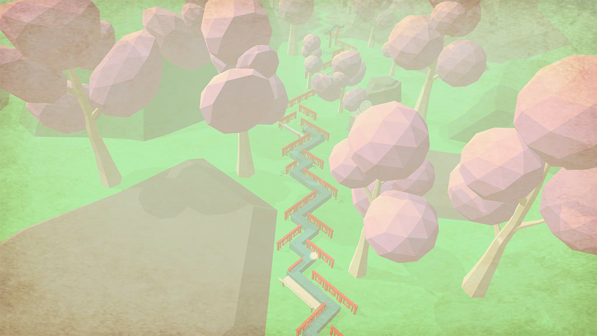
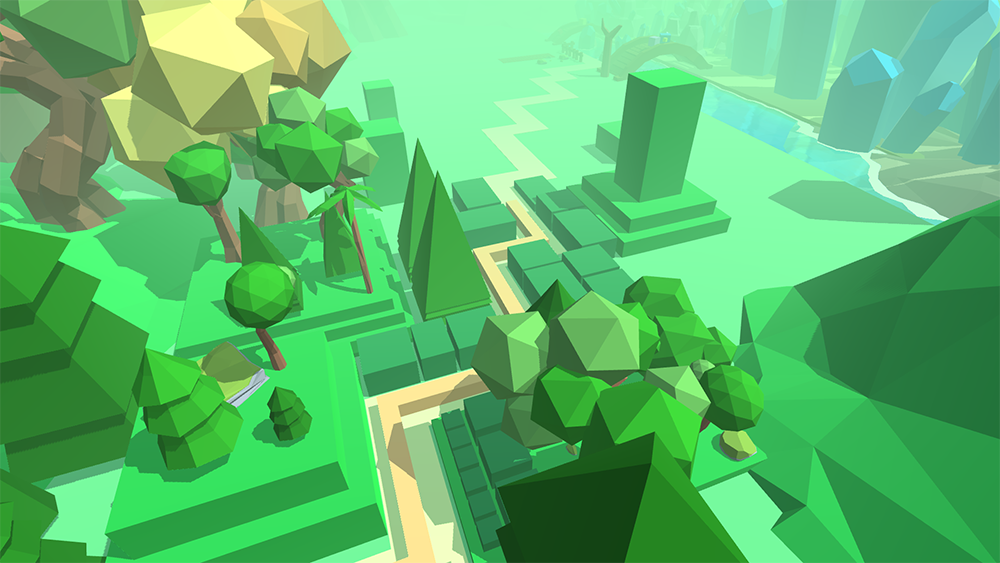
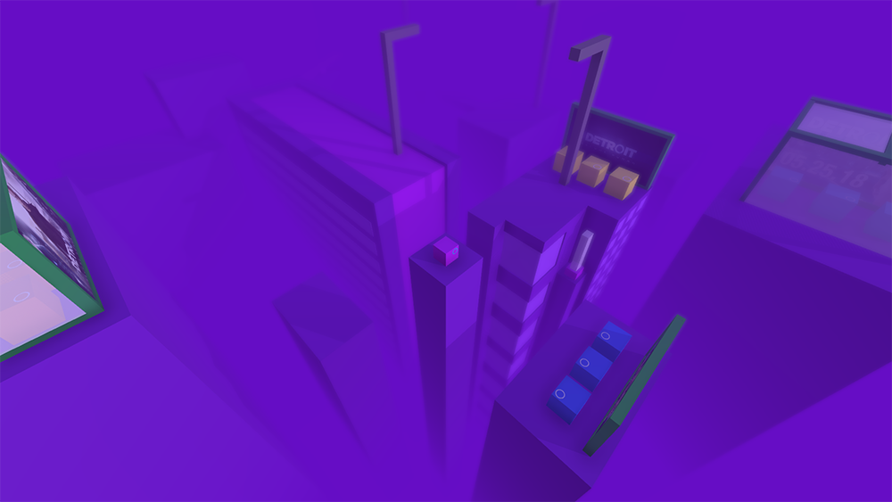
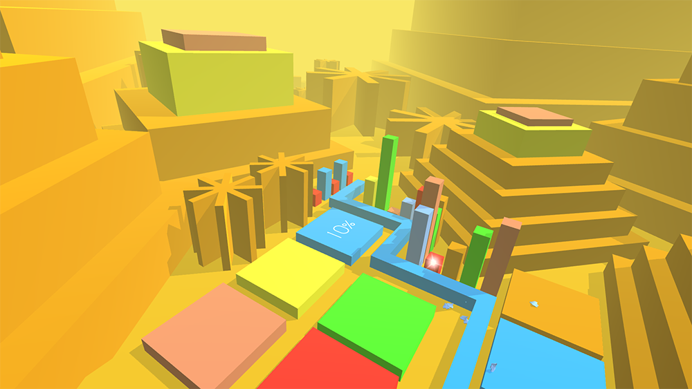
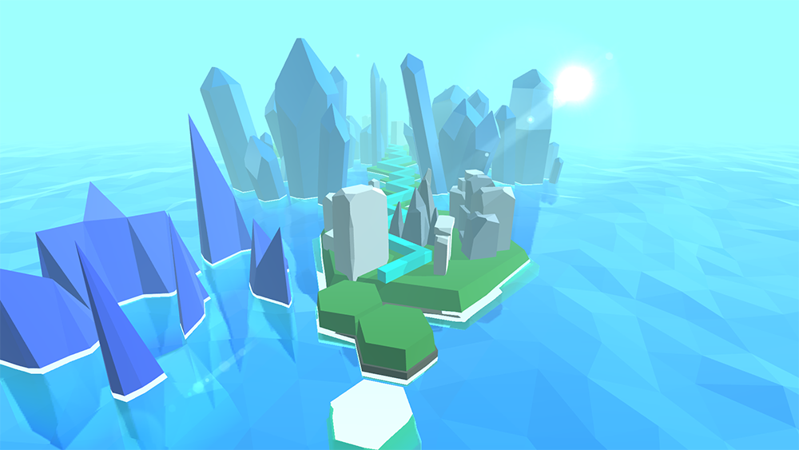

# 个人作品
*****
此页面收录了我从2018年至今全部完成和未完成的饭制关卡作品
## 已完成作品
### 2018年
#### 海洋

使用UE4制作，是真正意义上的第一个完整作品

发表日期：2018年5月4日

视频链接：[B站](https://www.bilibili.com/video/BV12p411f7kC)

#### 乡野

使用UE4制作

发表日期：2018年5月26日

视频链接：[B站](https://www.bilibili.com/video/BV1Ts411u7Z8/?spm_id_from=333.788.videopod.episodes&vd_source=1c695510ce7ddee97334e7846a16a194&p=38)

#### 云

使用UE4制作，个人成名作

发表日期：2018年6月18日

视频链接：[B站](https://www.bilibili.com/video/BV1Ts411u7Z8?spm_id_from=333.788.videopod.episodes&vd_source=1c695510ce7ddee97334e7846a16a194&p=39)

#### 自然

从此作品开始，制作引擎更换为Unity

发表日期：2018年7月4日（旧）、2018年8月11日（新）

视频链接（旧）：[B站](https://www.bilibili.com/video/BV1Ts411u7Z8?spm_id_from=333.788.videopod.episodes&vd_source=1c695510ce7ddee97334e7846a16a194&p=4)

视频链接（新）：[B站](https://www.bilibili.com/video/BV1Ts411u7Z8?spm_id_from=333.788.videopod.episodes&vd_source=1c695510ce7ddee97334e7846a16a194&p=41)

#### 钢琴

发表日期：2018年7月10日

视频链接：[B站](https://www.bilibili.com/video/BV1Ts411u7Z8?spm_id_from=333.788.videopod.episodes&vd_source=1c695510ce7ddee97334e7846a16a194&p=35)

#### 中华

发表日期：2018年8月27日

视频链接：[B站](https://www.bilibili.com/video/BV1Ts411u7Z8?spm_id_from=333.788.videopod.episodes&vd_source=1c695510ce7ddee97334e7846a16a194&p=40)

#### 环境

~~最美丽的一集~~

发表日期：2018年10月13日

视频链接：[B站](https://www.bilibili.com/video/BV1Ts411u7Z8?spm_id_from=333.788.videopod.episodes&vd_source=1c695510ce7ddee97334e7846a16a194&p=36)

#### 底特律—序始

发表日期：2018年12月16日

视频链接：[B站](https://www.bilibili.com/video/BV1Ts411u7Z8?spm_id_from=333.788.videopod.episodes&vd_source=1c695510ce7ddee97334e7846a16a194&p=34)

### 2019年
#### The Enddays

发表日期：2019年1月30日

视频链接：[B站](https://www.bilibili.com/video/BV1Ts411u7Z8?spm_id_from=333.788.videopod.episodes&vd_source=1c695510ce7ddee97334e7846a16a194&p=33)

#### 矩阵

发表日期：2019年3月10日

视频链接：[B站](https://www.bilibili.com/video/BV1Ts411u7Z8?spm_id_from=333.788.videopod.episodes&vd_source=1c695510ce7ddee97334e7846a16a194&p=37)

#### 自然 \[重制]

发表日期：2019年3月24日

视频链接：[B站](https://www.bilibili.com/video/BV1Ts411u7Z8?spm_id_from=333.788.videopod.episodes&vd_source=1c695510ce7ddee97334e7846a16a194&p=42)

#### 乡野 \[重制]

发表日期：2019年7月18日

视频链接：[B站](https://www.bilibili.com/video/BV1Yb411K7dV?spm_id_from=333.788.videopod.episodes&vd_source=1c695510ce7ddee97334e7846a16a194&p=132)

#### 深空

发表日期：2019年8月5日

视频链接：[B站](https://www.bilibili.com/video/BV1Yb411K7dV?spm_id_from=333.788.videopod.episodes&vd_source=1c695510ce7ddee97334e7846a16a194&p=130)

### 2020年