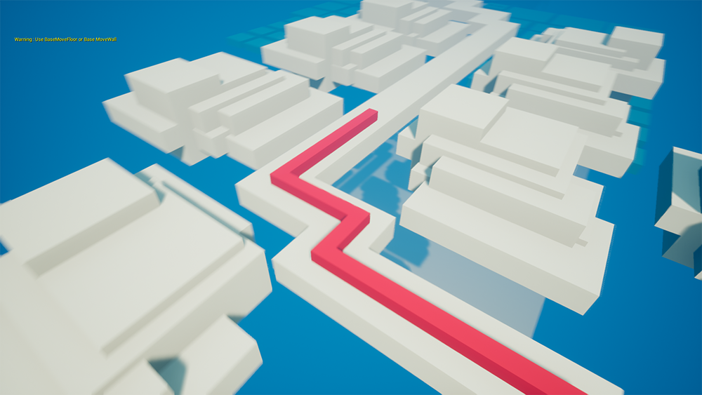
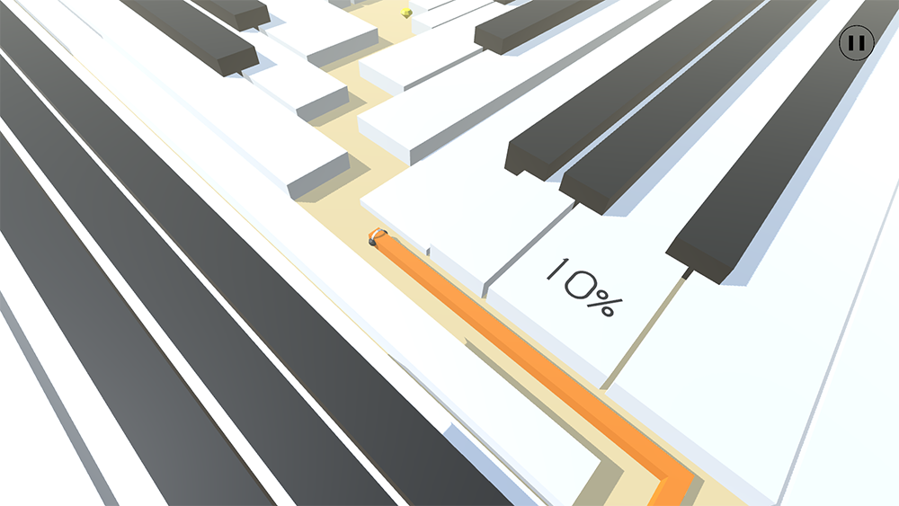
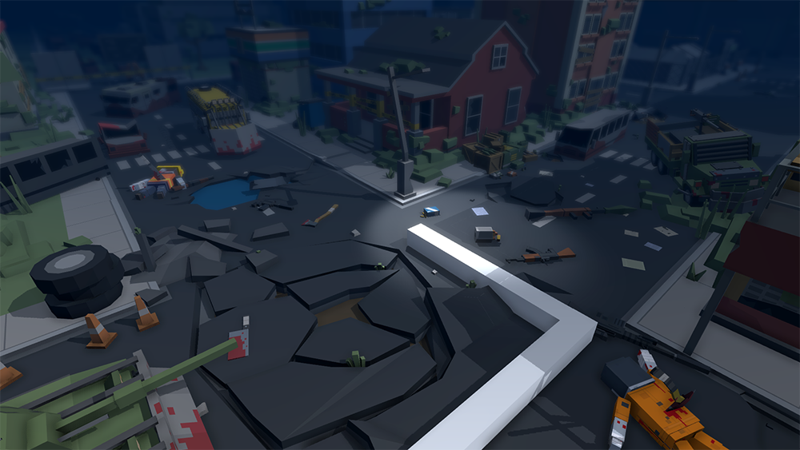
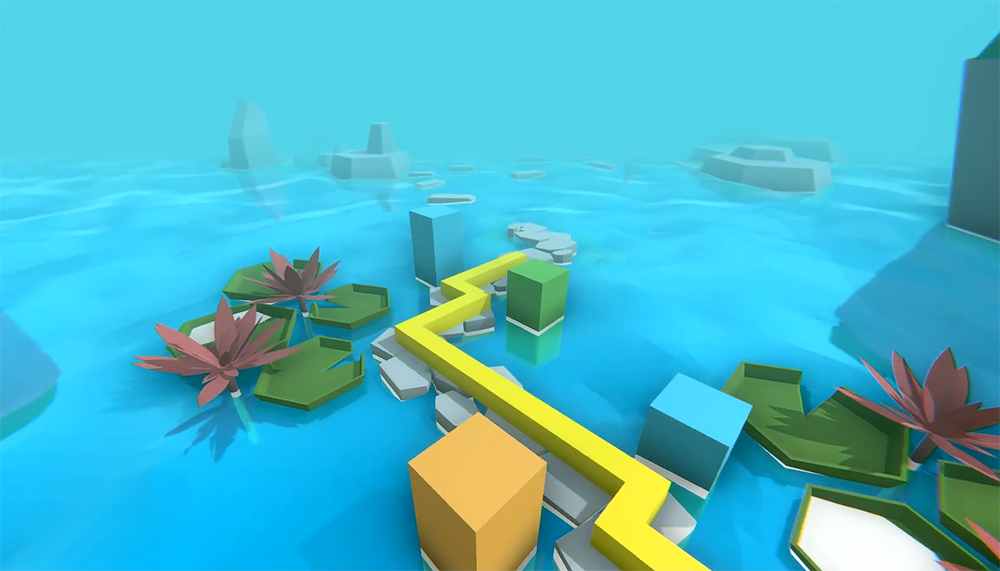

# 个人作品
*****
此页面收录了我从2018年至今全部完成和未完成的饭制关卡作品
## 已完成作品
### 2018年
#### 海洋

使用UE4制作，是真正意义上的第一个完整作品

发表日期：2018年5月4日

视频链接：[B站](https://www.bilibili.com/video/BV12p411f7kC)

#### 乡野

使用UE4制作

发表日期：2018年5月26日

视频链接：[B站](https://www.bilibili.com/video/BV1Ts411u7Z8/?spm_id_from=333.788.videopod.episodes&vd_source=1c695510ce7ddee97334e7846a16a194&p=38)

#### 云

使用UE4制作，个人成名作

发表日期：2018年6月18日

视频链接：[B站](https://www.bilibili.com/video/BV1Ts411u7Z8?spm_id_from=333.788.videopod.episodes&vd_source=1c695510ce7ddee97334e7846a16a194&p=39)

#### 自然

从此作品开始，制作引擎更换为Unity

发表日期：2018年7月4日（旧）、2018年8月11日（新）

视频链接（旧）：[B站](https://www.bilibili.com/video/BV1Ts411u7Z8?spm_id_from=333.788.videopod.episodes&vd_source=1c695510ce7ddee97334e7846a16a194&p=4)

视频链接（新）：[B站](https://www.bilibili.com/video/BV1Ts411u7Z8?spm_id_from=333.788.videopod.episodes&vd_source=1c695510ce7ddee97334e7846a16a194&p=41)

#### 钢琴

发表日期：2018年7月10日

视频链接：[B站](https://www.bilibili.com/video/BV1Ts411u7Z8?spm_id_from=333.788.videopod.episodes&vd_source=1c695510ce7ddee97334e7846a16a194&p=35)

#### 中华

发表日期：2018年8月27日

视频链接：[B站](https://www.bilibili.com/video/BV1Ts411u7Z8?spm_id_from=333.788.videopod.episodes&vd_source=1c695510ce7ddee97334e7846a16a194&p=40)

#### 环境

~~最美丽的一集~~

发表日期：2018年10月13日

视频链接：[B站](https://www.bilibili.com/video/BV1Ts411u7Z8?spm_id_from=333.788.videopod.episodes&vd_source=1c695510ce7ddee97334e7846a16a194&p=36)

#### 底特律—序始

发表日期：2018年12月16日

视频链接：[B站](https://www.bilibili.com/video/BV1Ts411u7Z8?spm_id_from=333.788.videopod.episodes&vd_source=1c695510ce7ddee97334e7846a16a194&p=34)

### 2019年
#### The Enddays

发表日期：2019年1月30日

视频链接：[B站](https://www.bilibili.com/video/BV1Ts411u7Z8?spm_id_from=333.788.videopod.episodes&vd_source=1c695510ce7ddee97334e7846a16a194&p=33)

#### 矩阵

发表日期：2019年3月10日

视频链接：[B站](https://www.bilibili.com/video/BV1Ts411u7Z8?spm_id_from=333.788.videopod.episodes&vd_source=1c695510ce7ddee97334e7846a16a194&p=37)

#### 自然 \[重制]

发表日期：2019年3月24日

视频链接：[B站](https://www.bilibili.com/video/BV1Ts411u7Z8?spm_id_from=333.788.videopod.episodes&vd_source=1c695510ce7ddee97334e7846a16a194&p=42)

#### 乡野 \[重制]

发表日期：2019年7月18日

视频链接：[B站](https://www.bilibili.com/video/BV1Yb411K7dV?spm_id_from=333.788.videopod.episodes&vd_source=1c695510ce7ddee97334e7846a16a194&p=132)

#### 深空

发表日期：2019年8月5日

视频链接：[B站](https://www.bilibili.com/video/BV1Yb411K7dV?spm_id_from=333.788.videopod.episodes&vd_source=1c695510ce7ddee97334e7846a16a194&p=130)

### 2020年
#### 序言（开端）

发表日期：2020年2月4日

视频链接：[B站](https://www.bilibili.com/video/BV157411h7um)

#### 贝多芬病毒

是对qqxqqx的关卡贝多芬病毒的重制

发表日期：2020年2月4日

视频链接：[B站](https://www.bilibili.com/video/BV157411h7um?spm_id_from=333.788.videopod.episodes&vd_source=1c695510ce7ddee97334e7846a16a194&p=2)

#### 橄榄球

是对qqxqqx的关卡橄榄球的重制

发表日期：2020年2月13日

视频链接：[B站](https://www.bilibili.com/video/BV1k7411V7Hq)

#### 海洋（MaxLine）

是和qqxqqx合作制作的关卡，开头至50%为我制作

发表日期：2020年4月6日

视频链接：[B站](https://www.bilibili.com/video/BV1X64y1u7zG)

#### 伊始

发表日期：2020年6月2日

视频链接：[B站](https://www.bilibili.com/video/BV1iA411v7MB)

#### 启示录

是和qqxqqx合作制作的关卡，开头至40%、80%至100%为我制作

此关卡在2019年6月就已有概念

^当时为此关卡制作的概念图

发表日期：2020年6月15日

视频链接：[B站](https://www.bilibili.com/video/BV15g4y1q7Vx)

#### 海滩

是对qqxqqx的关卡序言Remix的重制

发表日期：2020年8月2日

视频链接：[B站](https://www.bilibili.com/video/BV1964y1F7Sc)

#### 雨

发表日期：2020年8月2日

视频链接：[B站](https://www.bilibili.com/video/BV1jA411Y7J3)

#### 滑稽

是对Lusaslan的关卡滑稽的重制

发表日期：2020年10月4日

视频链接：[B站](https://www.bilibili.com/video/BV1fz4y1Z7sa)

### 2021年
#### 周年庆

MaxLine一周年纪念关卡，是和qqxqqx、lyckay和GP0108合作制作的关卡，70%至100%为我制作

发表日期：2021年2月4日

视频链接：[B站](https://www.bilibili.com/video/BV18V411B7Tw)

#### 地球 \[复刻]

发表日期：2021年2月17日

视频链接：[B站](https://www.bilibili.com/video/BV1Zo4y197Hy)

#### In the End

是对raw_chicken的关卡In the End的重制和续作

发表日期：2021年2月24日

视频链接：[B站](https://www.bilibili.com/video/BV1Xp4y1n7Vt)

#### 水晶 \[复刻]

发表日期：2021年6月11日

视频链接：[B站](https://www.bilibili.com/video/BV1664y1R7K9)

#### 数学

是对Li Ga Yb的关卡数学的重制

发表日期：2021年8月10日

视频链接：[B站](https://www.bilibili.com/video/BV1B3411r7JW)

### 2022年
#### 探索

是对Max余焰的关卡探索的重制

发表日期：2022年8月6日

视频链接：[B站](https://www.bilibili.com/video/BV1zt4y137kP)

### 2023年
#### 空间

此关卡于2024年2月被《跳舞的线》收录

发表日期：2023年6月15日

视频链接：[B站](https://www.bilibili.com/video/BV1rW4y1Q7ST)

### 2025年
#### 迷度 \[新]

是对CIAD233的关卡迷度的重制

发表日期：2025年4月20日

视频链接：[B站](https://www.bilibili.com/video/BV1465fzcEHa)

### 年份不可查作品
#### 风暴 \[完整版]

是和叶枫合作制作的关卡

视频链接：[B站](https://www.bilibili.com/video/BV1Yb411K7dV?spm_id_from=333.788.videopod.episodes&vd_source=1c695510ce7ddee97334e7846a16a194&p=61)

#### 序幕

视频链接：[B站](https://www.bilibili.com/video/BV1Yb411K7dV?spm_id_from=333.788.videopod.episodes&vd_source=1c695510ce7ddee97334e7846a16a194&p=135)

#### 草原

是和Max余焰、Max智焰合作制作的关卡

视频链接：[B站](https://www.bilibili.com/video/BV1Yb411K7dV?spm_id_from=333.788.videopod.episodes&vd_source=1c695510ce7ddee97334e7846a16a194&p=151)

#### 序幕（DLPCPE 2021）

视频链接：[B站](https://www.bilibili.com/video/BV1qP4y1X71s?spm_id_from=333.788.videopod.episodes&vd_source=1c695510ce7ddee97334e7846a16a194&p=2)

## 未完成作品
### 小镇
使用UE4制作

关卡图片缺失

制作时间：2018年

### 风暴
TTF饭制，使用UE4制作

关卡图片缺失

制作时间：2018年

### 海盗
使用UE4制作

关卡图片缺失

制作时间：2018年

### 风暴 Dance Remix
使用UE4制作，开头至30%为我制作，后续交由雪能花制作

关卡图片缺失

制作时间：2018年

### The Ignite
因工程损坏而放弃制作，关卡原名称已不可查

关卡图片缺失

制作时间：2018年

### 舞池

制作时间：2018年

视频链接：[B站](https://www.bilibili.com/video/BV1cN41167F4?vd_source=1c695510ce7ddee97334e7846a16a194&spm_id_from=333.788.videopod.episodes&p=5)

### 霓虹
关卡图片缺失

制作时间：2018年或2019年

### Darkside
关卡图片缺失

制作时间：2018年或2019年

### The Faded Original Full
关卡图片缺失

制作时间：2018年或2019年

### 雪之梦

制作时间：2018年或2019年

视频链接：[B站](https://www.bilibili.com/video/BV1cN41167F4?vd_source=1c695510ce7ddee97334e7846a16a194&spm_id_from=333.788.videopod.episodes&p=3)

### 宇宙魔方

制作时间：2018年或2019年

视频链接：[B站](https://www.bilibili.com/video/BV1cN41167F4?vd_source=1c695510ce7ddee97334e7846a16a194&spm_id_from=333.788.videopod.episodes&p=6)

### 战争

制作时间：2019年

视频链接：[B站](https://www.bilibili.com/video/BV1cN41167F4?vd_source=1c695510ce7ddee97334e7846a16a194&spm_id_from=333.788.videopod.episodes&p=4)

### 底特律—序始 \[重制]

制作时间：2019年

视频链接：[B站](https://www.bilibili.com/video/BV1cN41167F4?vd_source=1c695510ce7ddee97334e7846a16a194&spm_id_from=333.788.videopod.episodes&p=7)

### 互联网
关卡图片缺失

制作时间：2019年

### 幻想曲
MaxLine的早期关卡，音乐由羽焰辰星制作，是[Marble Machine](https://music.163.com/song?id=408532991&uct2=U2FsdGVkX1/zS+Qx0uOfnyPY5CbLuj9wWYzK+4tiMy8=)的Remix

关卡图片缺失

制作时间：2020年

### 命运

开头至20%为我制作，后续交由Hatcat制作

制作时间：2022年

### 无人区 \[重制]

制作时间：2022年